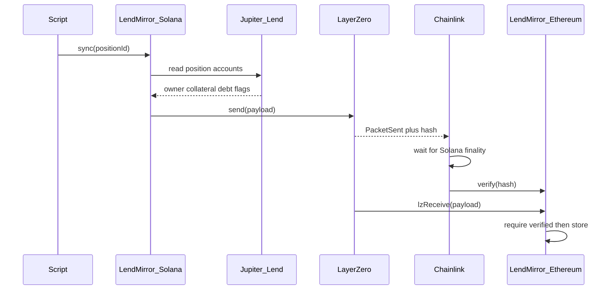

# LendMirror — implementation plan

It copies a Jupiter Lend loan facts onto Ethereum. It does not move the loan. It does not move tokens.

Alternatives if the team prefers another name: `PositionRelay`, `JupEcho`.

## Goal

Take a Jupiter Lend borrow position on Solana and publish a snapshot to Ethereum mainnet so EVM apps can read:

- who owns it
- collateral amount
- debt amount
- whether it is liquidated
- when the snapshot was taken
- other details

Ethereum cannot read Solana. LendMirror sends the snapshot through LayerZero. Chainlink checks that this exact send happened on Solana. The Ethereum contract stores the snapshot only after that check.

## What this is not

- Not a token bridge
- Not moving the Jupiter loan itself
- Not letting Ethereum unlock money in v1
- Chainlink does not re-read Jupiter Lend. It checks the LayerZero packet.

## How it works

Step by step:

1. A user or script asks LendMirror on Solana to sync one position.
2. The Solana program reads that position from Jupiter Lend accounts (not from our server).
3. It packs the fields into a payload and calls LayerZero `send`.
4. Solana records `PacketSent` plus a hash of the payload.
5. Chainlink machines watch Solana, wait until the block is final, and check the hash.
6. When enough of them agree, they call `verify` on Ethereum.
7. LayerZero then delivers the payload to our Ethereum contract (`lzReceive`).
8. The contract stores the latest snapshot. Other EVM apps read it.

## Trust model

| Question | Answer |
| --- | --- |
| Can a stranger invent a packet on Ethereum? | No. `lzReceive` only runs after Chainlink (and any other required checkers) verify the hash. |
| Can someone change bytes in transit? | No. The hash would no longer match. |
| Can the numbers be wrong? | Yes, if our Solana program reads the wrong accounts or packs the wrong fields. That is our job to get right. |
| Does Chainlink check Jupiter Lend? | No. It checks that this LayerZero send happened on Solana. |

So: **Jupiter Lend is the source of the numbers. Our Solana program is the packer. Chainlink is the witness of the send.**

## What we build vs what we use

**We build**

1. **Solana program** (`programs/lendmirror`) — LayerZero OApp. Instruction: `sync`. Reads Jupiter position accounts. Encodes payload. Calls LayerZero send.
2. **Ethereum contract** (`LendMirror.sol`) — LayerZero OApp. `lzReceive` decodes payload and writes `positions[positionId]`.
3. **Shared payload codec** — same field order and types on both chains.
4. **Sync script** — builds the Solana `sync` transaction for one position. v1 is manual. A bot can come later.
5. **LayerZero config** — peer addresses, Ethereum as destination, Chainlink as a required checker (DVN).

**We do not build**

LayerZero, Chainlink watchers, Jupiter Lend, price oracles.

**Starter code to copy**

- LayerZero Solana OApp example: devtools/examples/oapp-solana
- LayerZero EVM OApp docs and `OApp` base contract
- Jupiter position shape: GET /borrow/positions and on-chain reads via @jup-ag/lend-read