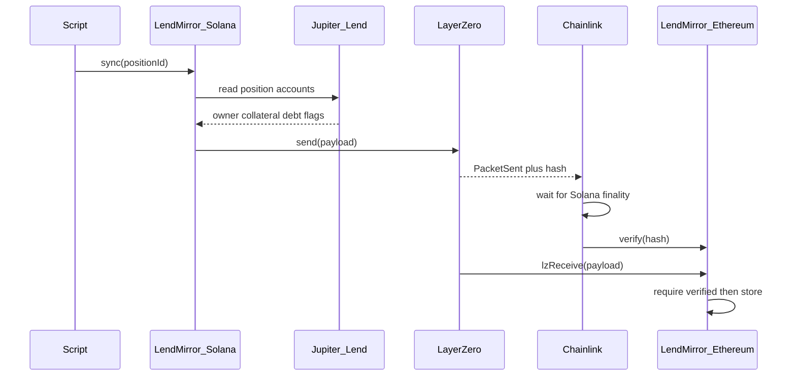

# LendMirror

End goal: copy a Jupiter Lend borrow snapshot from Solana onto Ethereum. It does not move the loan. It does not move tokens.

**What is live now (testnet):** a Pyth SOL/USD price on Solana Devnet is packed and sent through LayerZero. Sepolia stores it as `lastPrice`. Same hop a loan snapshot will use. Not a token bridge.

Path: Devnet (eid `40168`) → Sepolia (eid `40161`).

## Goal

Take a Jupiter Lend borrow position on Solana and publish a snapshot to Ethereum mainnet so EVM apps can read:

- who owns it
- collateral amount
- debt amount
- whether it is liquidated
- when the snapshot was taken
- other details

Ethereum cannot read Solana. LendMirror sends the snapshot through LayerZero. Chainlink checks that this exact send happened on Solana. The Ethereum contract stores the snapshot only after that check.

## What this is not

- Not a token bridge
- Not moving the Jupiter loan itself
- Not letting Ethereum unlock money in v1
- Chainlink does not re-read Jupiter Lend. It checks the LayerZero packet.


## What is live now

1. Client looks up Pyth’s **shard-0 push feed** from a 32-byte feed id. You do not type a separate price-update account.
2. `get_pyth_price` copies that into Store + a per-feed PDA.
3. `send` packs `PythPrice` (32-byte length header + 92-byte body) and CPIs into LayerZero.
4. Sepolia `LendMirror._lzReceive` writes `lastPrice`.

SOL/USD feed id: `ef0d8b6fda2ceba41da15d4095d1da392a0d2f8ed0c6c7bc0f4cfac8c280b56d`  
Pyth push-feed account (shard 0): `[7UVimffxr9ow1uXYxsr4LHAcV58mLzhmwaeKvJ1pjLiE](https://solscan.io/account/7UVimffxr9ow1uXYxsr4LHAcV58mLzhmwaeKvJ1pjLiE?cluster=devnet)`

On Devnet that feed can be stale. The program currently reads it without an age cap so the pipe can be tested. Tighten that before mainnet.

Sepolia `lastPrice.pythAccount` is this Pyth account as 32 bytes (hex on Ethereum, base58 on Solana). It is not a transaction id.

## How it works (later: Jupiter)




Step by step (product, not live yet):

1. A user or script asks LendMirror on Solana to sync one position.
2. The Solana program reads that position from Jupiter Lend accounts (not from our server).
3. It packs the fields into a payload and calls LayerZero `send`.
4. Solana records `PacketSent` plus a hash of the payload.
5. Chainlink machines watch Solana, wait until the block is final, and check the hash.
6. When enough of them agree, they call `verify` on Ethereum.
7. LayerZero then delivers the payload to our Ethereum contract (`lzReceive`).
8. The contract stores the latest snapshot. Other EVM apps read it.


## Trust model


| Question                                    | Answer                                                                                                       |
| ------------------------------------------- | ------------------------------------------------------------------------------------------------------------ |
| Can a stranger invent a packet on Ethereum? | No. `lzReceive` only runs after Chainlink (and any other required checkers) verify the hash.                 |
| Can someone change bytes in transit?        | No. The hash would no longer match.                                                                          |
| Can the numbers be wrong?                   | Yes, if our Solana program reads the wrong accounts or packs the wrong fields. That is our job to get right. |
| Does Chainlink check Jupiter Lend?          | No. It checks that this LayerZero send happened on Solana.                                                   |


So: **the source of the numbers is whatever we read on Solana (Pyth now, Jupiter later). Our Solana program is the packer. Chainlink is the witness of the send.**

## What we build vs what we use

**We build**

1. **Solana program** (`programs/lendmirror`) — LayerZero OApp. Live instructions: `init_store`, `set_peer_config`, `quote_send`, `get_pyth_price`, `send`.
2. **Ethereum contract** (`LendMirror.sol`) — LayerZero OApp. `_lzReceive` decodes the Pyth body and writes `lastPrice`.
3. **Shared payload codec** — `PythPrice` on Solana, `PythPriceMsgCodec.sol` on Ethereum. Same field order.
4. **Scripts** — `lz:oapp:solana:get-pyth-price` then `lz:oapp:solana:send-pyth`.
5. **LayerZero config** — peer addresses, Ethereum as destination.

**We do not build**

LayerZero, Chainlink watchers, Jupiter Lend, Pyth.

---


## Testnet: addresses (live now)

Path: **Solana Devnet** (LayerZero eid `40168`) → **Ethereum Sepolia** (eid `40161`).

LayerZero’s env name `RPC_URL_SOLANA_TESTNET` is Devnet for us. The chain is chosen by `--eid` / `--network`, not by that name.


| What                                           | Address                                        | Explorer                                                                                                 |
| ---------------------------------------------- | ---------------------------------------------- | -------------------------------------------------------------------------------------------------------- |
| Solana wallet (admin, fee payer)               | `AF1uGS22J8KUQdM41x3x6FYg4uhgS8sdcHrNPVc3MDPo` | [Solscan Devnet](https://solscan.io/account/AF1uGS22J8KUQdM41x3x6FYg4uhgS8sdcHrNPVc3MDPo?cluster=devnet) |
| LendMirror **program id** (code)               | `HXJvfUdYHUJKvAEZGN7rFxANLNohJnsRbPtoNAWyDfBK` | [Solscan Devnet](https://solscan.io/account/HXJvfUdYHUJKvAEZGN7rFxANLNohJnsRbPtoNAWyDfBK?cluster=devnet) |
| LendMirror **Store** (OApp / LayerZero sender) | `JCwdEfB4hX9F45Sixmur7X6vC1ZoxkiVaSJ5EeBtdbti` | [Solscan Devnet](https://solscan.io/account/JCwdEfB4hX9F45Sixmur7X6vC1ZoxkiVaSJ5EeBtdbti?cluster=devnet) |
| LayerZero Endpoint (Solana Devnet)             | `76y77prsiCMvXMjuoZ5VRrhG5qYBrUMYTE5WgHqgjEn6` | [Solscan Devnet](https://solscan.io/account/76y77prsiCMvXMjuoZ5VRrhG5qYBrUMYTE5WgHqgjEn6?cluster=devnet) |
| Ethereum wallet (Sepolia deployer)             | `0x9Dee2100Cb47734A7a629Db0a1B061Df865a9c87`   | [Etherscan Sepolia](https://sepolia.etherscan.io/address/0x9Dee2100Cb47734A7a629Db0a1B061Df865a9c87)     |
| **LendMirror.sol**                             | `0xFd4230Cd7E557983B5627A03F1Ef08A657c52388`   | [Etherscan Sepolia](https://sepolia.etherscan.io/address/0xFd4230Cd7E557983B5627A03F1Ef08A657c52388)     |
| LayerZero Endpoint (Sepolia)                   | `0x6EDCE65403992e310A62460808c4b910D972f10f`   | [Etherscan Sepolia](https://sepolia.etherscan.io/address/0x6EDCE65403992e310A62460808c4b910D972f10f)     |


Local cheat sheet: `deployments/solana-testnet/OApp.json`. Ethereum `setPeer` for Solana uses the **Store**, not the program id.

An older string-send deploy (`H84BoBh…` / `0xdAAE65…`) is dead. Do not use those addresses.

Proven Pyth send (SOL/USD onto Sepolia `lastPrice`):

- Read Pyth on Solana: [E7majDGu…](https://solscan.io/tx/E7majDGubdjd3aHhB7Ho1PG4sTsnQ9ZYae1sScMRR1kDxRo5KykfXKqSEbjLtUNiv4pywyjhF4WM7BAfZBXVt2T?cluster=devnet)
- LayerZero send: [2LSZ8KRU…](https://solscan.io/tx/2LSZ8KRUJZ4WvaKGx1Fy3VZ4UjLbpzozG4dEsi4ENm9cog8CjZp4wAUJaECpgC1C4uAdktzWK4T7pDz4dx9kjkus?cluster=devnet)
- LayerZero Scan: [testnet.layerzeroscan.com/tx/2LSZ8KRU…](https://testnet.layerzeroscan.com/tx/2LSZ8KRUJZ4WvaKGx1Fy3VZ4UjLbpzozG4dEsi4ENm9cog8CjZp4wAUJaECpgC1C4uAdktzWK4T7pDz4dx9kjkus)
- Sepolia contract: `[0xFd4230Cd…](https://sepolia.etherscan.io/address/0xFd4230Cd7E557983B5627A03F1Ef08A657c52388)` — read `lastPrice()` or `npx hardhat lz:oapp:evm:debug --network sepolia`


## Testnet: first-time setup

1. **Node 18** (`nvm use`). Hardhat 2.29 warns it wants 20+. Ignore that. Node **21** broke compile (uuid ESM).
2. **npm install.** If you see Hardhat `HH19` / “rename to .cjs”, do **not** rename files. This repo is already CommonJS. Pin `uuid` to `8.3.2` via `package.json` `overrides` (already there), then `rm -rf node_modules package-lock.json && npm install`. Confirm there is no nested `node_modules/rpc-websockets/node_modules/uuid`.
3. **Rust, Solana CLI, Anchor 0.31.1.** Create `~/.config/solana/id.json` if needed (`solana-keygen new`).
4. **Devnet SOL:**
  ```bash
   solana config set --url https://api.devnet.solana.com
   solana airdrop 2
   solana balance
  ```
5. **Sepolia ETH** on the wallet in `.env`. Faucet: [Google Cloud Sepolia faucet](https://cloud.google.com/application/web3/faucet/ethereum/sepolia).
6. Copy `.env.example` → `.env` (never commit `.env`):
  ```
   PRIVATE_KEY=<sepolia key>
   SOLANA_KEYPAIR_PATH=/Users/<you>/.config/solana/id.json
   RPC_URL_SOLANA_TESTNET=https://api.devnet.solana.com
  ```
   Leave `MNEMONIC` and `SOLANA_PRIVATE_KEY` empty if you use those two.
7. Do **not** use `anchor build -v` (Docker) here. Use plain `anchor build`.


## Testnet: deploy and send

Program id in source must match `target/deploy/lendmirror-keypair.json`. If you generate a new keypair, rebuild with that id first.

```bash
# 1. Build Solana (id must match target/deploy/lendmirror-keypair.json)
LENDMIRROR_ID=HXJvfUdYHUJKvAEZGN7rFxANLNohJnsRbPtoNAWyDfBK anchor build

# 2. Deploy / upgrade program. Prefer --use-rpc (public Devnet RPC drops write txs).
#    Do not add -u devnet on top of a custom RPC — that overrides it.
solana program deploy \
  --program-id target/deploy/lendmirror-keypair.json \
  target/deploy/lendmirror.so \
  --use-rpc \
  --with-compute-unit-price 100000

# 3. Create Store (OApp). First caller becomes admin. Skip if Store already exists.
nvm use 18
npx hardhat lz:oapp:solana:create --eid 40168 --program-id HXJvfUdYHUJKvAEZGN7rFxANLNohJnsRbPtoNAWyDfBK

# 4. Deploy LendMirror.sol
npx hardhat lz:deploy --networks sepolia --ci

# 5. Solana send-library config, then peers on both chains
npx hardhat lz:oapp:solana:init-config --oapp-config layerzero.config.ts
npx hardhat lz:oapp:wire --oapp-config layerzero.config.ts --ci

# 6. Copy Pyth SOL/USD into Store, then send to Sepolia. Do not use lz:oapp:send (that packs a string).
npx hardhat lz:oapp:solana:get-pyth-price \
  --eid 40168 \
  --feed-id ef0d8b6fda2ceba41da15d4095d1da392a0d2f8ed0c6c7bc0f4cfac8c280b56d
npx hardhat lz:oapp:solana:send-pyth --from-eid 40168 --dst-eid 40161

# 7. Wait a few minutes, then read lastPrice (this is the check — Etherscan will not show the name until you paste ABI)
npx hardhat lz:oapp:evm:debug --network sepolia --contract-name LendMirror
```

Etherscan has no `lastPrice` button until the source is verified. The value is still on-chain. To see it in the UI: open the contract → **Contract** → **Add Custom ABI** → paste:

```json
[{"inputs":[],"name":"lastPrice","outputs":[{"internalType":"bytes32","name":"pythAccount","type":"bytes32"},{"internalType":"bytes32","name":"feedId","type":"bytes32"},{"internalType":"int64","name":"price","type":"int64"},{"internalType":"uint64","name":"conf","type":"uint64"},{"internalType":"int32","name":"exponent","type":"int32"},{"internalType":"int64","name":"publishTime","type":"int64"}],"stateMutability":"view","type":"function"}]
```

Then **Read Custom** → `lastPrice`. LayerZero’s receive shows under **Internal Txns**, not the main Transactions list.

Do **not** keep re-running `wire` after peers are set.

## Testnet: what each address is

- **Program id** — the deployed bytecode. Not the LayerZero sender.
- **Store** — PDA from `init_store` (seed `LendMirrorStore`). Packet `sender`. Ethereum peer for eid `40168`.
- **Solana wallet** — pays fees; `admin` after create.
- **Ethereum wallet** — deployed the contract; LayerZero delegate.
- **Endpoints** — LayerZero’s programs/contracts, not ours.

