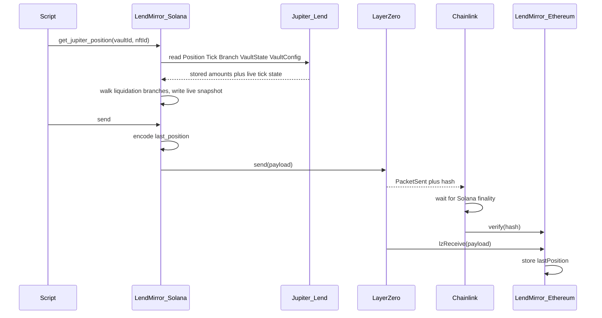

# LendMirror

Copy a Jupiter Lend borrow snapshot from Solana onto Ethereum. It does not move the loan. It does not move tokens.

- **Mainnet path:** Solana (eid `30168`) → Arbitrum (eid `30110`)
- **Testnet path:** Solana Devnet (eid `40168`) → Ethereum Sepolia (eid `40161`)

## Goal

Publish a Jupiter Lend borrow position to Ethereum so EVM apps can read:

- position id (vault + nft)
- collateral and debt amounts (live, after any liquidation)
- the stored amounts the Position account still has, so you can see the gap
- whether it is liquidated, and whether anything is left
- when the snapshot was taken
- related token mints and exchange prices

Ethereum cannot read Solana. LendMirror sends the snapshot through LayerZero. DVNs check that this exact send happened on Solana. The Ethereum contract stores the snapshot only after that check.

## What this is not

- Not a token bridge
- Not moving the Jupiter loan itself
- Not letting Ethereum unlock money in v1
- DVNs do not re-read Jupiter Lend. They check the LayerZero packet.

## How it works



1. An allowed wallet calls `get_jupiter_position` with `vault_id` and `nft_id`.
2. The Solana program reads the Jupiter Position, Tick, VaultState, and VaultConfig. If that tick was liquidated, it also reads TickIdLiquidation and Branch accounts and recomputes what is left (same as Jupiter `getCurrentPositionState`). `col_raw` / `debt_raw` / `tick` on the snapshot are those live numbers. `stored_*` is what the Position account still says.
3. An allowed wallet calls `send`. The program packs `last_position` itself (32-byte length header + 225-byte body). Callers cannot invent the payload.
4. LayerZero records the packet on Solana. DVNs verify, then Ethereum `lzReceive` writes `lastPosition()`.

## Who can do what

These are different keys. Do not mix them up.

| Role | What it is | What it can do |
|------|------------|----------------|
| **Program id** | The deployed Solana program | Holds the code. Not a wallet. Not the LayerZero sender. |
| **Store** | PDA created by `init_store` (seed `LendMirrorStoreV0`) | LayerZero **sender** identity. Ethereum `setPeer` must use this address, not the program id. |
| **Admin** | Wallet written once at `init_store` (`params.admin`) | Update peers. Update the snapshot and send allowlists. Cannot transfer admin on-chain in v1. Does **not** create the Store. |
| **Snapshotter** | Wallet on the Store snapshot list (max 8) | Call `get_jupiter_position` to refresh `last_position`. |
| **Sender** | Wallet on the Store send list (max 8) | Call `send` to push the stored snapshot to Ethereum. Cannot choose custom bytes — payload is always `last_position`. |
| **Upgrade authority** | Key that deployed/upgraded the program (usually `lendmirror-keypair.json` until rotated) | Only key that can call `init_store` (create the Store). Can upgrade bytecode. Keep this key safe offline. |
| **Ethereum owner** | Wallet that called `initialize` on the proxy | Owns the EVM contract / LayerZero delegate. Sets peers. **Upgrades** the proxy (`upgradeToAndCall`). |
| **Fee payer** | Any wallet paying SOL/ETH for a tx | Pays rent and fees. For snapshot/send it must also be (or accompany) an allowed authority. |

**Rules in plain words**

- Only the **upgrade authority** can call `init_store`. A random wallet cannot front-run create and become admin. There is no `close_store`; a stolen Store would burn this program id.
- `params.admin` is who the upgrade authority *names* as Store admin. It is not the gate. The create script uses the same wallet for both.
- Only the **admin** changes who is allowed to snapshot or send.
- Only **snapshotters** can refresh the on-chain snapshot.
- Only **senders** can publish that snapshot to Ethereum.
- After create, admin is automatically on both lists. Admin can replace those lists later (up to 8 wallets each).
- Anyone can call `quote_send` to ask for a fee estimate. That does not send.

Admin tasks (eid comes from `DEPLOYMENT_TYPE`):

```bash
npx hardhat lz:oapp:solana:set-snapshotters --keys <pubkey1>,<pubkey2>
npx hardhat lz:oapp:solana:set-senders --keys <pubkey1>,<pubkey2>
```

## One switch: `DEPLOYMENT_TYPE`

Set `DEPLOYMENT_TYPE=devnet` or `DEPLOYMENT_TYPE=mainnet` in `.env`. That picks one profile:

| File | Path |
|------|------|
| [`config/devnet.ts`](config/devnet.ts) | Solana Devnet `40168` → Sepolia `40161` |
| [`config/mainnet.ts`](config/mainnet.ts) | Solana `30168` → Arbitrum `30110` |

[`lib/deployment.ts`](lib/deployment.ts) loads the profile and the matching keys and RPCs from `.env`. Hardhat, `npx lm`, and the LayerZero config all use that same profile. If you pass `--eid` or `--network` and it disagrees with the profile, the command stops.

**Use `npx lm` for Solana CLI, Forge, Cast, and Anchor build.** Those tools do not read `DEPLOYMENT_TYPE` on their own. Bare `solana`, `forge`, and `cast` can use a different wallet or RPC and will write to the wrong chain.

```bash
npx lm build
npx lm solana program deploy --program-id target/deploy/lendmirror-keypair.json target/deploy/lendmirror.so --use-rpc
npx lm forge create contracts/LendMirror.sol:LendMirror --broadcast --constructor-args <ENDPOINT>
npx lm cast send <PROXY> "upgradeToAndCall(address,bytes)" <IMPL> 0x
```

## Addresses

Committed in the profile files. Live values:

### Devnet / Sepolia (`DEPLOYMENT_TYPE=devnet`)

| Item | Value |
|------|-------|
| Solana program id | `GQDxkWJhMGppaXExXBC8hGWmfaUv9igo4PKdaLyc53T1` |
| Solana Store (OApp) | `BqsqziQ9VsD3o81zPCQuMfZebdn4eQUAtMjJxZLYhXdM` |
| Solana CCIP payer | `53ZqmxXwJhXxgLBFXpM1mZUDZ4AZwXaVhpnktxusQn6m` |
| Solana admin | `AF1uGS22J8KUQdM41x3x6FYg4uhgS8sdcHrNPVc3MDPo` |
| Snapshotters / Senders | `AF1uGS22J8KUQdM41x3x6FYg4uhgS8sdcHrNPVc3MDPo` |
| Sepolia LendMirror (proxy) | `0xbE4c9C5DB8E2747C545B2591B3937764f1A2d514` |
| Sepolia implementation | `0xC722956634AC775A05F78B50BC840d27614916fd` |
| Sepolia owner | `0x9Dee2100Cb47734A7a629Db0a1B061Df865a9c87` |
| LayerZero pathway | Devnet `40168` → Sepolia `40161` |
| Chainlink | Wired (payer is the Sepolia `ccipSender`) |

Local files: `deployments/solana-testnet/OApp.json`, `deployments/sepolia/LendMirror.json`. Etherscan: https://sepolia.etherscan.io/address/0xbE4c9C5DB8E2747C545B2591B3937764f1A2d514

### Mainnet (`DEPLOYMENT_TYPE=mainnet`)

| Item | Value |
|------|-------|
| Solana program id | `9oySM9Jo4ZEXFcWYFbuPK1FeqwrDr6wmnAmenAybzHqQ` |
| Solana Store (OApp) | `BLoEaf2L5rZvEwZuVfFjAabHW4woM9Mr1XknBQCZkyf4` |
| Solana admin | `B8HnbEgetyiAdvkbgZR7LsChh93KR3jWuSw6xSQxt1hL` |
| Snapshotters / Senders | `B8HnbEgetyiAdvkbgZR7LsChh93KR3jWuSw6xSQxt1hL` |
| Arbitrum LendMirror (proxy) | `0xb42E98c712B5CAf1e55dB8106262077515879EA2` |
| Arbitrum implementation | `0xdAAE65Df8B96e9eE45eb756441B7942e5E128924` |
| Arbitrum owner | `0x9Dee2100Cb47734A7a629Db0a1B061Df865a9c87` |
| LayerZero pathway | Solana `30168` → Arbitrum `30110` |
| Chainlink | Not wired |

Local files: `deployments/solana-mainnet/OApp.json`, `deployments/arbitrum/LendMirror.json`. The proxy is the LayerZero peer, not the implementation. Arbiscan: https://arbiscan.io/address/0xb42E98c712B5CAf1e55dB8106262077515879EA2

## What we build vs what we use

**We build**

1. **Solana program** — `init_store`, `set_peer_config`, `set_snapshotters`, `set_senders`, `quote_send`, `get_jupiter_position`, `send`, `send_ccip`
2. **Ethereum contract** — UUPS proxy + OApp receiver + `ccipReceive`; `_lzReceive` decodes into `lastPosition()`. Peer = **proxy** address.
3. **Shared codec** — `PositionSnapshot` on Solana, `PositionSnapshotMsgCodec.sol` on Ethereum
4. **Scripts** — create Store, allowlists, set-peer, snapshot, send, CCIP, evm debug

**We do not build**

LayerZero, DVNs, Chainlink CCIP programs, Jupiter Lend.

## Tools

Hardhat tasks need **Node 18** (`nvm use 18`). Node 21 breaks compile. Hardhat may warn it wants 20; ignore that.

Also: Rust, Solana CLI, Anchor **0.31.1**, `npm install`. If Hardhat prints `HH19` / “rename to .cjs”, do not rename files. `uuid` is already pinned in `package.json`.

`.env` (from `.env.example`):

| Variable | Used for |
|----------|----------|
| `DEPLOYMENT_TYPE` | `devnet` or `mainnet`. Required. |
| `SOLANA_KEYPAIR_PATH_DEVNET` / `_MAINNET` | Solana wallet for that path. Hardhat and `npx lm` use only the active one. |
| `EVM_PRIVATE_KEY_DEVNET` / `_MAINNET` | EVM owner key for that path. |
| `RPC_URL_SOLANA_DEVNET` / `_MAINNET` | Solana RPC for that path. Use a paid RPC on Devnet. |
| `RPC_URL_EVM_DEVNET` / `_MAINNET` | Sepolia or Arbitrum RPC. |

Two Solana files: **`lendmirror-keypair.json`** is the **program id**. **`SOLANA_KEYPAIR_PATH_*`** is the **wallet**. Do not mix them.

`layerzero.config.ts` follows `DEPLOYMENT_TYPE`. `lz:oapp:wire` crashes (DVN `PublicKey` bug). Do not use it. Peers are set with `set-peer`. `init-config` uses the same config file.

## Already deployed?

Addresses are in the table above. To send again you only need snapshot + send + debug. Do not create a second Store on the same program id (`init_store` fails if it exists).

## First deploy

Set `DEPLOYMENT_TYPE` and fill the matching `*_DEVNET` or `*_MAINNET` keys in `.env`. Then:

```bash
nvm use 18

# 1. Build with the profile program id (avoids DeclaredProgramIdMismatch).
npx lm build -- --features no-log-ix-name

# 2. Upload the .so with the profile RPC and wallet.
npx lm solana program deploy \
  --program-id target/deploy/lendmirror-keypair.json \
  target/deploy/lendmirror.so \
  --use-rpc

# 3. Create the Store once. Signer must be the program upgrade authority.
npx hardhat lz:oapp:solana:create

# 4. EVM receiver (UUPS). Printed address is the proxy.
npx hardhat lz:deploy --ci

# 5. Tell each side who the other is. Do not run wire.
npx hardhat lz:oapp:solana:set-peer
npx hardhat lz:oapp:evm:set-peer
npx hardhat lz:oapp:solana:get-peer

# 6. Snapshot then send (LayerZero).
npx hardhat lz:oapp:solana:get-jupiter-position --vault-id 1 --nft-id 29
npx hardhat lz:oapp:solana:send-jupiter

# 7. Wait a few minutes, then read.
npx hardhat lz:oapp:evm:debug
```

Devnet also has Chainlink. After peers are set:

```bash
npx hardhat lz:oapp:solana:set-ccip-route
npx hardhat lz:oapp:evm:set-ccip-route
npx hardhat lz:oapp:solana:send-ccip
```

A **new** Store also needs LayerZero send-library accounts for the destination eid:

```bash
npx hardhat lz:oapp:solana:init-config --oapp-config layerzero.config.ts
```

That follows `DEPLOYMENT_TYPE`. The Store in the address table already has this.

If you change the Store account layout, the old Store cannot be loaded. The program id can stay. Change `STORE_SEED` (`LendMirrorStoreV0` in the program and in `lib/client/pda.ts`). `init_store` then creates a new address and registers that address with LayerZero. Point Ethereum `setPeer` at the new Store and run `init-config` for it. The old Store can stay. The EVM receiver also needs an upgrade: the payload body is 225 bytes.

## Optional: IDL

Not needed to send. Only so Solscan can name instructions.

After `npx lm build`, `target/idl/lendmirror.json` often has a junk `address`. Fix it, then upload:

```bash
python3 -c 'import json,os; from pathlib import Path; p=Path("target/idl/lendmirror.json"); d=json.load(open(p)); d["address"]=os.environ["LENDMIRROR_ID"]; json.dump(d, open(p,"w"), indent=2)'

npx lm solana --help >/dev/null
# Or with Anchor provider flags from the profile:
anchor idl init "$LENDMIRROR_ID" -f target/idl/lendmirror.json \
  --provider.cluster "$RPC_URL_SOLANA_DEVNET" \
  --provider.wallet "$SOLANA_KEYPAIR_PATH_DEVNET"
```

Use the `_MAINNET` vars when `DEPLOYMENT_TYPE=mainnet`. Later rebuilds: `anchor idl upgrade` with the same flags.

## Optional: Solana verified badge

Separate from the IDL. OtterSec rebuilds your **public** Git commit in Linux Docker and compares hashes.

A Mac `anchor build` hash will **not** match Docker. To get a badge you must either deploy the Docker `.so`, or use `--remote` (OtterSec’s machines). Local Docker on Apple Silicon is slow (amd64 emulation) and re-downloads tools every run.

`cargo install solana-verify --locked` may fail on older Cargo. `0.4.11` works. That version has no `--env`; the program id in `declare_id!` (or `LENDMIRROR_ID` in the repo) must be the one on-chain. Pass `-- --features no-log-ix-name`.

```bash
# With DEPLOYMENT_TYPE=mainnet and RPC_URL_SOLANA_MAINNET set:
solana-verify -u "$RPC_URL_SOLANA_MAINNET" verify-from-repo --remote \
  --program-id 9oySM9Jo4ZEXFcWYFbuPK1FeqwrDr6wmnAmenAybzHqQ \
  --library-name lendmirror \
  --commit-hash <SHA on GitHub> \
  https://github.com/avyactjain/lendmirror \
  -- --features no-log-ix-name
```

Status: https://verify.osec.io/status/9oySM9Jo4ZEXFcWYFbuPK1FeqwrDr6wmnAmenAybzHqQ  
Devnet program: swap the id for `GQDxk…` and `-u "$RPC_URL_SOLANA_DEVNET"`.

## Local tests

```bash
cargo test -p lendmirror
npx lm build
LENDMIRROR_ID=GQDxkWJhMGppaXExXBC8hGWmfaUv9igo4PKdaLyc53T1 anchor test

cd crates/jup-tick-parity
cargo test

npm run test:jup-live
```

`jup-tick-parity` is host-only. It checks our tick math against the Jupiter Rust SDK.

`test:jup-live` fetches a real NFT (default vault `1`, nft `1`). Jupiter's number comes from `getPositionByVaultIdV2`. Ours comes from the Rust program (`liquidation_record`, `debt_raw_at_tick`, `walk_branches`). Override with `JUP_VAULT_ID` / `JUP_NFT_ID`. Skips if `RPC_URL_SOLANA_MAINNET` is unset.

## Send again (already deployed)

```bash
# .env: DEPLOYMENT_TYPE=devnet  (or mainnet)
nvm use 18
npx hardhat lz:oapp:solana:get-jupiter-position --vault-id <id> --nft-id <id>
npx hardhat lz:oapp:solana:send-jupiter
npx hardhat lz:oapp:evm:debug
# Devnet Chainlink copy:
npx hardhat lz:oapp:solana:send-ccip
```

On Etherscan/Arbiscan use **Read as Proxy**.
