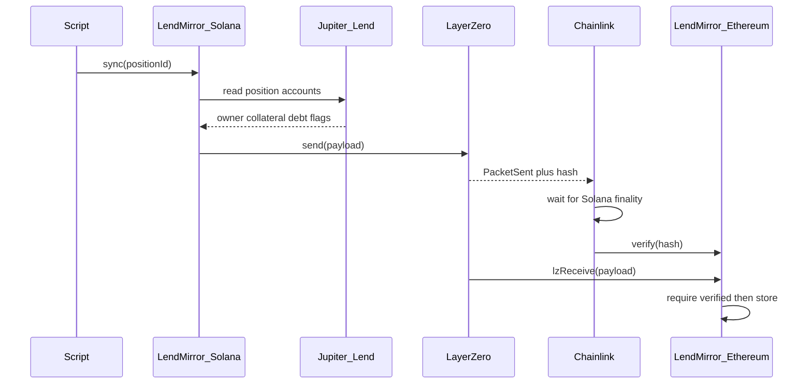

# LendMirror — implementation plan

It copies a Jupiter Lend loan facts onto Ethereum. It does not move the loan. It does not move tokens.

Alternatives if the team prefers another name: `PositionRelay`, `JupEcho`.

## Goal

Take a Jupiter Lend borrow position on Solana and publish a snapshot to Ethereum mainnet so EVM apps can read:

- who owns it
- collateral amount
- debt amount
- whether it is liquidated
- when the snapshot was taken
- other details

Ethereum cannot read Solana. LendMirror sends the snapshot through LayerZero. Chainlink checks that this exact send happened on Solana. The Ethereum contract stores the snapshot only after that check.

## What this is not

- Not a token bridge
- Not moving the Jupiter loan itself
- Not letting Ethereum unlock money in v1
- Chainlink does not re-read Jupiter Lend. It checks the LayerZero packet.


## How it works




Step by step:

1. A user or script asks LendMirror on Solana to sync one position.
2. The Solana program reads that position from Jupiter Lend accounts (not from our server).
3. It packs the fields into a payload and calls LayerZero `send`.
4. Solana records `PacketSent` plus a hash of the payload.
5. Chainlink machines watch Solana, wait until the block is final, and check the hash.
6. When enough of them agree, they call `verify` on Ethereum.
7. LayerZero then delivers the payload to our Ethereum contract (`lzReceive`).
8. The contract stores the latest snapshot. Other EVM apps read it.


## Trust model


| Question                                    | Answer                                                                                                       |
| ------------------------------------------- | ------------------------------------------------------------------------------------------------------------ |
| Can a stranger invent a packet on Ethereum? | No. `lzReceive` only runs after Chainlink (and any other required checkers) verify the hash.                 |
| Can someone change bytes in transit?        | No. The hash would no longer match.                                                                          |
| Can the numbers be wrong?                   | Yes, if our Solana program reads the wrong accounts or packs the wrong fields. That is our job to get right. |
| Does Chainlink check Jupiter Lend?          | No. It checks that this LayerZero send happened on Solana.                                                   |


So: **Jupiter Lend is the source of the numbers. Our Solana program is the packer. Chainlink is the witness of the send.**

## What we build vs what we use

**We build**

1. **Solana program** (`programs/lendmirror`) — LayerZero OApp. Instruction: `sync`. Reads Jupiter position accounts. Encodes payload. Calls LayerZero send.
2. **Ethereum contract** (`LendMirror.sol`) — LayerZero OApp. `lzReceive` decodes payload and writes `positions[positionId]`.
3. **Shared payload codec** — same field order and types on both chains.
4. **Sync script** — builds the Solana `sync` transaction for one position. v1 is manual. A bot can come later.
5. **LayerZero config** — peer addresses, Ethereum as destination, Chainlink as a required checker (DVN).

**We do not build**

LayerZero, Chainlink watchers, Jupiter Lend, price oracles.

**Starter code to copy**

- LayerZero Solana OApp example: devtools/examples/oapp-solana
- LayerZero EVM OApp docs and `OApp` base contract
- Jupiter position shape: GET /borrow/positions and on-chain reads via @jup-ag/lend-read

---


## Testnet: addresses (live now)

Path: **Solana Devnet** (LayerZero eid `40168`) → **Ethereum Sepolia** (eid `40161`).

LayerZero’s env name `RPC_URL_SOLANA_TESTNET` is Devnet for us. The chain is chosen by `--eid` / `--network`, not by that name.


| What                                           | Address                                        | Explorer                                                                                                 |
| ---------------------------------------------- | ---------------------------------------------- | -------------------------------------------------------------------------------------------------------- |
| Solana wallet (admin, fee payer)               | `F944CXcWkDmQZ1tyBZcBB4riMSoaBq4sMQM5rz1MK8ad` | [Solscan Devnet](https://solscan.io/account/F944CXcWkDmQZ1tyBZcBB4riMSoaBq4sMQM5rz1MK8ad?cluster=devnet) |
| LendMirror **program id** (code)               | `H84BoBhYfCsLofgrAwQWt9YmFZRPKLkNznzfmeJS1xj1` | [Solscan Devnet](https://solscan.io/account/H84BoBhYfCsLofgrAwQWt9YmFZRPKLkNznzfmeJS1xj1?cluster=devnet) |
| LendMirror **Store** (OApp / LayerZero sender) | `9GcKzB7pbz7yvpFzAhV1zPiKDgrSWQyoeXzGaoZZq5L1` | [Solscan Devnet](https://solscan.io/account/9GcKzB7pbz7yvpFzAhV1zPiKDgrSWQyoeXzGaoZZq5L1?cluster=devnet) |
| LayerZero Endpoint (Solana Devnet)             | `76y77prsiCMvXMjuoZ5VRrhG5qYBrUMYTE5WgHqgjEn6` | [Solscan Devnet](https://solscan.io/account/76y77prsiCMvXMjuoZ5VRrhG5qYBrUMYTE5WgHqgjEn6?cluster=devnet) |
| Ethereum wallet (Sepolia deployer)             | `0x9Dee2100Cb47734A7a629Db0a1B061Df865a9c87`   | [Etherscan Sepolia](https://sepolia.etherscan.io/address/0x9Dee2100Cb47734A7a629Db0a1B061Df865a9c87)     |
| **LendMirror.sol**                             | `0xdAAE65Df8B96e9eE45eb756441B7942e5E128924`   | [Etherscan Sepolia](https://sepolia.etherscan.io/address/0xdAAE65Df8B96e9eE45eb756441B7942e5E128924)     |
| LayerZero Endpoint (Sepolia)                   | `0x6EDCE65403992e310A62460808c4b910D972f10f`   | [Etherscan Sepolia](https://sepolia.etherscan.io/address/0x6EDCE65403992e310A62460808c4b910D972f10f)     |


Local cheat sheet: `deployments/solana-testnet/OApp.json`. Ethereum `setPeer` for Solana uses the **Store**, not the program id.

Proven send (`hello from lendmirror`):

- Solana: [43bwH7vg…](https://solscan.io/tx/43bwH7vgYituvKR5D3Jrg42n7QwkJ1ptcfByTNWEDLeda8bgEMjhweQgdSsWtBuzuo9ToqvBcpMrPnpgTfphju8u?cluster=devnet)
- LayerZero Scan: [testnet.layerzeroscan.com/tx/43bwH7vg…](https://testnet.layerzeroscan.com/tx/43bwH7vgYituvKR5D3Jrg42n7QwkJ1ptcfByTNWEDLeda8bgEMjhweQgdSsWtBuzuo9ToqvBcpMrPnpgTfphju8u)
- Ethereum Sepolia received: [https://sepolia.etherscan.io/address/0xdAAE65Df8B96e9eE45eb756441B7942e5E128924#readCustomContract](https://sepolia.etherscan.io/address/0xdAAE65Df8B96e9eE45eb756441B7942e5E128924#readCustomContract) (Add ABI if required to use the read calls)


## Testnet: first-time setup

1. **Node 18** (`nvm use`). Hardhat 2.29 warns it wants 20+. Ignore that. Node **21** broke compile (uuid ESM).
2. **npm install.** If you see Hardhat `HH19` / “rename to .cjs”, do **not** rename files. This repo is already CommonJS. Pin `uuid` to `8.3.2` via `package.json` `overrides` (already there), then `rm -rf node_modules package-lock.json && npm install`. Confirm there is no nested `node_modules/rpc-websockets/node_modules/uuid`.
3. **Rust, Solana CLI, Anchor 0.31.1.** Create `~/.config/solana/id.json` if needed (`solana-keygen new`).
4. **Devnet SOL:**
  ```bash
   solana config set --url https://api.devnet.solana.com
   solana airdrop 2
   solana balance
  ```
5. **Sepolia ETH** on the wallet in `.env`. Faucet: [Google Cloud Sepolia faucet](https://cloud.google.com/application/web3/faucet/ethereum/sepolia).
6. Copy `.env.example` → `.env` (never commit `.env`):
  ```
   PRIVATE_KEY=<sepolia key>
   SOLANA_KEYPAIR_PATH=/Users/<you>/.config/solana/id.json
   RPC_URL_SOLANA_TESTNET=https://api.devnet.solana.com
  ```
   Leave `MNEMONIC` and `SOLANA_PRIVATE_KEY` empty if you use those two.
7. Do **not** use `anchor build -v` (Docker) here. Use plain `anchor build`.


## Testnet: deploy and send

Program id in source must match `target/deploy/lendmirror-keypair.json`. If you generate a new keypair, rebuild with that id first.

```bash
# 1. Build Solana
LENDMIRROR_ID=H84BoBhYfCsLofgrAwQWt9YmFZRPKLkNznzfmeJS1xj1 anchor build

# 2. Deploy program (code only — no Store yet)
solana program deploy \
  --program-id target/deploy/lendmirror-keypair.json \
  target/deploy/lendmirror.so \
  -u devnet \
  --with-compute-unit-price 100000

# 3. Create Store (OApp). First caller becomes admin.
nvm use 18
npx hardhat lz:oapp:solana:create --eid 40168 --program-id H84BoBhYfCsLofgrAwQWt9YmFZRPKLkNznzfmeJS1xj1

# 4. Deploy LendMirror.sol
npx hardhat lz:deploy --networks sepolia --ci

# 5. Solana send-library config, then peers on both chains
npx hardhat lz:oapp:solana:init-config --oapp-config layerzero.config.ts
npx hardhat lz:oapp:wire --oapp-config layerzero.config.ts --ci

# 6. Send a string. tasks/common/send.ts must set lzReceive gas
#    (Options.newOptions().addExecutorLzReceiveOption(100000, 0).toBytes()).
#    Empty options fail: ZeroLzReceiveGasProvided (6004).
npx hardhat lz:oapp:send --from-eid 40168 --dst-eid 40161 --message "hello from lendmirror"

# 7. Wait a few minutes, then read Ethereum `data()`
npx hardhat lz:oapp:evm:debug --network sepolia --contract-name LendMirror
```

Our program deploy: [54odkv1L…](https://solscan.io/tx/54odkv1LcM6CxsnLgCFp4aPxJmGow7pk72vGL7Soqmcyonka1qv89Dtuh4drDwfp11TSoamdGCz9chfakUputToQ?cluster=devnet).  
Our Store create: [2yFRYETr…](https://solscan.io/tx/2yFRYETrHqiwmR5MsweQkXpjqCSLsSHZtLVkPFS1f73jeeftDkKNnavbWziKCfNynXNhhz9GsVZNWhkkzTN6xW59?cluster=devnet).

**Wire:** first run had 10 ok txs and one expired Solana **receive** ULN config. A second `wire` crashed (`requiredDvns[0]` / `PublicKey`). Do **not** keep re-running wire. Send Solana → Sepolia already worked; v1 does not receive on Solana.

If Etherscan “Read Contract” has no names, the contract is unverified. The string is still on-chain. Use the debug task.

## Testnet: what each address is

- **Program id** — the deployed bytecode. Not the LayerZero sender.
- **Store** — PDA from `init_store`. Packet `sender`. Ethereum peer for eid `40168`.
- **Solana wallet** — pays fees; `admin` after create.
- **Ethereum wallet** — deployed the contract; LayerZero delegate.
- **Endpoints** — LayerZero’s programs/contracts, not ours.

