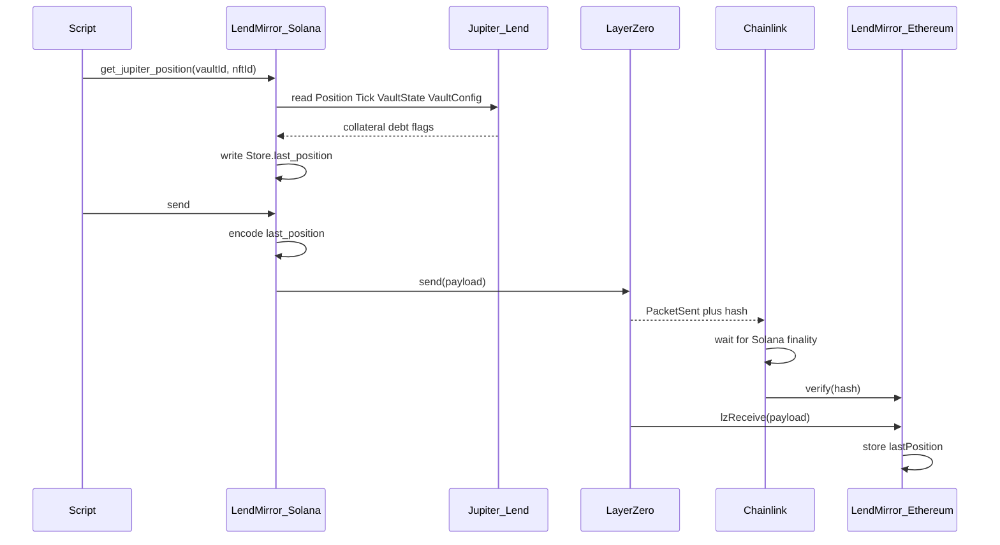

# LendMirror

Copy a Jupiter Lend borrow snapshot from Solana onto Ethereum. It does not move the loan. It does not move tokens.

- **Mainnet path:** Solana (eid `30168`) → Ethereum (eid `30101`)
- **Testnet path:** Solana Devnet (eid `40168`) → Ethereum Sepolia (eid `40161`)

## Goal

Publish a Jupiter Lend borrow position to Ethereum so EVM apps can read:

- position id (vault + nft)
- collateral and debt amounts
- whether it is liquidated
- when the snapshot was taken
- related token mints and exchange prices

Ethereum cannot read Solana. LendMirror sends the snapshot through LayerZero. DVNs check that this exact send happened on Solana. The Ethereum contract stores the snapshot only after that check.

## What this is not

- Not a token bridge
- Not moving the Jupiter loan itself
- Not letting Ethereum unlock money in v1
- DVNs do not re-read Jupiter Lend. They check the LayerZero packet.

## How it works



1. An allowed wallet calls `get_jupiter_position` with `vault_id` and `nft_id`.
2. The Solana program reads Jupiter Vaults accounts and writes `Store.last_position`.
3. An allowed wallet calls `send`. The program packs `last_position` itself (32-byte length header + 200-byte body). Callers cannot invent the payload.
4. LayerZero records the packet on Solana. DVNs verify, then Ethereum `lzReceive` writes `lastPosition()`.

## Who can do what

These are different keys. Do not mix them up.

| Role | What it is | What it can do |
|------|------------|----------------|
| **Program id** | The deployed Solana program | Holds the code. Not a wallet. Not the LayerZero sender. |
| **Store** | PDA created by `init_store` (seed `LendMirrorStore`) | LayerZero **sender** identity. Ethereum `setPeer` must use this address, not the program id. |
| **Admin** | Wallet set once at `init_store` (must sign create) | Create the Store. Update peers. Update the snapshot and send allowlists. Cannot transfer admin on-chain in v1. |
| **Snapshotter** | Wallet on the Store snapshot list (max 8) | Call `get_jupiter_position` to refresh `last_position`. |
| **Sender** | Wallet on the Store send list (max 8) | Call `send` to push the stored snapshot to Ethereum. Cannot choose custom bytes — payload is always `last_position`. |
| **Upgrade authority** | Key that deployed/upgraded the program (usually `lendmirror-keypair.json` until rotated) | Can upgrade program bytecode. Keep this key safe offline. |
| **Ethereum owner** | Wallet that called `initialize` on the proxy | Owns the EVM contract / LayerZero delegate. Sets peers. **Upgrades** the proxy (`upgradeToAndCall`). |
| **Fee payer** | Any wallet paying SOL/ETH for a tx | Pays rent and fees. For snapshot/send it must also be (or accompany) an allowed authority. |

**Rules in plain words**

- Only the **admin** creates the Store and changes who is allowed to snapshot or send.
- Only **snapshotters** can refresh the on-chain snapshot.
- Only **senders** can publish that snapshot to Ethereum.
- After create, admin is automatically on both lists. Admin can replace those lists later (up to 8 wallets each).
- Anyone can call `quote_send` to ask for a fee estimate. That does not send.

Admin tasks:

```bash
npx hardhat lz:oapp:solana:set-snapshotters --eid <EID> --keys <pubkey1>,<pubkey2>
npx hardhat lz:oapp:solana:set-senders --eid <EID> --keys <pubkey1>,<pubkey2>
```

## Addresses

Fill these in after each deploy.

### Devnet / Sepolia

| Item | Value |
|------|-------|
| Solana program id | |
| Solana Store (OApp) | |
| Solana admin | |
| Snapshotters | |
| Senders | |
| Ethereum LendMirror | |
| Ethereum owner | |
| LayerZero pathway | Devnet `40168` → Sepolia `40161` |

Local file after create: `deployments/solana-testnet/OApp.json`.

### Mainnet

| Item | Value |
|------|-------|
| Solana program id | |
| Solana Store (OApp) | |
| Solana admin | |
| Snapshotters | |
| Senders | |
| Ethereum LendMirror | |
| Ethereum owner | |
| LayerZero pathway | Solana `30168` → Ethereum `30101` |
| Solana verified build | |
| Etherscan | |

## What we build vs what we use

**We build**

1. **Solana program** — `init_store`, `set_peer_config`, `set_snapshotters`, `set_senders`, `quote_send`, `get_jupiter_position`, `send`
2. **Ethereum contract** — UUPS proxy + OApp receiver; `_lzReceive` decodes into `lastPosition()`. Peer = **proxy** address.
3. **Shared codec** — `PositionSnapshot` on Solana, `PositionSnapshotMsgCodec.sol` on Ethereum
4. **Scripts** — create Store, allowlists, snapshot, send-jupiter, evm debug, wire

**We do not build**

LayerZero, DVNs, Jupiter Lend.

## Testnet: first-time setup

1. **Node 18** (`nvm use`). Hardhat 2.29 warns it wants 20+. Ignore that. Node **21** broke compile.
2. **npm install.** If you see Hardhat `HH19` / “rename to .cjs”, do **not** rename files. Pin `uuid` to `8.3.2` via `package.json` `overrides` (already there).
3. **Rust, Solana CLI, Anchor 0.31.1.** Create `~/.config/solana/id.json` if needed.
4. **Devnet SOL** and **Sepolia ETH** on the wallets in `.env`.
5. Copy `.env.example` → `.env`:
   ```
   PRIVATE_KEY=<sepolia key>
   SOLANA_KEYPAIR_PATH=/Users/<you>/.config/solana/id.json
   RPC_URL_SOLANA_TESTNET=<helius or other Devnet RPC>
   ```
6. Prefer a custom Devnet RPC. Public `api.devnet.solana.com` often drops program write txs.

## Testnet: deploy and send

Program id must match `target/deploy/lendmirror-keypair.json`. If you generate a new keypair, rebuild with that id first.

**Store layout includes allowlists.** After upgrading the program you must create a **new** Store (same seed fails if the old Store still exists — use a new program id, or close/recreate).

```bash
# 1. Build Solana (smaller binary)
LENDMIRROR_ID=<pubkey from target/deploy/lendmirror-keypair.json> \
  anchor build -- --features no-log-ix-name

# 2. Deploy / upgrade. Prefer --use-rpc. Do not add -u devnet on top of a custom RPC.
solana program deploy \
  --program-id target/deploy/lendmirror-keypair.json \
  target/deploy/lendmirror.so \
  --use-rpc \
  --with-compute-unit-price 100000 \
  --max-sign-attempts 100

# 3. Create Store (OApp). eid 40168 picks Devnet Jupiter Vaults.
#    The wallet that signs becomes admin and is seeded onto both allowlists.
nvm use 18
npx hardhat lz:oapp:solana:create --eid 40168 --program-id <same pubkey>

# 4. Deploy LendMirror.sol
npx hardhat lz:deploy --networks sepolia --ci

# 5. First time: Solana libraries + DVNs
npx hardhat lz:oapp:solana:init-config --oapp-config layerzero.config.ts
npx hardhat lz:oapp:wire --oapp-config layerzero.config.ts --ci
# If wire dies on requiredDvns / PublicKey after a new EVM deploy, set peers only:
npx hardhat lz:oapp:solana:set-peer --eid 40168 --dst-eid 40161
npx hardhat lz:oapp:evm:set-peer --network sepolia --src-eid 40168
npx hardhat lz:oapp:solana:get-peer --eid 40168 --dst-eid 40161

# 6. Snapshot a Devnet Jupiter position, then send to Sepolia
#    Wallet must be on the snapshotters / senders lists (admin is by default).
npx hardhat lz:oapp:solana:get-jupiter-position --eid 40168 --vault-id 1 --nft-id 29
npx hardhat lz:oapp:solana:send-jupiter --from-eid 40168 --dst-eid 40161

# 7. Wait a few minutes, then read lastPosition
npx hardhat lz:oapp:evm:debug --network sepolia
```

Etherscan has no `lastPosition` button until the source is verified. To read in the UI: **Contract** → **Add Custom ABI** → paste the `lastPosition` ABI from `deployments/sepolia/LendMirror.json` → **Read Custom**. LayerZero receive shows under **Internal Txns**.

Do **not** keep re-running `wire` after peers are set.

## Publish IDL (Devnet / Mainnet)

After program deploy, publish the IDL so explorers can decode instructions. Do both uploads below.

`program_id_from_env!` makes Anchor write a junk `address` into `target/idl/lendmirror.json`. Fix it before any upload:

```bash
export LENDMIRROR_ID=<your program id>
# Same RPC you use for deploy (Helius, etc.)
export RPC_URL_SOLANA_TESTNET=<your solana rpc>

python3 - <<'PY'
import json, os
p = "target/idl/lendmirror.json"
d = json.load(open(p))
d["address"] = os.environ["LENDMIRROR_ID"]
json.dump(d, open(p, "w"), indent=2)
print(d["address"])
PY
```

### Anchor IDL (classic)

```bash
# First time
anchor idl init $LENDMIRROR_ID \
  -f target/idl/lendmirror.json \
  --provider.cluster "$RPC_URL_SOLANA_TESTNET" \
  --provider.wallet "$SOLANA_KEYPAIR_PATH"

# Later updates (after rebuild)
anchor idl upgrade $LENDMIRROR_ID \
  -f target/idl/lendmirror.json \
  --provider.cluster "$RPC_URL_SOLANA_TESTNET" \
  --provider.wallet "$SOLANA_KEYPAIR_PATH"

# Confirm (use the same RPC you care about)
anchor idl fetch $LENDMIRROR_ID --provider.cluster "$RPC_URL_SOLANA_TESTNET" \
  | python3 -c "import sys,json; print(json.load(sys.stdin)['address'])"
```

To wipe and re-init: `anchor idl close $LENDMIRROR_ID --provider.cluster "$RPC_URL_SOLANA_TESTNET" --provider.wallet "$SOLANA_KEYPAIR_PATH"`, then `idl init` again.

### Program Metadata IDL (Solscan / Explorer Program IDL tab)

Needs **Node ≥ 20** (not the Node 18 Hardhat shell):

```bash
nvm use 20
mkdir -p /tmp/pmp && cd /tmp/pmp
npm init -y
npm install @solana-program/program-metadata@latest @solana/kit

cd /path/to/lendmirror
node /tmp/pmp/node_modules/@solana-program/program-metadata/bin/cli.cjs write idl \
  $LENDMIRROR_ID \
  ./target/idl/lendmirror.json \
  --keypair "$SOLANA_KEYPAIR_PATH" \
  --rpc "$RPC_URL_SOLANA_TESTNET"
```

If Explorer still looks empty on default Devnet, set its cluster to your **custom RPC** — public `api.devnet.solana.com` can lag behind Helius. Then open the program page again.

Switch back with `nvm use 18` before Hardhat tasks.

### Verified bytecode badge (OtterSec / `solana-verify`)

This is separate from the IDL. Explorers show a verified badge when the on-chain `.so` matches a public Git commit.

1. Install (Docker required for the reproducible build):
   ```bash
   cargo install solana-verify --locked
   ```
2. Build with the **exact** program id you deployed (Devnet example):
   ```bash
   LENDMIRROR_ID=GQDxkWJhMGppaXExXBC8hGWmfaUv9igo4PKdaLyc53T1 \
     anchor build -- --features no-log-ix-name
   ```
   If the on-chain binary does not match this commit, upgrade Devnet from that `.so` first.
3. Push the commit to a **public** GitHub repo, then:
   ```bash
   solana-verify verify-from-repo -ud \
     --program-id GQDxkWJhMGppaXExXBC8hGWmfaUv9igo4PKdaLyc53T1 \
     https://github.com/avyactjain/lendmirror \
     --commit-hash <SHA>

   solana-verify remote submit-job \
     --program-id GQDxkWJhMGppaXExXBC8hGWmfaUv9igo4PKdaLyc53T1 \
     --uploader <UPGRADE_AUTHORITY_PUBKEY>
   ```
4. Status: https://verify.osec.io/status/GQDxkWJhMGppaXExXBC8hGWmfaUv9igo4PKdaLyc53T1  
   When green, Solscan / Explorer show the verified badge (use a custom Devnet RPC if the public one lags).

### Authority tests

```bash
cargo test -p lendmirror          # Store allowlist unit tests
LENDMIRROR_ID=GQDxkWJhMGppaXExXBC8hGWmfaUv9igo4PKdaLyc53T1 anchor test   # instruction auth
```

## Mainnet

Mainnet deploy commands and LayerZero mainnet config are being added. Until then, use the same flow as testnet with:

- Solana eid `30168`, Ethereum eid `30101`
- A **new** program keypair (do not reuse Devnet)
- Jupiter Vaults mainnet program `jupr81YtYssSyPt8jbnGuiWon5f6x9TcDEFxYe3Bdzi` (selected automatically when eid is mainnet)
- Separate admin / snapshotter / sender wallets as needed

Fill the **Mainnet** address table above after deploy.
