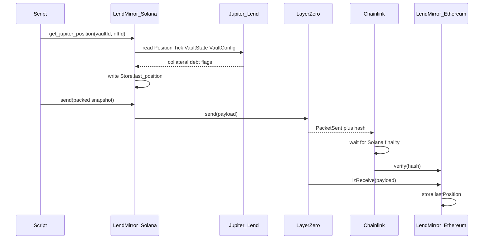

# LendMirror

Copy a Jupiter Lend borrow snapshot from Solana onto Ethereum. It does not move the loan. It does not move tokens.

Path (testnet): Solana Devnet (eid `40168`) → Ethereum Sepolia (eid `40161`).

## Goal

Publish a Jupiter Lend borrow position to Ethereum so EVM apps can read:

- position id (vault + nft)
- collateral and debt amounts
- whether it is liquidated
- when the snapshot was taken
- related token mints and exchange prices

Ethereum cannot read Solana. LendMirror sends the snapshot through LayerZero. DVNs (e.g. Chainlink) check that this exact send happened on Solana. The Ethereum contract stores the snapshot only after that check.

## What this is not

- Not a token bridge
- Not moving the Jupiter loan itself
- Not letting Ethereum unlock money in v1
- DVNs do not re-read Jupiter Lend. They check the LayerZero packet.

## How it works



1. A script calls `get_jupiter_position` with `vault_id` and `nft_id`.
2. The Solana program reads Jupiter Vaults accounts and writes `Store.last_position`.
3. The script calls `send` with the packed 200-byte snapshot (32-byte length header + body).
4. LayerZero records the packet on Solana. DVNs verify, then Ethereum `lzReceive` writes `lastPosition()`.

## What we build vs what we use

**We build**

1. **Solana program** — `init_store`, `set_peer_config`, `quote_send`, `get_jupiter_position`, `send`
2. **Ethereum contract** — OApp receiver; `_lzReceive` decodes `PositionSnapshotMsgCodec` into `lastPosition()`
3. **Shared codec** — `PositionSnapshot` on Solana, `PositionSnapshotMsgCodec.sol` on Ethereum
4. **Scripts** — create Store, snapshot, send-jupiter, evm debug, wire

**We do not build**

LayerZero, DVNs, Jupiter Lend.

## Testnet: first-time setup

1. **Node 18** (`nvm use`). Hardhat 2.29 warns it wants 20+. Ignore that. Node **21** broke compile.
2. **npm install.** If you see Hardhat `HH19` / “rename to .cjs”, do **not** rename files. Pin `uuid` to `8.3.2` via `package.json` `overrides` (already there).
3. **Rust, Solana CLI, Anchor 0.31.1.** Create `~/.config/solana/id.json` if needed.
4. **Devnet SOL** and **Sepolia ETH** on the wallets in `.env`.
5. Copy `.env.example` → `.env`:
   ```
   PRIVATE_KEY=<sepolia key>
   SOLANA_KEYPAIR_PATH=/Users/<you>/.config/solana/id.json
   RPC_URL_SOLANA_TESTNET=<helius or other Devnet RPC>
   ```
6. Prefer a custom Devnet RPC. Public `api.devnet.solana.com` often drops program write txs.

## Testnet: deploy and send

Program id must match `target/deploy/lendmirror-keypair.json`. If you generate a new keypair, rebuild with that id first.

**Store layout changed (no Pyth).** After upgrading the program you must create a **new** Store (same seed fails if the old Store still exists — use a new program id, or close/recreate). Sepolia must be redeployed too because `lastPrice` / string `send` were removed.

```bash
# 1. Build Solana
LENDMIRROR_ID=<pubkey from target/deploy/lendmirror-keypair.json> anchor build

# 2. Deploy / upgrade. Prefer --use-rpc. Do not add -u devnet on top of a custom RPC.
solana program deploy \
  --program-id target/deploy/lendmirror-keypair.json \
  target/deploy/lendmirror.so \
  --use-rpc \
  --with-compute-unit-price 100000 \
  --max-sign-attempts 100

# 3. Create Store (OApp). eid 40168 picks Devnet Jupiter Vaults.
nvm use 18
npx hardhat lz:oapp:solana:create --eid 40168 --program-id <same pubkey>

# 4. Deploy LendMirror.sol
npx hardhat lz:deploy --networks sepolia --ci

# 5. Solana send-library config, then peers
npx hardhat lz:oapp:solana:init-config --oapp-config layerzero.config.ts
npx hardhat lz:oapp:wire --oapp-config layerzero.config.ts --ci

# 6. Snapshot a Devnet Jupiter position, then send to Sepolia
npx hardhat lz:oapp:solana:get-jupiter-position --eid 40168 --vault-id 1 --nft-id 29
npx hardhat lz:oapp:solana:send-jupiter --from-eid 40168 --dst-eid 40161

# 7. Wait a few minutes, then read lastPosition
npx hardhat lz:oapp:evm:debug --network sepolia
```

Etherscan has no `lastPosition` button until the source is verified. To read in the UI: **Contract** → **Add Custom ABI** → paste the `lastPosition` ABI from `deployments/sepolia/LendMirror.json` → **Read Custom**. LayerZero receive shows under **Internal Txns**.

Do **not** keep re-running `wire` after peers are set.

## Testnet: what each address is

- **Program id** — deployed bytecode. Not the LayerZero sender.
- **Store** — PDA from `init_store` (seed `LendMirrorStore`). Packet `sender`. Ethereum peer for eid `40168`.
- **Solana wallet** — pays fees; `admin` after create.
- **Ethereum wallet** — deployed the contract; owner / LayerZero delegate.
- **Endpoints** — LayerZero’s programs/contracts, not ours.

Local cheat sheet: `deployments/solana-testnet/OApp.json`.
