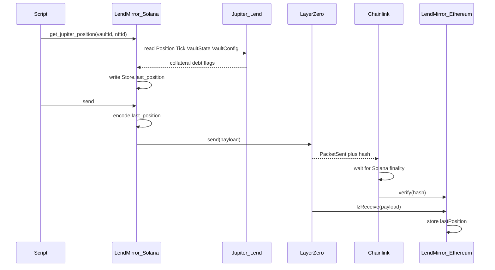

# LendMirror

Copy a Jupiter Lend borrow snapshot from Solana onto Ethereum. It does not move the loan. It does not move tokens.

- **Mainnet path:** Solana (eid `30168`) → Arbitrum (eid `30110`)
- **Testnet path:** Solana Devnet (eid `40168`) → Ethereum Sepolia (eid `40161`)

## Goal

Publish a Jupiter Lend borrow position to Ethereum so EVM apps can read:

- position id (vault + nft)
- collateral and debt amounts
- whether it is liquidated
- when the snapshot was taken
- related token mints and exchange prices

Ethereum cannot read Solana. LendMirror sends the snapshot through LayerZero. DVNs check that this exact send happened on Solana. The Ethereum contract stores the snapshot only after that check.

## What this is not

- Not a token bridge
- Not moving the Jupiter loan itself
- Not letting Ethereum unlock money in v1
- DVNs do not re-read Jupiter Lend. They check the LayerZero packet.

## How it works



1. An allowed wallet calls `get_jupiter_position` with `vault_id` and `nft_id`.
2. The Solana program reads Jupiter Vaults accounts and writes `Store.last_position`.
3. An allowed wallet calls `send`. The program packs `last_position` itself (32-byte length header + 200-byte body). Callers cannot invent the payload.
4. LayerZero records the packet on Solana. DVNs verify, then Ethereum `lzReceive` writes `lastPosition()`.

## Who can do what

These are different keys. Do not mix them up.

| Role | What it is | What it can do |
|------|------------|----------------|
| **Program id** | The deployed Solana program | Holds the code. Not a wallet. Not the LayerZero sender. |
| **Store** | PDA created by `init_store` (seed `LendMirrorStore`) | LayerZero **sender** identity. Ethereum `setPeer` must use this address, not the program id. |
| **Admin** | Wallet written once at `init_store` (`params.admin`) | Update peers. Update the snapshot and send allowlists. Cannot transfer admin on-chain in v1. Does **not** create the Store. |
| **Snapshotter** | Wallet on the Store snapshot list (max 8) | Call `get_jupiter_position` to refresh `last_position`. |
| **Sender** | Wallet on the Store send list (max 8) | Call `send` to push the stored snapshot to Ethereum. Cannot choose custom bytes — payload is always `last_position`. |
| **Upgrade authority** | Key that deployed/upgraded the program (usually `lendmirror-keypair.json` until rotated) | Only key that can call `init_store` (create the Store). Can upgrade bytecode. Keep this key safe offline. |
| **Ethereum owner** | Wallet that called `initialize` on the proxy | Owns the EVM contract / LayerZero delegate. Sets peers. **Upgrades** the proxy (`upgradeToAndCall`). |
| **Fee payer** | Any wallet paying SOL/ETH for a tx | Pays rent and fees. For snapshot/send it must also be (or accompany) an allowed authority. |

**Rules in plain words**

- Only the **upgrade authority** can call `init_store`. A random wallet cannot front-run create and become admin. There is no `close_store`; a stolen Store would burn this program id.
- `params.admin` is who the upgrade authority *names* as Store admin. It is not the gate. The create script uses the same wallet for both.
- Only the **admin** changes who is allowed to snapshot or send.
- Only **snapshotters** can refresh the on-chain snapshot.
- Only **senders** can publish that snapshot to Ethereum.
- After create, admin is automatically on both lists. Admin can replace those lists later (up to 8 wallets each).
- Anyone can call `quote_send` to ask for a fee estimate. That does not send.

Admin tasks:

```bash
npx hardhat lz:oapp:solana:set-snapshotters --eid <EID> --keys <pubkey1>,<pubkey2>
npx hardhat lz:oapp:solana:set-senders --eid <EID> --keys <pubkey1>,<pubkey2>
```

## Addresses

### Devnet / Sepolia

| Item | Value |
|------|-------|
| Solana program id | `GQDxkWJhMGppaXExXBC8hGWmfaUv9igo4PKdaLyc53T1` |
| Solana Store (OApp) | `6KJuMfT3qpD8AFWegQvWRtE41qT6BJsSJmkSmqXqPn7a` |
| Solana admin | `AF1uGS22J8KUQdM41x3x6FYg4uhgS8sdcHrNPVc3MDPo` |
| Snapshotters | `AF1uGS22J8KUQdM41x3x6FYg4uhgS8sdcHrNPVc3MDPo` |
| Senders | `AF1uGS22J8KUQdM41x3x6FYg4uhgS8sdcHrNPVc3MDPo` |
| Sepolia LendMirror (proxy) | `0xbE4c9C5DB8E2747C545B2591B3937764f1A2d514` |
| Sepolia implementation | `0xE7A7E4A8555Ca2428421626AE1720d570949D59c` |
| Sepolia owner | `0x9Dee2100Cb47734A7a629Db0a1B061Df865a9c87` |
| LayerZero pathway | Devnet `40168` → Sepolia `40161` |

Local files: `deployments/solana-testnet/OApp.json`, `deployments/sepolia/LendMirror.json`. Etherscan: https://sepolia.etherscan.io/address/0xbE4c9C5DB8E2747C545B2591B3937764f1A2d514

### Mainnet

| Item | Value |
|------|-------|
| Solana program id | `9oySM9Jo4ZEXFcWYFbuPK1FeqwrDr6wmnAmenAybzHqQ` |
| Solana Store (OApp) | `BLoEaf2L5rZvEwZuVfFjAabHW4woM9Mr1XknBQCZkyf4` |
| Solana admin | `B8HnbEgetyiAdvkbgZR7LsChh93KR3jWuSw6xSQxt1hL` |
| Snapshotters | `B8HnbEgetyiAdvkbgZR7LsChh93KR3jWuSw6xSQxt1hL` |
| Senders | `B8HnbEgetyiAdvkbgZR7LsChh93KR3jWuSw6xSQxt1hL` |
| Arbitrum LendMirror (proxy) | `0xb42E98c712B5CAf1e55dB8106262077515879EA2` |
| Arbitrum implementation | `0xdAAE65Df8B96e9eE45eb756441B7942e5E128924` |
| Arbitrum owner | `0x9Dee2100Cb47734A7a629Db0a1B061Df865a9c87` |
| LayerZero pathway | Solana `30168` → Arbitrum `30110` |
| Solana verified build | |
| Arbiscan | https://arbiscan.io/address/0xb42E98c712B5CAf1e55dB8106262077515879EA2 |

Local files: `deployments/solana-mainnet/OApp.json`, `deployments/arbitrum/LendMirror.json`. The proxy is the LayerZero peer, not the implementation.

## What we build vs what we use

**We build**

1. **Solana program** — `init_store`, `set_peer_config`, `set_snapshotters`, `set_senders`, `quote_send`, `get_jupiter_position`, `send`
2. **Ethereum contract** — UUPS proxy + OApp receiver; `_lzReceive` decodes into `lastPosition()`. Peer = **proxy** address.
3. **Shared codec** — `PositionSnapshot` on Solana, `PositionSnapshotMsgCodec.sol` on Ethereum
4. **Scripts** — create Store, allowlists, set-peer, snapshot, send, evm debug

**We do not build**

LayerZero, DVNs, Jupiter Lend.

## Tools

Hardhat tasks need **Node 18** (`nvm use 18`). Node 21 breaks compile. Hardhat may warn it wants 20; ignore that.

Also: Rust, Solana CLI, Anchor **0.31.1**, `npm install`. If Hardhat prints `HH19` / “rename to .cjs”, do not rename files. `uuid` is already pinned in `package.json`.

`.env` (from `.env.example`):

| Variable | Used for |
|----------|----------|
| `PRIVATE_KEY` | EVM deploy / `set-peer` / owner txs. One key for every Hardhat network. |
| `SOLANA_KEYPAIR_PATH` | Solana fee payer, admin at create, upgrade authority if that wallet deployed the program. |
| `RPC_URL_SOLANA_TESTNET` | Devnet (eid `40168`). Use a paid RPC. Public `api.devnet.solana.com` often drops writes. |
| `RPC_URL_SOLANA` | Mainnet (eid `30168`). |
| `RPC_URL_SEPOLIA` / `RPC_URL_ARBITRUM` | EVM RPCs. |

Two Solana files: **`lendmirror-keypair.json`** is the **program id**. **`SOLANA_KEYPAIR_PATH`** is the **wallet**. Do not mix them.

`layerzero.config.ts` in this repo is the **mainnet** path (Solana `30168` → Arbitrum `30110`). `lz:oapp:wire` crashes (DVN `PublicKey` bug). Do not use it. Peers are set with `set-peer`. `init-config` follows that same config file — only run it when the file matches the path you mean.

## Already deployed?

Addresses are in the table above. To send again you only need snapshot + send + debug. Do not create a second Store on the same program id (`init_store` fails if it exists).

## Testnet: first deploy (Devnet → Sepolia)

Default `declare_id!` is the **mainnet** program id. For Devnet you must set `LENDMIRROR_ID`.

```bash
# 0. CLI on Devnet
solana config set --url "$RPC_URL_SOLANA_TESTNET"
solana address
solana balance

# 1. Build. Pubkey must match the keypair you will pass to --program-id.
export LENDMIRROR_ID=$(solana-keygen pubkey target/deploy/lendmirror-keypair.json)
LENDMIRROR_ID=$LENDMIRROR_ID anchor build -- --features no-log-ix-name

# 2. Upload the .so. --use-rpc uses whatever solana config --url is.
#    --with-compute-unit-price is optional (helps when txs stall).
solana program deploy \
  --program-id target/deploy/lendmirror-keypair.json \
  target/deploy/lendmirror.so \
  --use-rpc

# 3. Create the Store once. Signer must be the program upgrade authority
#    (the key that deployed the .so). That wallet is named admin and put on
#    both allowlists. eid 40168 selects Devnet Jupiter Vaults.
#    Writes deployments/solana-testnet/OApp.json
nvm use 18
npx hardhat lz:oapp:solana:create --eid 40168 --program-id $LENDMIRROR_ID

# 4. EVM receiver (UUPS). Printed address is the proxy. That is the Solana peer.
#    Do not re-run this unless you want a new proxy (then you must set-peer again).
npx hardhat lz:deploy --networks sepolia --ci

# 5. Tell each side who the other is. Do not run wire.
npx hardhat lz:oapp:solana:set-peer --eid 40168 --dst-eid 40161 --evm-network sepolia
npx hardhat lz:oapp:evm:set-peer --network sepolia --src-eid 40168
npx hardhat lz:oapp:solana:get-peer --eid 40168 --dst-eid 40161
# get-peer should print the Sepolia proxy.

# 6. Snapshot then send. vault-id / nft-id must exist on Devnet Jupiter.
#    Wallet must be on the allowlists (admin is, after create).
npx hardhat lz:oapp:solana:get-jupiter-position --eid 40168 --vault-id 1 --nft-id 29
npx hardhat lz:oapp:solana:send-jupiter --from-eid 40168 --dst-eid 40161

# 7. Wait a few minutes, then read.
npx hardhat lz:oapp:evm:debug --network sepolia
```

On Etherscan/Arbiscan, `lastPosition` is on **Read as Proxy** after you verify implementation + proxy source. There is no Custom ABI on the new UI. Until then, use step 7.

A **new** Store also needs LayerZero send-library accounts for the destination eid. `npx hardhat lz:oapp:solana:init-config --oapp-config layerzero.config.ts` creates them. That command uses `layerzero.config.ts` as-is (mainnet today). For a new Devnet Store, point that file at Devnet `40168` + Sepolia `40161`, run `init-config` once, then restore the file. The Store in the address table already has this.

If you change the Store account layout, the old Store cannot be reused. Deploy a new program id.

## Optional: IDL

Not needed to send. Only so Solscan can name instructions.

After `anchor build`, `target/idl/lendmirror.json` often has a junk `address`. Fix it, then upload:

```bash
python3 -c 'import json,os; p="target/idl/lendmirror.json"; d=json.load(open(p)); d["address"]=os.environ["LENDMIRROR_ID"]; json.dump(d, open(p,"w"), indent=2)'

anchor idl init $LENDMIRROR_ID -f target/idl/lendmirror.json \
  --provider.cluster "$RPC_URL_SOLANA_TESTNET" \
  --provider.wallet "$SOLANA_KEYPAIR_PATH"
```

Later rebuilds: `anchor idl upgrade` with the same flags. Mainnet: use `$RPC_URL_SOLANA` instead.

## Optional: Solana verified badge

Separate from the IDL. OtterSec rebuilds your **public** Git commit in Linux Docker and compares hashes.

A Mac `anchor build` hash will **not** match Docker. To get a badge you must either deploy the Docker `.so`, or use `--remote` (OtterSec’s machines). Local Docker on Apple Silicon is slow (amd64 emulation) and re-downloads tools every run.

`cargo install solana-verify --locked` may fail on older Cargo. `0.4.11` works. That version has no `--env`; the program id in `declare_id!` (or `LENDMIRROR_ID` in the repo) must be the one on-chain. Pass `-- --features no-log-ix-name`.

```bash
solana-verify -u "$RPC_URL_SOLANA" verify-from-repo --remote \
  --program-id 9oySM9Jo4ZEXFcWYFbuPK1FeqwrDr6wmnAmenAybzHqQ \
  --library-name lendmirror \
  --commit-hash <SHA on GitHub> \
  https://github.com/avyactjain/lendmirror \
  -- --features no-log-ix-name
```

Status: https://verify.osec.io/status/9oySM9Jo4ZEXFcWYFbuPK1FeqwrDr6wmnAmenAybzHqQ  
Devnet program: swap the id for `GQDxk…` and `-u "$RPC_URL_SOLANA_TESTNET"`.

## Local tests

```bash
cargo test -p lendmirror
LENDMIRROR_ID=GQDxkWJhMGppaXExXBC8hGWmfaUv9igo4PKdaLyc53T1 anchor test
```

## Mainnet

Live path is Solana `30168` → Arbitrum `30110`. Addresses are in the table above. Jupiter Vaults is selected automatically when eid is `30168`. Use a **mainnet** program keypair, not the Devnet one.

`declare_id!` already defaults to the live mainnet program id. Do not export the Devnet `LENDMIRROR_ID` when building for mainnet.

To send again (Store and peers already exist):

```bash
nvm use 18
npx hardhat lz:oapp:solana:get-jupiter-position --eid 30168 --vault-id <id> --nft-id <id>
npx hardhat lz:oapp:solana:send-jupiter --from-eid 30168 --dst-eid 30110
npx hardhat lz:oapp:evm:debug --network arbitrum
```

First-time deploy is the same as testnet, with:

```bash
solana config set --url "$RPC_URL_SOLANA"
npx hardhat lz:oapp:solana:create --eid 30168 --program-id $LENDMIRROR_ID
npx hardhat lz:deploy --networks arbitrum --ci
npx hardhat lz:oapp:solana:init-config --oapp-config layerzero.config.ts
npx hardhat lz:oapp:solana:set-peer --eid 30168 --dst-eid 30110 --evm-network arbitrum
npx hardhat lz:oapp:evm:set-peer --network arbitrum --src-eid 30168
```

`init-config` is safe here because `layerzero.config.ts` is already the mainnet path. Still do not run `wire`. On Arbiscan use **Read as Proxy**.
