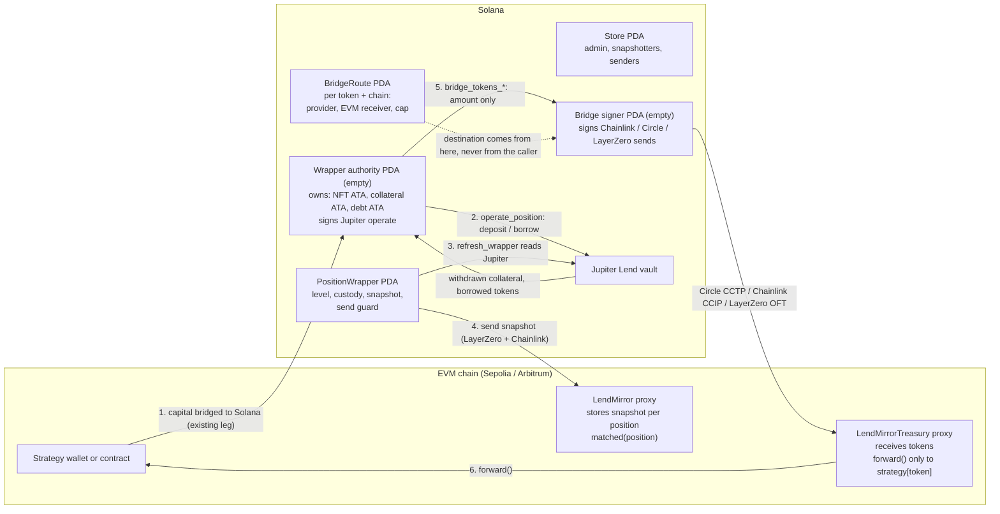

# LendMirror

LendMirror lets an EVM-side strategy run a Jupiter Lend borrow position that lives on Solana.

A Solana program **holds** the position NFT, **operates** the position (deposit, pay back, withdraw, borrow) within an access level the admin sets, **mirrors** the position's collateral and debt to an EVM chain over two independent messaging networks (LayerZero and Chainlink), and **bridges tokens** back to one fixed EVM contract. Money is either inside a program-owned account on Solana or on its way to that one EVM contract. No caller can point it anywhere else.

- **Testnet path (live):** Solana Devnet → Ethereum Sepolia.
- **Mainnet path:** Solana → Arbitrum. Not upgraded to this version yet (see Addresses).

Everything in this file is backed by code; file references are relative to the repo root. `programs/lendmirror/ARCHITECTURE.md` maps every source file and has a primer on Anchor for Rust developers new to Solana. `docs/what-changed.md` is the before/after story. `docs/bridge-providers.md` is the token-by-token bridge matrix.

---


## 1. The idea in one picture


```mermaid
flowchart LR
    subgraph EVM["EVM chain (Sepolia / Arbitrum)"]
        STRAT[Strategy wallet or contract]
        LM["LendMirror proxy<br/>stores snapshot per position<br/>matched(position)"]
        TR["LendMirrorTreasury proxy<br/>receives tokens<br/>forward() only to strategy[token]"]
    end
    subgraph SOL["Solana"]
        STORE["Store PDA<br/>admin, snapshotters, senders"]
        W["PositionWrapper PDA<br/>level, custody, snapshot,<br/>send guard"]
        AUTH["Wrapper authority PDA (empty)<br/>owns: NFT ATA, collateral ATA, debt ATA<br/>signs Jupiter operate"]
        BS["Bridge signer PDA (empty)<br/>signs Chainlink / Circle / LayerZero sends"]
        ROUTE["BridgeRoute PDA<br/>per token + chain:<br/>provider, EVM receiver, cap"]
        JUP["Jupiter Lend vault"]
    end
    STRAT -- "1. capital bridged to Solana (existing leg)" --> AUTH
    AUTH -- "2. operate_position: deposit / borrow" --> JUP
    JUP -- "withdrawn collateral, borrowed tokens" --> AUTH
    W -- "3. refresh_wrapper reads Jupiter" --> JUP
    W -- "4. send snapshot (LayerZero + Chainlink)" --> LM
    AUTH -- "5. bridge_tokens_*: amount only" --> BS
    ROUTE -. "destination comes from here, never from the caller" .-> BS
    BS -- "Circle CCTP / Chainlink CCIP / LayerZero OFT" --> TR
    TR -- "6. forward()" --> STRAT
```


**Money flow, in words.** Capital arrives in the wrapper authority's token account (step 1, handled outside this repo). The program deposits it as collateral (level 1) and borrows against it (level 2). Borrowed tokens land in the authority's own token account, never in a wallet. The position's numbers are mirrored to EVM so the strategy can watch its risk. When the strategy wants the borrowed tokens back on EVM, any allowed caller says "bridge X"; the program sends X to the EVM treasury, whose owner has fixed where it may go next.

---


## 2. What lives on chain


### Solana accounts

Every account is a PDA: an address derived from fixed seeds and this program's id, so there is exactly one of each kind per key.


Every seed lives in `src/seeds.rs` (Rust) and `lib/client/seeds.ts` (TypeScript), and every one ends in `V1`. The mainnet upgrade starts from empty state: each account below is created again under these seeds, so nothing the old program wrote can be read by mistake. Changing a layout later means a new seed (`V2`), never an edit.

| Account                        | Seeds                                              | Holds                                                                                                                                                                                                            | Source                                                               |
| ------------------------------ | -------------------------------------------------- | ---------------------------------------------------------------------------------------------------------------------------------------------------------------------------------------------------------------- | -------------------------------------------------------------------- |
| **Store**                      | `["LendMirrorStoreV1"]`                            | admin, LayerZero endpoint, Jupiter vaults program id, `snapshotters` (8 max), `senders` (8 max), legacy `last_position`                                                                                          | `src/state/store.rs`                                                 |
| **PeerConfig**                 | `["LendMirrorPeerV1", store, eid be]`                | the EVM `LendMirror` proxy address per LayerZero endpoint id, enforced options                                                                                                                                   | `src/state/peer_config.rs`                                           |
| **CcipRoute**                  | `["LendMirrorCcipRouteV1"]`                               | Chainlink router, fee quoter, RMN, LINK mint, destination selector, EVM receiver (20 bytes), gas limit for snapshot messages                                                                                     | `src/state/ccip_route.rs`                                            |
| **CCIP payer / bridge signer** | `["LendMirrorCcipPayerV1"]`, **no data**             | signs Chainlink sends and every token bridge; holds SOL for their fees; owns one token account per bridged mint                                                                                                  | `src/seeds.rs`                                                       |
| **PositionWrapper**            | `["LendMirrorPositionWrapperV1", vault_id le, nft_id le]`  | owner, vault/nft ids, `snapshot`, `version`, `level` (0..4), `custody`, `position_mint`, `last_sent_snapshot_time`, `send_count`, `authority_bump`, 64 reserved bytes                                            | `src/state/wrapper.rs`                                               |
| **Wrapper authority**          | `["LendMirrorWrapperAuthV1", wrapper]`, **no data**  | owns the position NFT account, the collateral token account, and the debt token account of that wrapper; is Jupiter's `signer` and `recipient`                                                                   | `src/state/wrapper.rs` (doc), `src/instructions/operate_position.rs` |
| **OnDemandStrategy**           | `["LendMirrorOnDemandV1", wrapper]`                  | up to 8 wallets allowed to act on one wrapper                                                                                                                                                                    | `src/state/wrapper.rs`                                               |
| **BridgeRoute**                | `["LendMirrorBridgeRouteV1", mint, dst_chain_id le]` | provider (1 Circle, 2 Chainlink, 3 LayerZero), provider program, provider aux (LayerZero escrow), EVM receiver (32 bytes), CCTP destination caller, domain/selector/eid, gas limit, enabled, per-transaction cap | `src/state/bridge_route.rs`                                          |
| **PositionSnapshotAccount**    | `["LendMirrorJupPositionV1", vault le, nft le]`                | legacy per-position snapshot written by `get_jupiter_position`                                                                                                                                                   | `src/state/jupiter_position.rs`                                      |


Why two empty PDAs? Solana's System program refuses to move lamports out of an account that holds data. Jupiter's `operate` signer and every bridge's `authority` must be able to pay fees or rent, so the signer is an empty PDA and the data lives next to it in the wrapper.

### The snapshot (`PositionSnapshot`, 225 bytes, big-endian)

`src/state/jupiter_position.rs::encode_body` and `contracts/libs/PositionSnapshotMsgCodec.sol` are byte-for-byte mirrors:


| Offset | Field                                                            | Meaning                                                                               |
| ------ | ---------------------------------------------------------------- | ------------------------------------------------------------------------------------- |
| 0      | position (32)                                                    | Jupiter Position account                                                              |
| 32     | vault_id (u16), nft_id (u32)                                     | which position                                                                        |
| 38     | position_mint, supply_token, borrow_token (32 each)              | NFT mint, collateral mint, debt mint                                                  |
| 134    | col_raw, debt_raw, dust_debt, net_debt (u64 each)                | **live** amounts after any liquidation branch walk; `net_debt = debt_raw - dust_debt` |
| 166    | tick (i32), tick_id (u32)                                        | live tick and the position's id inside it                                             |
| 174    | stored_col_raw, stored_debt_raw (u64), stored_tick (i32)         | what the Jupiter account still says (stale after liquidation)                         |
| 194    | is_supply_only, is_liquidated, is_fully_liquidated (1 byte each) | flags                                                                                 |
| 197    | branch_id (u32)                                                  | liquidation branch the walk ended on, 0 if none                                       |
| 201    | vault_supply_exchange_price, vault_borrow_exchange_price (u64)   | multiply raw amounts by these ÷ 1e12 to get token units                               |
| 217    | snapshot_time (i64)                                              | Solana clock at refresh; the send guard and the EVM stale rule both key on it         |


LayerZero carries a 32-byte length header plus the body (257 bytes, `src/msg_codec.rs`). Chainlink carries the bare body.

### EVM contracts


| Contract                            | Role                                                                                                                                                                                                                                                                                                                                                                                         | Source                                        |
| ----------------------------------- | -------------------------------------------------------------------------------------------------------------------------------------------------------------------------------------------------------------------------------------------------------------------------------------------------------------------------------------------------------------------------------------------- | --------------------------------------------- |
| **LendMirror** (UUPS proxy)         | `lzReceive` (LayerZero) and `ccipReceive` (Chainlink) each store their copy of the latest snapshot per position. `matched(position)` is true when both copies have equal hashes. A delivery older than the stored `snapshotTime` is acknowledged and dropped (`StaleDeliveryIgnored`), never reverted, so the two networks may arrive in any order. `positions()` lists every position seen. | `contracts/LendMirror.sol`                    |
| **PositionSnapshotMsgCodec**        | decodes the 225 bytes; `price()` applies the exchange prices                                                                                                                                                                                                                                                                                                                                 | `contracts/libs/PositionSnapshotMsgCodec.sol` |
| **LendMirrorTreasury** (UUPS proxy) | the fixed destination for bridged tokens. `claimCctp` finishes a Circle transfer with Circle's attestation. `ccipReceive` accepts Chainlink token deliveries from the allowed router, source chain, and Solana sender. `forward(token)` moves the whole balance to `strategy[token]`, which only the owner sets. No function sends to `msg.sender` or a caller-supplied address.             | `contracts/LendMirrorTreasury.sol`            |


---


## 3. Who can do what

Plain wording. "Admin" is the wallet named at `init_store`; "owner" of a wrapper is the snapshotter who created it.


| Who                                        | Can                                                                                                                                                                                                                            | Cannot                                                                                                                         |
| ------------------------------------------ | ------------------------------------------------------------------------------------------------------------------------------------------------------------------------------------------------------------------------------ | ------------------------------------------------------------------------------------------------------------------------------ |
| **Program upgrade authority** (deploy key) | create the Store once (`init_store`); upgrade the program                                                                                                                                                                      | be replaced on chain by anyone else                                                                                            |
| **Store admin**                            | set LayerZero peers; replace the snapshotter and sender lists; set the Chainlink snapshot route; set bridge routes (which bridge, which EVM address, cap); set any wrapper's level; return a position NFT to its wrapper owner | change the admin key (no instruction exists); move tokens anywhere except back to the wrapper owner via `release_position_nft` |
| **Snapshotter** (on `store.snapshotters`)  | wrap a position (becomes its owner); refresh any wrapper; legacy `get_jupiter_position`. A read-only role apart from the wrappers it created                                                                                   | send snapshots; operate or bridge on wrappers it does not own; set levels or routes                                            |
| **Sender / operator** (on `store.senders`) | send any wrapper's snapshot; bridge from any wrapper at level 1 or 2                                                                                                                                                           | refresh (needs snapshotter, owner, or OnDemand); operate                                                                       |
| **Wrapper owner**                          | attach an OnDemand list and set its callers; refresh, operate, bridge for that wrapper. The owner is first the snapshotter who created the wrapper, then the wallet that deposited the position NFT                            | raise their own level; get the NFT back without the admin; choose a bridge destination                                         |
| **Position NFT holder**                    | deposit the NFT into the wrapper (`deposit_position_nft`); they become the wrapper owner                                                                                                                                       | anything else until they own the wrapper                                                                                       |
| **OnDemand caller** (on a wrapper's list)  | refresh, send, operate, bridge for that one wrapper                                                                                                                                                                            | anything on other wrappers                                                                                                     |
| **Anyone**                                 | send tokens into a wrapper authority's token account (plain SPL transfer); on EVM: call `forward` and `claimCctp` (they only move funds along fixed paths)                                                                     | trigger any program instruction above                                                                                          |
| **EVM owner**                              | `LendMirror`: peers, Chainlink route, upgrade. `LendMirrorTreasury`: strategy per token, allowed Chainlink senders, Circle transmitter, upgrade                                                                                | receive tokens from the treasury unless set as a strategy                                                                      |
| **Level 0 wrapper**                        | be mirrored                                                                                                                                                                                                                    | operate, bridge                                                                                                                |
| **Level 1 wrapper**                        | deposit collateral, pay back debt (`new_col ≥ 0 && new_debt ≤ 0`, `src/state/wrapper.rs::level_allows`); bridge                                                                                                                | withdraw, borrow                                                                                                               |
| **Level 2 wrapper**                        | everything level 1 can, plus withdraw and borrow                                                                                                                                                                               | —                                                                                                                              |
| **Level 3 / 4 wrapper**                    | be stored, be mirrored                                                                                                                                                                                                         | operate, bridge (every amount is rejected until these levels are defined)                                                      |


Where the checks live: allowlist membership in `src/state/store.rs` and `src/state/wrapper.rs`; per-instruction rules in the `constraint =` lines of each `#[derive(Accounts)]` struct in `src/instructions/*.rs`.

---


## 4. Capabilities, end to end

Real numbers below are from the Devnet run of 2026-09-28 (wallet `AF1uGS22…`, Jupiter Devnet vault 1 / nft 29).

### A. Mirror one position to EVM

1. **Wrap.** A snapshotter runs `wrap_position { vault_id: 1, nft_id: 29 }`. The program creates the wrapper at level 0 with an empty snapshot and computes the authority bump. Nothing on Jupiter is touched or verified at this point.
2. **Refresh.** Owner, snapshotter, or OnDemand caller runs `refresh_wrapper`. The program checks the Jupiter accounts by PDA seeds and owner (`position`, `vault_state`, `vault_config`, `tick`), reads collateral and the tick, and if that tick was liquidated walks the liquidation branches passed as remaining accounts (`src/live_position.rs`) to compute what is really left. It stamps `snapshot_time` with the clock. Devnet result: `col_raw 10000000, debt_raw 12114962`.
3. **Send.** An OnDemand caller or a sender runs `send_position_snapshot_via_chainlink_and_lz { dst_eid: 40161, options, native_fee, ccip_fee_lamports }`. The program requires `snapshot_time > last_sent_snapshot_time` (else `SnapshotAlreadySent`), CPIs LayerZero's Endpoint with the Store as signer, tops up the bridge signer with `ccip_fee_lamports`, CPIs Chainlink's router with the bridge signer as signer, then records the send. Devnet: LayerZero fee 9,952,743 lamports, one transaction, both networks. A second send without a refresh failed with `SnapshotAlreadySent`.
4. **Read on EVM.** Sepolia stored both copies with hash `0xec817a58…` and `matched(position) == true`.

Why one transaction needs a lookup table: the send names 27 accounts plus LayerZero's, 1,652 bytes raw against Solana's 1,232-byte limit. `lz:oapp:solana:create-lookup-table` puts the fixed accounts in a table so each costs 1 byte instead of 32; every task references it (`tasks/solana/index.ts::getAddressLookupTables`).

### B. Mirror every position

`lz:oapp:solana:sync-all-positions` finds every `PositionWrapper` by account discriminator (`lib/client/lendmirror.ts::listWrappers`), refreshes each, and sends each unless the numbers did not change since the last send (`--force` overrides). One failing position does not stop the loop. The signer must be on `senders`. Devnet: one wrapper, refresh tx `jgVPww…`, send tx `33c9Cj…`.

### C. Hold the NFT and operate the position

1. **Custody.** The wallet holding the position NFT runs `deposit_position_nft`. It need not be the wallet that created the wrapper: the token program requires the holder's signature to move the NFT, and nothing else is required. The program derives the NFT mint from Jupiter's own seeds (`["position_mint", vault le, nft le]`), so only the mint of exactly this position is accepted, and transfers the single token from the holder's account to the authority's associated token account. `custody = true`, and the depositor becomes `wrapper.owner`, so the admin can only ever release the NFT back to them.
2. **Level.** The admin runs `set_wrapper_level 1`.
3. **Deposit.** Someone first sends collateral (e.g. wrapped SOL) to the authority's token account with a plain transfer. Then the owner or an OnDemand caller runs `operate_position { new_col: +300_000_000, new_debt: 0 }`. Before the CPI the program checks: custody is true; the level allows the signed amounts; the transfer type is a direct transfer and no Jupiter claim accounts are passed (a claim would park the payout where nothing here can spend it); `supply_token` and `borrow_token` equal the vault's mints; the three token accounts are the authority's associated token accounts. It then CPIs Jupiter `operate` with the authority PDA as `signer` **and** `recipient` (`src/instructions/operate_position.rs::jupiter_operate_metas`). Jupiter needs 35 accounts and its own extra accounts (oracle sources, branches, tick debt arrays), which the client resolves with Jupiter's SDK (`lib/client/jupiterOperate.ts`); the wallet runs Jupiter's setup instructions (init tick, init branch) in the same transaction.
4. **Borrow.** Admin sets level 2; `operate_position { new_col: 0, new_debt: +5_000_000 }` borrows 5 USDC into the authority's USDC account.
5. **Refresh** to see the new numbers in the snapshot.

Verified on a local fork of Jupiter mainnet (`npm run test:fork` with an Agave 4.2+ validator, see Tests): create position, custody, level 1 deposit through the CPI, level 1 borrow denied with `LevelDenied`, level 2 borrow with the USDC landing in the wrapper authority's account, refresh shows the collateral. Jupiter Devnet is an old build the Jupiter SDK cannot decode, so nothing runs there; the first live borrow is a small mainnet position after the mainnet upgrade.

`release_position_nft` (admin) moves the NFT back to the wrapper owner's associated token account; no other destination is possible.

### D. Bridge USDC to EVM through Circle

1. **Route.** Admin runs `set_bridge_route { mint: USDC, dst_chain_id: 11155111, provider: 1, provider_program: TokenMessengerMinterV2, receiver: treasury, destination_caller: treasury, domain_or_selector: 0, max_amount_per_tx }`.
2. **Bridge.** Any allowed caller with a level ≥ 1 wrapper runs `bridge_tokens_cctp { amount: 1_000_000, dst_chain_id: 11155111, max_fee: 0, min_finality_threshold: 2000 }`. There is no destination parameter. The program moves 1 USDC from the authority's account to the bridge signer's account, then CPIs Circle's `deposit_for_burn` with `mint_recipient = route.receiver` and `destination_caller = route.destination_caller`, signed by the bridge signer. Devnet tx `2SnABnY…`: authority 2 → 1 USDC, bridge signer 0.
3. **Attest.** Circle's sandbox API reported `status: complete` for the message about 15 minutes later (standard finality, no fee).
4. **Claim.** `lz:oapp:evm:treasury:claim-cctp --tx-hash 2SnABnY…` fetched the attestation and called `claimCctp` on the treasury, which called Circle's `receiveMessage`. Treasury balance: 1,000,000.
5. **Forward.** `lz:oapp:evm:treasury:forward --token <USDC>` sent the whole balance to `strategy[USDC]`. Treasury 0, strategy 1,000,000.


### E. Bridge a Chainlink-listed token (PST, or USDC)

Same shape with `provider: 2` and `bridge_tokens_ccip`: the program reuses the Chainlink router accounts of the snapshot path, appends the per-token accounts (user token account = bridge signer's, billing configs, pool program and PDAs, token admin registry, lookup table) as remaining accounts with `token_indexes = [0]`, sends an empty data payload with gas limit 0, and pays the fee in SOL from the bridge signer. Before the CPI the bridge signer approves the router's `fee_billing_signer` PDA for exactly `amount`; that PDA is what the router uses to pull the tokens into the pool. The treasury's `ccipReceive` checks router, source selector, and sender.

Verified on Devnet with Chainlink's test token CCIP-BnM (the only burn-mint token with a Devnet → Sepolia lane):

1. **Route.** `set-bridge-route --mint 3PjyGzj1jGVgHSKS4VR1Hr1memm63PmN8L9rtPDKwzZ6 --provider ccip` (receiver = treasury, selector 16015286601757825753).
2. **Bridge.** `bridge-tokens --vault-id 1 --nft-id 29 --mint 3Pjy… --amount 500000000`. Devnet tx `5zWd7upw…`: authority 0.5 → 0 BnM; the pool burned the tokens. CCIP message `0xa4ab447e…`, sender = bridge signer, receiver = treasury.
3. **Deliver.** Chainlink delivered to Sepolia about 80 seconds later (tx `0xfbedfc3f…`). Treasury 0.5 BnM.
4. **Forward.** `lz:oapp:evm:treasury:forward --token 0xFd57b4dd…` sent the whole balance to `strategy[BnM]`. Treasury 0, strategy 0.5.

### F. Bridge a LayerZero token (USDT0, USDai, sUSDai)

`provider: 3`, `provider_aux` = the token's OFT escrow account, `domain_or_selector` = LayerZero endpoint id. `bridge_tokens_oft` verifies that `oft_store` and `peer` are the PDAs LayerZero derives from that escrow and destination (`check_oft_pdas`), then CPIs the token's OFT program `send` with `to = route.receiver`, signed by the bridge signer, which also pays the LayerZero fee. The client quotes fee and arriving amount with LayerZero's OFT SDK. **Not tested on any network**: there is no LayerZero test token on Devnet, and the issuers' Solana program ids and escrows are still needed for the routes.

---


## 5. Safety rules (and where each is enforced)


| Rule                                                                 | Enforced by                                                                                                             |
| -------------------------------------------------------------------- | ----------------------------------------------------------------------------------------------------------------------- |
| A bridge caller supplies an amount, never a destination              | `BridgeTokensParams` has no address field; `receiver` is read from `BridgeRoute` in `src/instructions/bridge_tokens.rs` |
| Only the admin writes routes                                         | `SetBridgeRoute.admin: address = store.admin`                                                                           |
| Tokens leave only from PDA-owned associated token accounts           | `wrapper_ata` / `bridge_ata` constraints (`associated_token::authority = wrapper_authority` / `bridge_signer`)          |
| Jupiter can only pay out to the program                              | `recipient` and both recipient token accounts are the authority PDA and its ATAs in `jupiter_operate_metas`             |
| Level 1 can only lower risk                                          | `level_allows` in `src/state/wrapper.rs`; unit tests cover every sign combination and `i128::MIN`                       |
| Only the admin changes levels                                        | `SetWrapperLevel.admin: address = store.admin`                                                                          |
| A snapshot is sent once per refresh                                  | `PositionWrapper::can_send` / `record_send`; `SnapshotAlreadySent`                                                      |
| EVM never regresses to an older snapshot                             | `LendMirror._writeDelivery` stale check                                                                                 |
| Treasury pays out only to owner-set strategies                       | `LendMirrorTreasury.forward`                                                                                            |
| A LayerZero send cannot be pointed at another OFT deployment or lane | `check_oft_pdas` derives store and peer from the route's escrow and eid                                                 |
| Per-transaction bridge cap                                           | `params.amount <= bridge_route.max_amount_per_tx`                                                                       |
| Jupiter payouts cannot be parked in a claim account                  | `operate_position` rejects `transfer_type == Some(2)` and any claim account                                             |
| A LayerZero send is paid by its caller, with no caller options       | `fee_lamports >= native_fee` and `options.is_empty()` in `bridge_tokens_oft`; gas comes from the peer's enforced options |
| A route's receiver is an EVM address                                 | `set_bridge_route` requires the first 12 bytes to be zero, so CCIP, CCTP and OFT all read the same 20 bytes             |


Not enforced, on purpose: wrapping does not verify the Jupiter position exists (a wrapper for a nonexistent position simply cannot be refreshed and stays at level 0), and any allowed caller may bridge any amount up to the cap as often as they like (the destination is fixed, so this is a fee question, not a safety one).

---


## 6. Status


| Piece                                                                          | Status                                                                                                                                    |
| ------------------------------------------------------------------------------ | ----------------------------------------------------------------------------------------------------------------------------------------- |
| Live Jupiter read (ticks, liquidation branches)                                | Built; `crates/jup-tick-parity` and `npm run test:jup-live` compare against Jupiter's SDK                                                 |
| Snapshot send over LayerZero + Chainlink, once per refresh, newest wins on EVM | **Verified Devnet → Sepolia 2026-09-28**. **Verified mainnet → Arbitrum 2026-09-29** on vault 95 / nft 34 (a smart-collateral vault): refresh, send, both copies match. Fees: LayerZero 0.0012 SOL, Chainlink 0.0017 SOL |
| Sync every wrapped position                                                    | **Run on Devnet 2026-09-28**                                                                                                              |
| NFT custody, levels, Jupiter `operate` CPI                                     | Built; custody, level 1 deposit, the level gate, and the level 2 borrow proven on a warped Jupiter mainnet fork. **Mainnet 2026-09-29, vault 95 / nft 34:** a wallet without the NFT is refused (`AccountNotInitialized` on `source_nft_ata`); the NFT holder deposits and becomes owner (tx `4CRg9SrV…`); the admin releases it back to that owner (tx `3qZzuKPo…`, first run anywhere). `operate` not yet run on mainnet; it only builds Jupiter's plain `operate`, so smart vaults (`operate_dex`) are not supported |
| Token bridge, Circle CCTP (USDC)                                               | **Verified Devnet → Sepolia 2026-09-28**, end to end through the treasury. **Verified mainnet → Arbitrum 2026-09-30:** 1 USDC from wrapper 95/34 (bridged by the wrapper owner), claimed by the treasury, forwarded to the strategy `0x9Dee…` |
| Token bridge, Chainlink CCIP (PST, USDC)                                       | **Verified Devnet → Sepolia 2026-09-28** with CCIP-BnM, end to end through the treasury                                                   |
| Token bridge, LayerZero OFT (USDT0, USDai, sUSDai)                             | Built, unit-tested; **not tested on any network**                                                                                         |
| EVM treasury                                                                   | Deployed on Sepolia, used in the Devnet run                                                                                               |
| Mainnet                                                                        | Upgraded and wired 2026-09-29; LendMirror and treasury implementations verified on Arbiscan. See Addresses |


Tokens in scope, and only these: **USDC, USDT, USDai, sUSDai, PST**. Which bridge carries each, with mints and lanes, is in `docs/bridge-providers.md`.

Instructions (`src/lib.rs`): `init_store`, `set_peer_config`, `set_snapshotters`, `set_senders`, `quote_send`, `set_ccip_route`, `get_jupiter_position` (legacy), `wrap_position`, `attach_ondemand`, `set_ondemand_callers`, `refresh_wrapper`, `send_position_snapshot_via_chainlink_and_lz`, `set_wrapper_level`, `deposit_position_nft`, `release_position_nft`, `operate_position`, `set_bridge_route`, `bridge_tokens_cctp`, `bridge_tokens_ccip`, `bridge_tokens_oft`.

---


## 7. Addresses


### Devnet / Sepolia (`DEPLOYMENT_TYPE=devnet`)


| Item                                                           | Value                                                                                                       |
| -------------------------------------------------------------- | ----------------------------------------------------------------------------------------------------------- |
| Solana program id                                              | `GQDxkWJhMGppaXExXBC8hGWmfaUv9igo4PKdaLyc53T1` (upgraded 2026-09-28, slot 505141350)                        |
| Solana Store (OApp, LayerZero sender)                          | `4ENeFwbyLWTVs6ikTsi7u3JBw2t6zt9dp8U8XQHArTsz` under the V1 seeds, **not initialized yet**; the runs above used `BqsqziQ9VsD3o81zPCQuMfZebdn4eQUAtMjJxZLYhXdM` |
| Bridge signer / CCIP payer                                     | `ERZkW7D7pL1FfgRgTYaaYpWZFapq7RBc2d2NGxK4VBxR` under the V1 seeds; the runs above used `53ZqmxXwJhXxgLBFXpM1mZUDZ4AZwXaVhpnktxusQn6m` |
| Address lookup table                                           | `6hHfFhvqfHmvdgwUigfMBG1ycCQfHbsLhKWuMJExpSDK`                                                              |
| Admin, snapshotter, sender, upgrade authority                  | `AF1uGS22J8KUQdM41x3x6FYg4uhgS8sdcHrNPVc3MDPo`                                                              |
| Example wrapper (vault 1 / nft 29)                             | `4n4EThrVJEsPwyPrm5Zvcs4KG19hS3bu33c6zgaCY1xm`; its authority `ta2FFMT3aHMNhyAfcErWfw2C666R76eBkjWFJ5kST5E` |
| Devnet USDC (Circle)                                           | `4zMMC9srt5Ri5X14GAgXhaHii3GnPAEERYPJgZJDncDU`                                                              |
| Sepolia LendMirror (proxy, LayerZero peer, Chainlink receiver) | `0xbE4c9C5DB8E2747C545B2591B3937764f1A2d514`                                                                |
| Sepolia LendMirror implementation                              | `0xBE499Eb4C9231d308De0C5b4A96225cd984a5BC6` (upgraded 2026-09-29)                                                                |
| Sepolia LendMirrorTreasury (proxy)                             | `0x4d4016ab3b238ee8F7146E141F9bBe9b144d3b0C` (implementation `0x948297b2DD73D7Fd6D17E8c966705e2f9981F1D6`)  |
| Sepolia owner / current USDC strategy                          | `0x9Dee2100Cb47734A7a629Db0a1B061Df865a9c87`                                                                |
| Sepolia USDC (Circle)                                          | `0x1c7D4B196Cb0C7B01d743Fbc6116a902379C7238`                                                                |
| LayerZero pathway                                              | Devnet `40168` → Sepolia `40161`                                                                            |
| Chainlink                                                      | Snapshot route wired. Devnet token lanes carry CCIP-BnM `3PjyGzj1jGVgHSKS4VR1Hr1memm63PmN8L9rtPDKwzZ6`      |


Files: `deployments/solana-testnet/OApp.json`, `deployments/sepolia/*.json`, `config/devnet.ts`. Wrappers, authorities, OnDemand lists, and routes are per position or per token; the tasks print them. Wrappers created under the old `LendMirrorWrapper` seed are abandoned.

### Mainnet (`DEPLOYMENT_TYPE=mainnet`)

Our contracts and keys:

| What | Where | Address | Role | Status |
|---|---|---|---|---|
| LendMirror program | Solana | `9oySM9Jo4ZEXFcWYFbuPK1FeqwrDr6wmnAmenAybzHqQ` | the program; holds NFTs, operates positions, sends snapshots, bridges tokens | V1-seed build live since 2026-09-29, slot 451695916, 750,280 bytes |
| Program data account | Solana | `EKeeTYJpf9Z46cRxehg5M16m2fpvT8DcxicojbM92Kkt` | holds the program bytes | 3.81 SOL of rent |
| Solana wallet | Solana | `B8HnbEgetyiAdvkbgZR7LsChh93KR3jWuSw6xSQxt1hL` | upgrade authority; Store admin (permanent); the only snapshotter and sender | set 2026-09-29 |
| Store | Solana | `4FUxAXWrm124DfXw3J8J1uQWhueygVvuuhTQgKNGKZRV` | PDA `["LendMirrorStoreV1"]`; our LayerZero identity, admin and allowlists | created 2026-09-29 (tx `4Go72E1T…`), registered with LayerZero, send config for Arbitrum initialized |
| LayerZero peer account | Solana | `6mfKavvXreuM559b6uJKtzXwmRsLNkuiAA5EQSCAx9hF` | PDA `["LendMirrorPeerV1", store, 30110 be]`; says the Arbitrum proxy is our peer | set 2026-09-29 |
| Chainlink snapshot route | Solana | PDA `["LendMirrorCcipRouteV1"]` | Chainlink router, fee quoter, RMN, Arbitrum selector, proxy as receiver | set 2026-09-29 |
| USDC bridge route | Solana | `Ft1MQnTNf6XZBARxVdeu2WBBti6DW8SrVaFimXstp4Xj` | USDC to Arbitrum (42161) over Circle CCTP, receiver and claimer = treasury, cap 10 USDC per transaction | set 2026-09-29 |
| Bridge signer / CCIP payer | Solana | `D6RLag1KgbK8Fe8URR2zXFaZXKBnnx6tLPuL1sUuaLNG` | empty PDA `["LendMirrorCcipPayerV1"]`; signs every Chainlink send and token bridge, pays their SOL fees | allowed as sender on the proxy and the treasury; exists once funded |
| Address lookup table | Solana | `FK2PwZSMdxGNhrdYnZkxALYATBH1SvBonz9vmVb69LAa` | makes the send transactions fit | created 2026-09-29 |
| LendMirror proxy | Arbitrum | `0xb42E98c712B5CAf1e55dB8106262077515879EA2` | receives snapshots; LayerZero peer and Chainlink receiver | upgraded 2026-09-29; peer = Store `4FUx…` (tx `0xc0abee1e…`); Chainlink route set (tx `0xada20bae…`) |
| LendMirror implementation | Arbitrum | `0xe9E61B9aC26ED2CEBC2F21fbD76F7e6cfDa43032` | code behind the proxy | live (upgrade tx `0x4e751484…`); previous `0xdAAE65Df…` retired |
| LendMirrorTreasury proxy | Arbitrum | `0x736AAC431E66de7D07eb61738CA3598a53a24Ca0` | receives bridged tokens; the receiver of every bridge route; forwards only to owner-set strategies | deployed 2026-09-29; accepts Chainlink from `D6RLag…`; Circle transmitter set; USDC strategy = `0x9Dee…` (test) |
| LendMirrorTreasury implementation | Arbitrum | `0xBED1911918D70c2E88b83f2C75b1763e2c49A795` | code behind the treasury proxy | live |
| EVM wallet | Arbitrum | `0x9Dee2100Cb47734A7a629Db0a1B061Df865a9c87` | owner of both proxies; the same key owns the Sepolia contracts | |

Other parties' addresses we call:

| What | Where | Address |
|---|---|---|
| Jupiter Lend Vaults, main market | Solana | `jupr81YtYssSyPt8jbnGuiWon5f6x9TcDEFxYe3Bdzi` |
| USDC | Solana | `EPjFWdd5AufqSSqeM2qN1xzybapC8G4wEGGkZwyTDt1v` |
| USDC | Arbitrum | `0xaf88d065e77c8cC2239327C5EDb3A432268e5831` |
| LayerZero EndpointV2 | Arbitrum | `0x1a44076050125825900e736c501f859c50fE728c` |
| Chainlink CCIP router | Solana / Arbitrum | `Ccip842gzYHhvdDkSyi2YVCoAWPbYJoApMFzSxQroE9C` / `0x141fa059441E0ca23ce184B6A78bafD2A517DdE8` |
| Circle CCTP v2 | Solana / Arbitrum | `CCTPV2vPZJS2u2BBsUoscuikbYjnpFmbFsvVuJdgUMQe` / MessageTransmitterV2 `0x81D40F21F12A8F0E3252Bccb954D722d4c464B64` |

Pathway: LayerZero Solana `30168` → Arbitrum `30110`; Chainlink selectors Solana `124615329519749607` → Arbitrum `4949039107694359620`. Retired: the old program's Store `BLoEaf2L5rZvEwZuVfFjAabHW4woM9Mr1XknBQCZkyf4`. `deployments/arbitrum/LendMirror*.json` still records the retired implementation because the upgrade was done with `cast`; the proxy address in it is correct and the tasks read the ABI from the compiled contract.


---


## 8. Commands


### Environment

Node **18**, Rust **1.84** (pinned in `rust-toolchain.toml`), Solana CLI, Anchor **0.31.1**, Foundry. Then:

```bash
npm install
nvm use 18
set -a && source .env && set +a      # DEPLOYMENT_TYPE=devnet plus the four *_DEVNET values
```

`DEPLOYMENT_TYPE` picks `config/devnet.ts` or `config/mainnet.ts` for Hardhat, `npx lm`, and `layerzero.config.ts`. Bare `solana` / `forge` / `cast` ignore it; use `npx lm <solana|forge|cast|anchor|build> …` so the profile's RPC and keys are injected. `lz:oapp:wire` crashes; set peers with the `set-peer` tasks.

### Build

```bash
npx lm build -- --features no-log-ix-name     # Solana program, stamped with the profile's program id
npm run gen:api                               # regenerate lib/client/generated from target/idl (commit the result)
npx hardhat compile                           # EVM
```


### Test (nothing touches a public network)

```bash
cargo test -p lendmirror                                   # 37 unit tests: codecs, level policy, send guard, CCTP/CCIP/OFT bytes
forge test                                                 # 21: LendMirror, treasury, codec
RPC_URL_SOLANA_MAINNET= anchor test --skip-build           # 23: local validator with the LayerZero endpoint cloned from Devnet
SOLANA_TEST_VALIDATOR=/path/to/solana-release/bin/solana-test-validator npm run test:fork   # fork of Jupiter mainnet: custody, deposit, gate, borrow
cd crates/jup-tick-parity && cargo test                    # tick math vs Jupiter's Rust SDK
npm run test:jup-live                                      # live read vs Jupiter's read SDK (needs RPC_URL_SOLANA_MAINNET)
```

`anchor test` loads the program as upgradeable with the test wallet as authority (`Anchor.toml [[test.genesis]]`), which `init_store` requires. `test:fork` clones Jupiter's programs and one vault's accounts at genesis (read-only); regenerate the clone list with `tests/fork/dump-accounts.ts`.

The fork must start at mainnet's slot or Jupiter's oracle rejects every borrow (it compares the clock slot with the slot stored in the cloned price accounts). The Agave 2.1 validator that ships with the pinned CLI hangs after `--warp-slot`; Agave 4.2 does not. Download `solana-release-aarch64-apple-darwin.tar.bz2` (Apple silicon) from github.com/anza-xyz/agave/releases, unpack it anywhere, and pass its `bin/solana-test-validator` in `SOLANA_TEST_VALIDATOR`. Without it the runner uses the 2.1 binary unwarped and the borrow step skips itself with a note.

### Deploy or upgrade Devnet

```bash
npx lm build -- --features no-log-ix-name
npx lm solana program extend GQDxkWJhMGppaXExXBC8hGWmfaUv9igo4PKdaLyc53T1 250000   # only if the new .so is larger than the account
solana-keygen new --no-bip39-passphrase --silent -o deploy-buffer.json
npx lm solana program write-buffer target/deploy/lendmirror.so --buffer deploy-buffer.json --use-rpc --max-sign-attempts 100 --with-compute-unit-price 500000   # rerun until "Buffer:" prints; it resumes
npx lm solana program deploy --program-id target/deploy/lendmirror-keypair.json --buffer deploy-buffer.json target/deploy/lendmirror.so --use-rpc --max-sign-attempts 100 --with-compute-unit-price 500000
npx lm solana program close --buffers        # reclaim SOL from abandoned buffers
npm run gen:api
```

Sepolia:

```bash
npx hardhat compile
npx lm forge create contracts/LendMirror.sol:LendMirror --broadcast --constructor-args 0x6EDCE65403992e310A62460808c4b910D972f10f
npx lm cast send 0xbE4c9C5DB8E2747C545B2591B3937764f1A2d514 "upgradeToAndCall(address,bytes)" <NEW_IMPL> 0x
npx hardhat deploy --tags LendMirrorTreasury  # once; put the proxy address in config/devnet.ts `treasury`
```

First-time setup of a brand-new deployment (no Store yet): `lz:oapp:solana:create`, `lz:deploy --ci`, `lz:oapp:solana:init-config --oapp-config layerzero.config.ts`, `lz:oapp:solana:set-peer`, `lz:oapp:evm:set-peer`, `lz:oapp:solana:set-ccip-route`, `lz:oapp:evm:set-ccip-route`, `lz:oapp:solana:create-lookup-table`. `deployment-instructions.md` walks through each with explanations.

### Run

Data flow:

```bash
npx hardhat lz:oapp:solana:wrap-position --vault-id 1 --nft-id 29
npx hardhat lz:oapp:solana:attach-ondemand --vault-id 1 --nft-id 29           # optional
npx hardhat lz:oapp:solana:set-ondemand-callers --vault-id 1 --nft-id 29 --callers <pk1>,<pk2>
npx hardhat lz:oapp:solana:refresh-wrapper --vault-id 1 --nft-id 29
npx hardhat lz:oapp:solana:send-position-snapshot-via-chainlink-and-lz --vault-id 1 --nft-id 29
npx hardhat lz:oapp:evm:match --position <POSITION>       # or --all
npx hardhat lz:oapp:solana:sync-all-positions [--force] [--only 1:29] [--dry-run]
```

Custody and operate:

```bash
npx hardhat lz:oapp:solana:deposit-position-nft --vault-id 1 --nft-id 29
npx hardhat lz:oapp:solana:set-wrapper-level --vault-id 1 --nft-id 29 --level 1
npx hardhat lz:oapp:solana:operate-position --vault-id 1 --nft-id 29 --col 300000000 --debt 0
npx hardhat lz:oapp:solana:set-wrapper-level --vault-id 1 --nft-id 29 --level 2
npx hardhat lz:oapp:solana:operate-position --vault-id 1 --nft-id 29 --col 0 --debt 5000000     # --col min / --debt min = all
npx hardhat lz:oapp:solana:release-position-nft --vault-id 1 --nft-id 29                        # admin escape hatch
```

Bridge:

```bash
npx hardhat lz:oapp:evm:treasury:set-cctp-transmitter
npx hardhat lz:oapp:evm:treasury:set-ccip-route
npx hardhat lz:oapp:evm:treasury:set-strategy --token <ERC20> --strategy <address>
npx hardhat lz:oapp:solana:set-bridge-route --mint usdc --provider cctp                                   # or --provider ccip
npx hardhat lz:oapp:solana:set-bridge-route --mint <mint> --provider oft --oft-program <id> --escrow <acct> --dst-eid 30110
npx hardhat lz:oapp:solana:bridge-tokens --vault-id 1 --nft-id 29 --mint usdc --amount 1000000
npx hardhat lz:oapp:evm:treasury:claim-cctp --tx-hash <solana signature>     # Circle only, after attestation
npx hardhat lz:oapp:evm:treasury:forward --token <ERC20>
```

Admin lists and peers: `set-snapshotters --keys …`, `set-senders --keys …`, `set-peer`, `get-peer`, `debug`.

---


## 9. Review findings

Both sides were read end to end for this readme. What was found, what was fixed in the same change set, and what is still open.

### Fixed

| Where | Problem | Fix |
| --- | --- | --- |
| `operate_position` | Jupiter's `operate` accepts a "claim" transfer type. A caller could withdraw or borrow into a Liquidity claim account that no instruction here can spend, stranding the funds. | Only `transfer_type` `None` or `1` (direct) is accepted, and both claim accounts must be absent. |
| `operate_position`, `bridge_tokens_*` | Store snapshotters, meant to be a read role, could operate any custodied wrapper and bridge from any wrapper. | Operate: owner or OnDemand caller only. Bridge: owner, OnDemand caller, or sender (operator). Docs and `Store` comments now match the code. |
| `bridge_tokens_*` | The level gate was `level >= 1`, so the reserved levels 3 and 4 could bridge while they cannot operate. | Levels 1 and 2 only. |
| `bridge_tokens_oft` | The LayerZero fee is paid from the shared bridge-signer PDA. A caller could quote a high `native_fee`, bring little `fee_lamports`, and drain that PDA's SOL; caller-supplied executor options could turn it into a native drop to their own EVM address. | `fee_lamports >= native_fee` and `options` must be empty. Gas comes from the peer's enforced options, set by the admin. |
| `bridge_tokens_ccip` | The route's `provider_program` was never compared to the Chainlink router the CCIP accounts were validated against. | It must equal `ccip_route.router`. |
| `bridge_tokens_cctp` | `max_fee` (the Circle fast-transfer fee) had no bound. | Capped at 1% of the amount. |
| `set_bridge_route` | A 32-byte receiver that is not a left-padded EVM address would be read differently by CCIP (last 20 bytes) than by CCTP and OFT (all 32). A CCTP domain or LayerZero eid larger than `u32` was silently truncated. | Receiver must have 12 zero bytes in front. Domains and eids must fit a `u32`. |
| `PeerConfig::SIZE` | Sized with `size_of::<Self>()`, which counts the two `Vec` headers, not the up to 1536 bytes of enforced options Borsh writes. Any real enforced options overflowed the 81-byte account. | Sized from `EnforcedOptions::INIT_SPACE`; `set_peer_config` grows an old peer account before writing. |
| `lib/client/bridge.ts` | The CCIP pool chain-config PDA was derived under the wrong program and passed read-only; the pool writes its rate-limit bucket there. | Derived under the pool program, marked writable. |
| `bridge_tokens_ccip` | The router was given a `token_pools_signer` account it does not list, and nothing let the router pull the tokens: its on-chain transfer failed with `owner does not match`. | The router's `ccip_send` names 18 accounts. The pull is signed by the router's `fee_billing_signer` PDA, so the bridge signer approves that PDA for exactly `amount` before the CPI. |
| `tasks/solana/syncAll.ts` | A refresh whose numbers did not change was reported as "unchanged" and skipped, even though `snapshot_time` moved and the send would go through. | "Changed" now also means a newer snapshot time. |
| `tasks/evm/setPeer.ts` | An uninitialised proxy would be initialised by whichever key ran `set-peer`. | The task now refuses and tells you to fix the deployment. |
| Gas for the Chainlink snapshot | `400 000` was the Devnet setting; the Sepolia `lzReceive` / `ccipReceive` path needs more headroom. | `600 000` in `config/devnet.ts` and the LayerZero executor option. **The on-chain `CcipRoute` still holds 400 000 until `set-ccip-route` is run again on Devnet.** |

### Open, decided not to change now

| Where | Note |
| --- | --- |
| `wrap_position` | Does not check that the Jupiter position exists. Harmless (level 0, cannot refresh) but a typo in `nft_id` gives a dead wrapper that cannot be closed. Consider an admin `close_wrapper`. |
| Wrapper ownership | Fixed 2026-09-28: `deposit_position_nft` used to require the signer to be the wrapper owner, so a wrapper created by an ops wallet for someone else's position could never take custody. Now the NFT holder deposits and becomes the owner. Still open: there is no `set_wrapper_owner`; if the owner key is lost, the admin can only `release_position_nft` back to that lost key. |
| Bridge signer / wrapper authority SOL | SOL that lands on these PDAs (fees, refunds) has no withdraw instruction and is stuck. |
| `LendMirror.sol` | Single-step ownership; `lzReceive` is `payable` (LayerZero standard). The decoder accepts any payload of the right length without a version byte. |
| `LendMirrorTreasury.ccipReceive` | Chainlink does not call the receiver when the route's `gasLimit` is 0; the treasury still receives the tokens, it just does not log the delivery. |
| `deployments/sepolia/LendMirror_Implementation.json` | Still records the previous implementation. The proxy points at the current one (section 7); the record is informational. |
| Level 2 borrow on a public network | Proven on the warped fork only. Devnet's Jupiter is an old build the SDK cannot decode; the first live borrow is a small mainnet position after the mainnet upgrade. |
| LayerZero OFT token path | Not yet run on a public network: no OFT test token on Devnet. |
