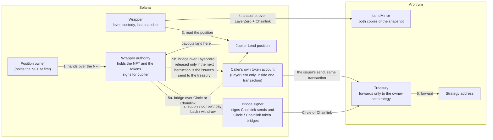

# LendMirror

LendMirror lets a team on Arbitrum run a Jupiter Lend borrow position that lives on Solana.

A Solana program holds the position, adds or removes collateral and debt within limits the admin sets, reports the position's numbers to Arbitrum, and sends tokens only to the receiver the admin set for that token and chain. Today that is our treasury contract on Arbitrum. A caller can never choose where tokens go. The admin can change a route and the upgrade authority can change the program, so those two keys are the ones to protect; see [Who can do what](#4-who-can-do-what).

> **Status, 29 September 2026 (UTC):** live on **Solana mainnet → Arbitrum One**. Every main flow ran on mainnet with real funds: mirroring a position, holding the position NFT, supply / borrow / pay back / withdraw through a Jupiter smart vault, and bridging USDC to Arbitrum. See the [Test Run](#3-test-run).

Mainnet tokens in scope: **USDC, USDT, USDai, sUSDai, PST**. The program accepts any token the admin gives a route (Devnet uses test PYUSD and Chainlink's test token).

**Contents**

1. [How it works](#1-how-it-works)
2. [Mainnet addresses](#2-mainnet-addresses)
3. [Test Run](#3-test-run)
4. [Who can do what](#4-who-can-do-what)
5. [Safety rules](#5-safety-rules)
6. [Tokens and bridges](#6-tokens-and-bridges)
7. [What is proven where](#7-what-is-proven-where)
8. [Commands](#8-commands)
9. [Reference: program accounts and the snapshot](#9-reference-program-accounts-and-the-snapshot)
10. [Devnet and Sepolia](#10-devnet-and-sepolia)
11. [Known limits](#11-known-limits)
12. [Repo map](#12-repo-map)

---

## 1. How it works

- **A Jupiter borrow position is an NFT.** Whoever holds the NFT controls the position.
- **The owner hands the NFT to our program.** The program keeps it in an account only the program can move. The owner can get it back through the admin.
- **The program can then act on the position:** supply collateral, borrow, pay back, withdraw. How far it may go is the wrapper's **level**, set by the admin. Level 1 may only lower the risk (supply, pay back). Level 2 may also raise it (withdraw, borrow).
- **Everything the position pays out lands in the program's own accounts.** Jupiter can pay only there. The one time these tokens touch a wallet is inside a LayerZero bridge transaction, which must send them straight on to the route's receiver or fail as a whole.
- **The program mirrors the position to Arbitrum.** It reads collateral and debt from Jupiter and sends them over two independent networks, LayerZero and Chainlink. The Arbitrum contract keeps both copies and says whether they match.
- **Tokens leave only along the admin's route.** A caller asks the program to bridge an amount. The destination is not a parameter: it comes from the route the admin wrote for that token and chain, and today every route points to our treasury contract on Arbitrum. The treasury forwards only to the address its owner set for that token.


```mermaid
flowchart LR
    subgraph SOL["Solana"]
        OWNER["Position owner<br/>(holds the NFT at first)"]
        W["Wrapper<br/>level, custody, last snapshot"]
        AUTH["Wrapper authority<br/>holds the NFT and the tokens<br/>signs for Jupiter"]
        JUP["Jupiter Lend position"]
        BS["Bridge signer<br/>signs Chainlink sends and<br/>Circle / Chainlink token bridges"]
        CALLER["Caller's own token account<br/>(LayerZero only, inside one transaction)"]
    end
    subgraph ARB["Arbitrum"]
        LM["LendMirror<br/>both copies of the snapshot"]
        TR["Treasury<br/>forwards only to the owner-set strategy"]
        STRAT["Strategy address"]
    end
    OWNER -- "1. hands over the NFT" --> AUTH
    AUTH -- "2. supply / borrow / pay back / withdraw" --> JUP
    JUP -- "payouts land here" --> AUTH
    W -- "3. read the position" --> JUP
    W -- "4. snapshot over LayerZero + Chainlink" --> LM
    AUTH -- "5a. bridge over Circle or Chainlink" --> BS
    BS -- "Circle or Chainlink" --> TR
    AUTH -- "5b. bridge over LayerZero: released only if the next<br/>instruction is the issuer's send to the treasury" --> CALLER
    CALLER -- "the issuer's send, same transaction" --> TR
    TR -- "6. forward" --> STRAT
```

**The money path:** Jupiter position → the wrapper's own token account on Solana → the bridge → the treasury on Arbitrum → the strategy address its owner set. For Circle and Chainlink the tokens go through the bridge signer's token account and the program calls the bridge itself. For LayerZero they go through the caller's own token account, inside one transaction that must also hold the issuer's send to the treasury.

More detail: [`programs/lendmirror/ARCHITECTURE.md`](programs/lendmirror/ARCHITECTURE.md) maps the source files and explains Anchor for Rust developers new to Solana. [`docs/what-changed.md`](docs/what-changed.md) is the before/after story. [`docs/bridge-providers.md`](docs/bridge-providers.md) covers every token's bridge.

---

## 2. Mainnet addresses

Solana links go to Solscan, Arbitrum links to Arbiscan.

### Our program and contracts

| What               | Chain    | Address                                                                                                                     | What it does                                                                                                                                                                                               |
| ------------------ | -------- | --------------------------------------------------------------------------------------------------------------------------- | ---------------------------------------------------------------------------------------------------------------------------------------------------------------------------------------------------------- |
| LendMirror program | Solana   | [`9oySM9Jo4ZEXFcWYFbuPK1FeqwrDr6wmnAmenAybzHqQ`](https://solscan.io/account/9oySM9Jo4ZEXFcWYFbuPK1FeqwrDr6wmnAmenAybzHqQ)   | Holds NFTs, operates positions, sends snapshots, bridges tokens. The `operate_dex` build is live since slot 451748984. It predates `bridge_tokens_lz`: LayerZero routes and bridges need the next upgrade. |
| Program data       | Solana   | [`EKeeTYJpf9Z46cRxehg5M16m2fpvT8DcxicojbM92Kkt`](https://solscan.io/account/EKeeTYJpf9Z46cRxehg5M16m2fpvT8DcxicojbM92Kkt)   | Stores the program's code (750,280 bytes of room).                                                                                                                                                         |
| Program IDL        | Solana   | [`8xxYX7DCKg1Y1X4Vqunrr2Ka1YagQL9frFK5sQv4BywU`](https://solscan.io/account/8xxYX7DCKg1Y1X4Vqunrr2Ka1YagQL9frFK5sQv4BywU)   | Lets explorers decode our instructions and accounts.                                                                                                                                                       |
| Store              | Solana   | [`4FUxAXWrm124DfXw3J8J1uQWhueygVvuuhTQgKNGKZRV`](https://solscan.io/account/4FUxAXWrm124DfXw3J8J1uQWhueygVvuuhTQgKNGKZRV)   | Our identity on LayerZero. Holds the admin and the allow lists.                                                                                                                                            |
| LayerZero peer     | Solana   | [`6mfKavvXreuM559b6uJKtzXwmRsLNkuiAA5EQSCAx9hF`](https://solscan.io/account/6mfKavvXreuM559b6uJKtzXwmRsLNkuiAA5EQSCAx9hF)   | Records that the Arbitrum LendMirror is our LayerZero partner.                                                                                                                                             |
| Chainlink route    | Solana   | [`Fa7ousHkzZMXrGtwwYQdSZUB46PE9yLKsTseaNjh2TzK`](https://solscan.io/account/Fa7ousHkzZMXrGtwwYQdSZUB46PE9yLKsTseaNjh2TzK)   | Where snapshots go over Chainlink: router, fees, Arbitrum, receiver.                                                                                                                                       |
| USDC bridge route  | Solana   | [`Ft1MQnTNf6XZBARxVdeu2WBBti6DW8SrVaFimXstp4Xj`](https://solscan.io/account/Ft1MQnTNf6XZBARxVdeu2WBBti6DW8SrVaFimXstp4Xj)   | USDC to Arbitrum over Circle, to the treasury, at most 10 USDC per call.                                                                                                                                   |
| Bridge signer      | Solana   | [`D6RLag1KgbK8Fe8URR2zXFaZXKBnnx6tLPuL1sUuaLNG`](https://solscan.io/account/D6RLag1KgbK8Fe8URR2zXFaZXKBnnx6tLPuL1sUuaLNG)   | Signs every Chainlink send and every Circle or Chainlink token bridge, and pays Chainlink's fee. Not used on the LayerZero path.                                                                           |
| Lookup table       | Solana   | [`FK2PwZSMdxGNhrdYnZkxALYATBH1SvBonz9vmVb69LAa`](https://solscan.io/account/FK2PwZSMdxGNhrdYnZkxALYATBH1SvBonz9vmVb69LAa)   | Shortens our transactions so they fit Solana's size limit.                                                                                                                                                 |
| LendMirror (proxy) | Arbitrum | [`0xb42E98c712B5CAf1e55dB8106262077515879EA2`](https://arbiscan.io/address/0xb42E98c712B5CAf1e55dB8106262077515879EA2)      | Permanent address. Receives snapshots over both networks and keeps both copies.                                                                                                                            |
| LendMirror (code)  | Arbitrum | [`0xe9E61B9aC26ED2CEBC2F21fbD76F7e6cfDa43032`](https://arbiscan.io/address/0xe9E61B9aC26ED2CEBC2F21fbD76F7e6cfDa43032#code) | The code behind the proxy. Source verified on Arbiscan.                                                                                                                                                    |
| Treasury (proxy)   | Arbitrum | [`0x736AAC431E66de7D07eb61738CA3598a53a24Ca0`](https://arbiscan.io/address/0x736AAC431E66de7D07eb61738CA3598a53a24Ca0)      | Permanent address. Receives every bridged token and forwards only to the owner-set strategy.                                                                                                               |
| Treasury (code)    | Arbitrum | [`0xBED1911918D70c2E88b83f2C75b1763e2c49A795`](https://arbiscan.io/address/0xBED1911918D70c2E88b83f2C75b1763e2c49A795#code) | The code behind the treasury proxy. Source verified on Arbiscan.                                                                                                                                           |

On Arbitrum each contract has two addresses:

| Role                                     | LendMirror                                                                                                                  | Treasury                                                                                                                    |
| ---------------------------------------- | --------------------------------------------------------------------------------------------------------------------------- | --------------------------------------------------------------------------------------------------------------------------- |
| Proxy: permanent address, holds the data | [`0xb42E98c712B5CAf1e55dB8106262077515879EA2`](https://arbiscan.io/address/0xb42E98c712B5CAf1e55dB8106262077515879EA2)      | [`0x736AAC431E66de7D07eb61738CA3598a53a24Ca0`](https://arbiscan.io/address/0x736AAC431E66de7D07eb61738CA3598a53a24Ca0)      |
| Contract: the code, replaced on upgrade  | [`0xe9E61B9aC26ED2CEBC2F21fbD76F7e6cfDa43032`](https://arbiscan.io/address/0xe9E61B9aC26ED2CEBC2F21fbD76F7e6cfDa43032#code) | [`0xBED1911918D70c2E88b83f2C75b1763e2c49A795`](https://arbiscan.io/address/0xBED1911918D70c2E88b83f2C75b1763e2c49A795#code) |

### Wallets

| Role                | Chain    | Address                                                                                                                   | What it may do                                                                                                                                  |
| ------------------- | -------- | ------------------------------------------------------------------------------------------------------------------------- | ----------------------------------------------------------------------------------------------------------------------------------------------- |
| Admin               | Solana   | [`B8HnbEgetyiAdvkbgZR7LsChh93KR3jWuSw6xSQxt1hL`](https://solscan.io/account/B8HnbEgetyiAdvkbgZR7LsChh93KR3jWuSw6xSQxt1hL) | Upgrades the program. Store admin, permanently: sets levels, routes and allow lists, releases NFTs. Also the only snapshotter and sender today. |
| EVM owner           | Arbitrum | [`0x9Dee2100Cb47734A7a629Db0a1B061Df865a9c87`](https://arbiscan.io/address/0x9Dee2100Cb47734A7a629Db0a1B061Df865a9c87)    | Owns both proxies. Also the treasury's USDC strategy for the test, so test USDC comes back to it.                                               |
| Test position owner | Solana   | [`HgyDJt5yGiPVUaTrfssF3VkdhRZ4BNdtnsCFE9pcPRHv`](https://solscan.io/account/HgyDJt5yGiPVUaTrfssF3VkdhRZ4BNdtnsCFE9pcPRHv) | Opened the test position on jup.ag and owns wrapper 95/34.                                                                                      |

### The test position: Jupiter vault 95, NFT 34

A smart vault: the collateral is a share of a USDG/USDC pool, the debt is USDC. [Open on jup.ag](https://jup.ag/lend/borrow/smart/95/nfts/34).

| What                                                                | Address                                                                                                                   |
| ------------------------------------------------------------------- | ------------------------------------------------------------------------------------------------------------------------- |
| Position NFT mint                                                   | [`7CkF6a4HVKg7qst2x2XdgL71tAUxvmnh5QU5wqidF23e`](https://solscan.io/token/7CkF6a4HVKg7qst2x2XdgL71tAUxvmnh5QU5wqidF23e)   |
| Wrapper (the program's record of the position)                      | [`H85XkQZ1TEsCTX6DuNmFUU93F2Bv7YuFkDAZ1y6f1Stw`](https://solscan.io/account/H85XkQZ1TEsCTX6DuNmFUU93F2Bv7YuFkDAZ1y6f1Stw) |
| Wrapper authority (holds the NFT and the tokens, signs for Jupiter) | [`AaJKP3h3hgNo7UswHdi1MWnccJzL1AtsgkFbXc9VLQqb`](https://solscan.io/account/AaJKP3h3hgNo7UswHdi1MWnccJzL1AtsgkFbXc9VLQqb) |
| Wrapper's USDC account                                              | [`7h1NZx1iP28M29WDRS4YDztKNHev5dx5QfwNc5DAsHNY`](https://solscan.io/account/7h1NZx1iP28M29WDRS4YDztKNHev5dx5QfwNc5DAsHNY) |
| Wrapper's USDG account                                              | [`5PQqR4XrdHxSy2Ax8VuKL4sUKVd4GjYWmzPASAhuCAWj`](https://solscan.io/account/5PQqR4XrdHxSy2Ax8VuKL4sUKVd4GjYWmzPASAhuCAWj) |
| Wrapper's NFT account                                               | [`4BwLdD5nHnvQJqhedjKEwpim5iPu87ScG3hZvQxLWsgy`](https://solscan.io/account/4BwLdD5nHnvQJqhedjKEwpim5iPu87ScG3hZvQxLWsgy) |

### Other parties we talk to

| What                                 | Chain    | Address                                                                                                                   |
| ------------------------------------ | -------- | ------------------------------------------------------------------------------------------------------------------------- |
| Jupiter Lend Vaults (main market)    | Solana   | [`jupr81YtYssSyPt8jbnGuiWon5f6x9TcDEFxYe3Bdzi`](https://solscan.io/account/jupr81YtYssSyPt8jbnGuiWon5f6x9TcDEFxYe3Bdzi)   |
| Jupiter Lend DEX (smart vault pools) | Solana   | [`jupZ4m2GqUCJ5iueMfzQf8khFfH31d4XAQt3RzCT9Vd`](https://solscan.io/account/jupZ4m2GqUCJ5iueMfzQf8khFfH31d4XAQt3RzCT9Vd)   |
| USDC                                 | Solana   | [`EPjFWdd5AufqSSqeM2qN1xzybapC8G4wEGGkZwyTDt1v`](https://solscan.io/token/EPjFWdd5AufqSSqeM2qN1xzybapC8G4wEGGkZwyTDt1v)   |
| USDG                                 | Solana   | [`2u1tszSeqZ3qBWF3uNGPFc8TzMk2tdiwknnRMWGWjGWH`](https://solscan.io/token/2u1tszSeqZ3qBWF3uNGPFc8TzMk2tdiwknnRMWGWjGWH)   |
| USDC                                 | Arbitrum | [`0xaf88d065e77c8cC2239327C5EDb3A432268e5831`](https://arbiscan.io/token/0xaf88d065e77c8cC2239327C5EDb3A432268e5831)      |
| LayerZero EndpointV2                 | Arbitrum | [`0x1a44076050125825900e736c501f859c50fE728c`](https://arbiscan.io/address/0x1a44076050125825900e736c501f859c50fE728c)    |
| Chainlink CCIP router                | Solana   | [`Ccip842gzYHhvdDkSyi2YVCoAWPbYJoApMFzSxQroE9C`](https://solscan.io/account/Ccip842gzYHhvdDkSyi2YVCoAWPbYJoApMFzSxQroE9C) |
| Chainlink CCIP router                | Arbitrum | [`0x141fa059441E0ca23ce184B6A78bafD2A517DdE8`](https://arbiscan.io/address/0x141fa059441E0ca23ce184B6A78bafD2A517DdE8)    |
| Circle CCTP v2 TokenMessengerMinter  | Solana   | [`CCTPV2vPZJS2u2BBsUoscuikbYjnpFmbFsvVuJdgUMQe`](https://solscan.io/account/CCTPV2vPZJS2u2BBsUoscuikbYjnpFmbFsvVuJdgUMQe) |
| Circle CCTP v2 MessageTransmitter    | Arbitrum | [`0x81D40F21F12A8F0E3252Bccb954D722d4c464B64`](https://arbiscan.io/address/0x81D40F21F12A8F0E3252Bccb954D722d4c464B64)    |

Network ids: LayerZero Solana `30168` → Arbitrum `30110`. Chainlink Solana `124615329519749607` → Arbitrum `4949039107694359620`. Circle domain Solana `5` → Arbitrum `3`.

Retired: the old program's Store [`BLoEaf2L…`](https://solscan.io/account/BLoEaf2L5rZvEwZuVfFjAabHW4woM9Mr1XknBQCZkyf4) and the old Arbitrum code `0xdAAE65Df…`.

---

## 3. Test Run

Everything below happened on **mainnet with real funds on 29 September 2026 (UTC)**. Amounts were kept small: 1 USDC at a time. Every row links to its transaction.

**Who's who**

| Name in the tables | Address                                                                                 | Why it signs                                                                                                          |
| ------------------ | --------------------------------------------------------------------------------------- | --------------------------------------------------------------------------------------------------------------------- |
| **Admin**          | [`B8Hn…t1hL`](https://solscan.io/account/B8HnbEgetyiAdvkbgZR7LsChh93KR3jWuSw6xSQxt1hL)  | Upgrade authority and Store admin. The only wallet that may change levels or routes, or release an NFT.               |
| **Position owner** | [`HgyD…PRHv`](https://solscan.io/account/HgyDJt5yGiPVUaTrfssF3VkdhRZ4BNdtnsCFE9pcPRHv)  | Opened the Jupiter position, so it holds the NFT. After handing the NFT over, it owns the wrapper and may operate it. |
| **EVM owner**      | [`0x9Dee…9c87`](https://arbiscan.io/address/0x9Dee2100Cb47734A7a629Db0a1B061Df865a9c87) | Owns the Arbitrum contracts.                                                                                          |
| **Anyone**         |                                                                                         | A step any wallet may run. The funds still follow the fixed path.                                                     |

**The position:** Jupiter vault 95, NFT 34, opened on jup.ag by the position owner, with 9.70 USDG and 10.29 USDC supplied and 15 USDC borrowed.

### 3.1 Set up, once

| #   | Step                                       | Who       | What happened                                                                 | Proof                                                                                                                                                                                                                                                        |
| --- | ------------------------------------------ | --------- | ----------------------------------------------------------------------------- | ------------------------------------------------------------------------------------------------------------------------------------------------------------------------------------------------------------------------------------------------------------ |
| 1   | Make room for the new program              | Admin     | The program account grew to fit the new, larger program.                      | [`2h6bj43S…`](https://solscan.io/tx/2h6bj43Srrx3dd9hsgSDKjiaQeRBXy3WDdZqjdXn47xdc9pnK5Uof8QAN748KqqtYw469nMnbfPp5LCQ1FeCM2wu)                                                                                                                                |
| 2   | Upgrade the program                        | Admin     | The new program, with fresh `V1` account seeds, went live.                    | [`38GcMTnD…`](https://solscan.io/tx/38GcMTnDmP7jjm2er7GLnMBDKECz1p3dTCXsh7Nj3RWfzUv47jAT8B9CFAH8JBQQ3Yoa1tA8fjc9vgxWjgQdbPw9)                                                                                                                                |
| 3   | Deploy the new LendMirror code on Arbitrum | EVM owner | New code deployed.                                                            | [`0xfdfed299…`](https://arbiscan.io/tx/0xfdfed2997ee69a6aaad4459ed60f86ad0344850a0413fffcb5059855e52db54a)                                                                                                                                                   |
| 4   | Point the LendMirror proxy at the new code | EVM owner | The permanent address now runs the new code.                                  | [`0x4e751484…`](https://arbiscan.io/tx/0x4e751484bfe7da0945b63e7d839cf9641df6f58e75f0b7fb29ea9744dae75e80)                                                                                                                                                   |
| 5   | Deploy the treasury on Arbitrum            | EVM owner | Code deployed, then the permanent proxy.                                      | [`0x8fb39bcc…`](https://arbiscan.io/tx/0x8fb39bcc3e3fda5d72a6b309706fdf9733980fbb874a5809b5fbc78d2d1c4fe9), [`0x0e9d55c8…`](https://arbiscan.io/tx/0x0e9d55c8c05f09cc08b032624c314f0eb5edee67c985c8672b2a7ee169c708df)                                       |
| 6   | Verify both contracts on Arbiscan          | EVM owner | Source code is public on the explorer.                                        | [LendMirror code](https://arbiscan.io/address/0xe9E61B9aC26ED2CEBC2F21fbD76F7e6cfDa43032#code), [treasury code](https://arbiscan.io/address/0xBED1911918D70c2E88b83f2C75b1763e2c49A795#code)                                                                 |
| 7   | Create the Store                           | Admin     | Our LayerZero identity exists. The admin is fixed from here on.               | [`4Go72E1T…`](https://solscan.io/tx/4Go72E1TuHQkqv2hp1RJJurTYYAA23uH94GPHFb5r6ozMukD25SAhjGij1REqADwTnR9uBQEtzj1D59wvAq8Mkjg)                                                                                                                                |
| 8   | Connect LayerZero, Solana side             | Admin     | Solana knows the Arbitrum LendMirror is our partner.                          | [`5Eocjtex…`](https://solscan.io/tx/5EocjtexGjUrHFLKTstBZcuUs6nqqeD1rJ114ZBt5QgVJ4fyuVUSbZyiwPeeAZRej9pDFXqdonwMbFd9m5btSSUG), [`66RhEuN9…`](https://solscan.io/tx/66RhEuN9vu5bcJopf9Z7TbNvMZjP83yTmpMtjZPciuijR6HHyD4qnL3oviQzvnafQpo9oPncvZUtDFXAkUqzhVv3) |
| 9   | Connect LayerZero, Arbitrum side           | EVM owner | Arbitrum accepts messages from our Store only.                                | [`0xc0abee1e…`](https://arbiscan.io/tx/0xc0abee1e75705f2bbd0e1bfd3ee2738fdd3447f501dfda0d909e5cc8c7afb325)                                                                                                                                                   |
| 10  | Allow the admin to wrap and refresh        | Admin     | Snapshotter list set.                                                         | [`3pZrmMyL…`](https://solscan.io/tx/3pZrmMyLJaP4PFuEPM4rKTMexvSS4N9wADZd41dQmRzxmzHUg3AMRGB5Bqq3eXcQG2UHJm1AirTM2gD7NFs7A2uD)                                                                                                                                |
| 11  | Put the admin on the sender list           | Admin     | The admin may now mirror snapshots and bridge tokens from any wrapper.        | [`srKGH6ou…`](https://solscan.io/tx/srKGH6ouATR5vKb3Xtf8RBkD8wqNrRS6SxM58293jg7Dhbk461KE7npT4YWuApti8JXPAo2uAmTX7PDB2dNNYde)                                                                                                                                 |
| 12  | Connect Chainlink, Solana side             | Admin     | Snapshots may go to the Arbitrum LendMirror over Chainlink.                   | [`5SDMGSYC…`](https://solscan.io/tx/5SDMGSYCwEvPHTUZGrwe7YVUG3w4KiHf2YDxSNjgMPLPrZpqhfXzk9KEmZMCw6PubdgPHMFMWd8zznNCmnj6bMvM)                                                                                                                                |
| 13  | Connect Chainlink, Arbitrum side           | EVM owner | LendMirror accepts Chainlink messages from our bridge signer only.            | [`0xada20bae…`](https://arbiscan.io/tx/0xada20bae69bc693b1ed4d169a11eac326186d40891b9308a3a08922943fd4dd6)                                                                                                                                                   |
| 14  | Let the treasury accept Chainlink tokens   | EVM owner | Only from our bridge signer.                                                  | [`0x5fb535fe…`](https://arbiscan.io/tx/0x5fb535fe98288f273d91b39b9a90642d21a2de86948a0ad7c5fd3f8a61f0c28d)                                                                                                                                                   |
| 15  | Tell the treasury about Circle             | EVM owner | The treasury can finish Circle transfers.                                     | [`0x45a7ef62…`](https://arbiscan.io/tx/0x45a7ef622e955757e246a57383ab486c1d3fcaa391f9421c7fd6423a3f39af4c)                                                                                                                                                   |
| 16  | Set where USDC goes after Arbitrum         | EVM owner | The treasury's USDC strategy is the EVM owner's wallet, for the test.         | [`0xe52ec6cf…`](https://arbiscan.io/tx/0xe52ec6cfc3e61ea5f8c59c9358e18f0d5ef5c0a9567e42a351b8df2849c2c294)                                                                                                                                                   |
| 17  | Fix the USDC route                         | Admin     | USDC goes over Circle, only to the treasury, at most 10 USDC per transaction. | [`2H5HH8tS…`](https://solscan.io/tx/2H5HH8tS2qG8FXAnDzbQh51pyU6328PG1Pr9NbfLmmNBZ626bPZq4pXMHtWXMKySHSddUUErkYq1yL8qzmGogdve)                                                                                                                                |
| 18  | Publish the IDL                            | Admin     | Explorers show our instructions and accounts in plain names.                  | [IDL account](https://solscan.io/account/8xxYX7DCKg1Y1X4Vqunrr2Ka1YagQL9frFK5sQv4BywU)                                                                                                                                                                       |

### 3.2 Mirror the position to Arbitrum

| #   | Step                                                               | Who       | What happened                                                                                                                                                                                                                             | Proof                                                                                                                                                                                                                                              |
| --- | ------------------------------------------------------------------ | --------- | ----------------------------------------------------------------------------------------------------------------------------------------------------------------------------------------------------------------------------------------- | -------------------------------------------------------------------------------------------------------------------------------------------------------------------------------------------------------------------------------------------------- |
| 1   | Wrap [position 95/34](https://jup.ag/lend/borrow/smart/95/nfts/34) | Admin     | The program created the wrapper [`H85XkQZ1TEsCTX6DuNmFUU93F2Bv7YuFkDAZ1y6f1Stw`](https://solscan.io/account/H85XkQZ1TEsCTX6DuNmFUU93F2Bv7YuFkDAZ1y6f1Stw), at level 0: mirror only.                                                       | [`4BYPWA3F…`](https://explorer.solana.com/tx/4BYPWA3FfSDiV7AYPGxuvbVRPCK5qJYcYdqz5aqqV1Cycgo1U1S1EY6MLTR2Y86J7jX8j7au2xzPs23UyCcGzKv5)                                                                                                             |
| 2   | Refresh the wrapper                                                | Admin     | The program read the position from Jupiter and stored it: 9,895,200,710 collateral shares, 14,875,925,507 debt units. The [wrapper account](https://solscan.io/account/H85XkQZ1TEsCTX6DuNmFUU93F2Bv7YuFkDAZ1y6f1Stw) shows this data now. | [`haqehTLj…`](https://explorer.solana.com/tx/haqehTLj9cCtpKpBFJGRLzDrWcqmMuhRNw9nZcQAVmvoXd5GbC8a7zZGnBytZwxub9vu2w775wLzr4NHmHhf5qa)                                                                                                              |
| 3   | Send the snapshot                                                  | Admin     | One transaction sent the same snapshot over both networks. Fees: LayerZero 0.0012 SOL, Chainlink 0.0017 SOL.                                                                                                                              | [`ggPRn6GY…`](https://explorer.solana.com/tx/ggPRn6GYV8K7JPRrERMmBwQVSmx3yUxef4eWLyg79vXqfm9ik5Abk4QtPbynaPJZZs2kWYkHxjv9CuwEfnTAneg)                                                                                                              |
| 4   | Delivered by LayerZero                                             | LayerZero | Arrived and stored on the Arbitrum LendMirror.                                                                                                                                                                                            | [`0x2d10fa9f…`](https://arbiscan.io/tx/0x2d10fa9fa41783ebc950558677b2fa957248f79183292cba888891b545bb04d5), [LayerZero Scan](https://layerzeroscan.com/tx/ggPRn6GYV8K7JPRrERMmBwQVSmx3yUxef4eWLyg79vXqfm9ik5Abk4QtPbynaPJZZs2kWYkHxjv9CuwEfnTAneg) |
| 5   | Delivered by Chainlink                                             | Chainlink | Arrived and stored on the Arbitrum LendMirror.                                                                                                                                                                                            | [`0xdb2187df…`](https://arbiscan.io/tx/0xdb2187df92dac812990a2f8fa9da7384151fa55de89117b774ef690fa841df07), [CCIP explorer](https://ccip.chain.link/msg/0xd40d36300a17cc37691f2265838db6762ac9938a1593deaf164583663df6276b)                        |
| 6   | See both copies on Arbitrum                                        | Anyone    | Both snapshots are stored on the [LendMirror proxy](https://arbiscan.io/address/0xb42E98c712B5CAf1e55dB8106262077515879EA2).                                                                                                              | [`0xb42E98c7…`](https://arbiscan.io/address/0xb42E98c712B5CAf1e55dB8106262077515879EA2)                                                                                                                                                            |
| 7   | Compare the two copies                                             | Anyone    | `lz:oapp:evm:match --all` printed `match`: both networks delivered identical bytes.                                                                                                                                                       | read only, no transaction                                                                                                                                                                                                                          |

### 3.3 Hand the NFT to the program, and take it back

| #   | Step                                           | Who            | What happened                                                                                    | Proof                                                                                                                                              |
| --- | ---------------------------------------------- | -------------- | ------------------------------------------------------------------------------------------------ | -------------------------------------------------------------------------------------------------------------------------------------------------- |
| 1   | A wallet without the NFT tries to hand it over | Admin          | Refused before sending (`AccountNotInitialized`): only the NFT holder can do this. Nothing sent. | refused in simulation                                                                                                                              |
| 2   | Hand the NFT over                              | Position owner | The NFT moved to the wrapper's NFT account. The position owner became the wrapper owner.         | [`4CRg9SrV…`](https://solscan.io/tx/4CRg9SrV38aVwY6NUKU9iTnca85A111d8fnQgFW571cABVtxJxqpViBET66zJjy2AdRUgCutW3LfEz9UTG6LwMbB?cluster=mainnet-beta) |
| 3   | Give the NFT back                              | Admin          | The NFT returned to the position owner, the only place it may go.                                | [`3qZzuKPo…`](https://solscan.io/tx/3qZzuKPoVrrnn8dcZFSiv2E67aENpds9tofYoTJ16UdYBFnTAFgRcWqkv5NEh7fVLk4gULh71jiGTqysiFu4b8Jy?cluster=mainnet-beta) |

### 3.4 Bridge 1 USDC from Solana to Arbitrum

| #   | Step                         | Who                    | What happened                                                                                                                                                                                                                                              | Proof                                                                                                                                              |
| --- | ---------------------------- | ---------------------- | ---------------------------------------------------------------------------------------------------------------------------------------------------------------------------------------------------------------------------------------------------------- | -------------------------------------------------------------------------------------------------------------------------------------------------- |
| 1   | Raise the wrapper to level 1 | Admin                  | The wrapper may now supply collateral, pay back debt, and bridge its tokens to the treasury.                                                                                                                                                               | [`4WUbsQjp…`](https://solscan.io/tx/4WUbsQjpJ2ZGkuA77MV6SMspNoVEkQsXPuY6mk4JD3yMzdicFcKVDakMXvN8RLEGLZHosQrpJfUfsEnWaj8fDXha?cluster=mainnet-beta) |
| 2   | Put 1 USDC into the wrapper  | Position owner         | 1 USDC landed in the wrapper's USDC account [`7h1N…`](https://solscan.io/account/7h1NZx1iP28M29WDRS4YDztKNHev5dx5QfwNc5DAsHNY), which belongs to the wrapper authority [`AaJK…`](https://solscan.io/account/AaJKP3h3hgNo7UswHdi1MWnccJzL1AtsgkFbXc9VLQqb). | [`4ZVfSxG5…`](https://solscan.io/tx/4ZVfSxG5v4L3wqwmguwA9fQ8yNekoQSHQKaRjMuWGQDhwgv3u9MuBMTSqeuXxy89vWwQojXSkv2s1YfjFx7JuPUX?cluster=mainnet-beta) |
| 3   | Bridge 1 USDC                | Position owner         | The program sent 1 USDC into Circle's bridge, addressed to the treasury. The caller only chose the amount.                                                                                                                                                 | [`425maWwn…`](https://solscan.io/tx/425maWwns2GFJVH5WwwxDAX37iDZq8aXrzXezNu7K7bhCqb5diVB8SrijDwZZNwS5dc7QrStchEJiXrby9mrWJLx)                      |
| 4   | Claim it on Arbitrum         | EVM owner (anyone may) | Circle minted 1 USDC into the [treasury](https://arbiscan.io/address/0x736AAC431E66de7D07eb61738CA3598a53a24Ca0).                                                                                                                                          | [`0x5921b568…`](https://arbiscan.io/tx/0x5921b5687d9221dd4ab2fd46f17cfdb777efcb2794b45eea76b8c29a7d4d8e59)                                         |
| 5   | Forward it                   | EVM owner (anyone may) | The treasury sent the 1 USDC to its USDC strategy, the [EVM owner's wallet](https://arbiscan.io/address/0x9Dee2100Cb47734A7a629Db0a1B061Df865a9c87).                                                                                                       | [`0x84b139a3…`](https://arbiscan.io/tx/0x84b139a3a0b250f8d5dfb58ab7c2c344a8e0a4c403b0ca66fe0907780ac3471b)                                         |

### 3.5 Upgrade the program for smart vaults

Vault 95 is a **smart vault**: its collateral is a share of a two-token pool. Jupiter only accepts its smart-vault instruction, `operate_dex`, on such vaults, and the program was built for the plain one, `operate`. The program was rebuilt on `operate_dex`, tested on a local copy of mainnet (12 of 12 steps passed), then deployed.

| #   | Step                | Who   | What happened                                                                                                            | Proof                                                                                                                         |
| --- | ------------------- | ----- | ------------------------------------------------------------------------------------------------------------------------ | ----------------------------------------------------------------------------------------------------------------------------- |
| 1   | Upgrade the program | Admin | The `operate_dex` build went live. The new program is smaller, so no extra room was needed. The IDL was refreshed after. | [`5JE6pDH4…`](https://solscan.io/tx/5JE6pDH4MzB9KpXvHytUEgH8iASxMfGHgtNkV6B3rexyKhwGsNUpbyGPFJSiGi7rVJc9qPSLKE2Qucgz6r8yyJhr) |

### 3.6 Operate the position through the program

| #   | Step                                | Who                                 | What happened                                                                                                  | Proof                                                                                                                                                                                                                                                                                                                                                                                                                                                                          |
| --- | ----------------------------------- | ----------------------------------- | -------------------------------------------------------------------------------------------------------------- | ------------------------------------------------------------------------------------------------------------------------------------------------------------------------------------------------------------------------------------------------------------------------------------------------------------------------------------------------------------------------------------------------------------------------------------------------------------------------------ |
| 1   | Hand the NFT over again             | Position owner                      | The program holds the NFT.                                                                                     | [`2XndUcs4…`](https://solscan.io/tx/2XndUcs4cCs2jiL366W6ESEq2WwCgej77cScrp6NLStb2qtjrnNjs7o6ysXUArYHaYfkFy7BUqDPjvwo41N29WP5?cluster=mainnet-beta)                                                                                                                                                                                                                                                                                                                             |
| 2   | Put 1 USDC into the wrapper         | Position owner                      | Wrapper's USDC account: 1 USDC.                                                                                | [`3BVtkcp2…`](https://solscan.io/tx/3BVtkcp2JXmbrpPoizU3rfVnm95qzQqu2Pf8dpeuoxSfBLcnQhP3pwuPuvGvbzHV5cYVG6mHfrzxzRcvZ9xdcLi2?cluster=mainnet-beta)                                                                                                                                                                                                                                                                                                                             |
| 3   | Give the wrapper authority 0.05 SOL | Position owner (the task does this) | Jupiter charges the position's signer for any account it creates, so the wrapper authority needs a little SOL. | [`2u5ZBm99…`](https://solscan.io/tx/2u5ZBm99H6bDRfRvDXJ1ApiM2R2JvA29PANWn49viJb9NGqqb7Bhmv1smxYa9XpZdnZiN9XYxkNnzRzP9FUBJFZZ)                                                                                                                                                                                                                                                                                                                                                  |
| 4   | Supply 1 USDC as collateral         | Position owner, level 1             | The wrapper's 1 USDC went into the pool position. Its USDC account went back to 0.                             | setup [`2uMbBEe9…`](https://solscan.io/tx/2uMbBEe9yzkNaA54zJGhvV2gqyYgC2WrEU7NuQ9wTsW8QfKcp9DdE6C9iYtB8tLa4LFrEeYo7u1LV5kfH5b19sLz?cluster=mainnet-beta), supply [`4avLRFj9…`](https://solscan.io/tx/4avLRFj9YZg3qQPk68NyXGQMi9FoGdsVRUDaxTwT769vWTdfrHdM1VmdCswNDFxhmYSJE2qEbv7svjCipEfCVPdq?cluster=mainnet-beta), refresh [`sx21cuj2…`](https://solscan.io/tx/sx21cuj2KorVbFKre8tX5aEzd12Vjc5n6Jt4xBR23abk9GfmeAb9YYvBZSnkf39MncCKc7bHze6VM2GuNUW5a4i?cluster=mainnet-beta) |
| 5   | Raise the wrapper to level 2        | Admin                               | The wrapper may now also withdraw and borrow.                                                                  | [`3uqu5xNJ…`](https://solscan.io/tx/3uqu5xNJ9ADsVygVdyNfFmTuxkV5ULj5TTMWnnQAjfdKBi5daVsbbGConZp5bfbB3LBy6MnvZwuJEFc4QRF4zPtB?cluster=mainnet-beta)                                                                                                                                                                                                                                                                                                                             |
| 6   | Borrow 1 USDC, using the wrapper    | Position owner, level 2             | 1 USDC landed in the wrapper's own USDC account, not in any wallet. The wrapper still holds the NFT.           | setup [`4JAyhwkY…`](https://solscan.io/tx/4JAyhwkYAL36WTYjZeGNcQmCjSF64CnT32wkaW1qsL4skMxTiZXeUWqA7BCZizFA1pLico9qKgrCBiMx22KoL3Ne?cluster=mainnet-beta), borrow [`2Dpax2tj…`](https://solscan.io/tx/2Dpax2tjubvfyqMGMv2WnpKc33g1LiKUoXi6GRERorbLVQvQqaqXBbDNkidePYoh6wVfg665q594Q95y9bJ4f9p2?cluster=mainnet-beta), refresh [`8h3fbQDF…`](https://solscan.io/tx/8h3fbQDFau3vG38fuZJ6GY6sCR8tZvmzCn9JdMcZapebhzokUGb8BkHMfYKnQXkMuGevqNFWwW8wGCW3L8zc6Ai)                      |
| 7   | Pay back 0.9 USDC                   | Position owner                      | Paid from the wrapper's USDC account: 1.000000 → 0.099999. Jupiter rounds a payback up by one unit.            | setup [`32xqxyyk…`](https://solscan.io/tx/32xqxyykmRGfjTrTsFWqTnYrdnZqrn8gG5cXZfiB6znct57ptyH6Z5sG5Wh7ynUjfYZakizdxSdem4ER6wxp4wWL?cluster=mainnet-beta), pay back [`5mWz3Dxx…`](https://solscan.io/tx/5mWz3Dxx79TrTP1CVBHMasdE5daPswUqG2vRL48HRLxoZ7sg1wWs4gFTp8knAWHw4YNBr5gwQGP7a3LDkA6H8W5M?cluster=mainnet-beta)                                                                                                                                                          |
| 8   | Withdraw 0.5 USDC of collateral     | Position owner, level 2             | 0.5 USDC landed in the wrapper's USDC account: 0.099999 → 0.599999.                                            | setup [`4jzQM75B…`](https://solscan.io/tx/4jzQM75Btbsy2P15cc3AEfkJTyGHNiEg3aWen7VEdF3qZsWo4Yx2BZwBgfcseZomuyP1WXfUkfHhSdpxdgvL9kfG?cluster=mainnet-beta), withdraw [`4LJkH8o9…`](https://solscan.io/tx/4LJkH8o9XU6QWe3rys7kHNZ1vNnMCHwPd2riZmACtz7p7CFZDauMZZjK2qjNUYt3Ptio4cUuRkpEimCBv2hgqZyi?cluster=mainnet-beta), refresh [`3TMDmnTJ…`](https://solscan.io/tx/3TMDmnTJmknpsPTodqFEPL5LiemmtexVr7UUJ7T1eotE9vFiUipmN1ui73LUFmjyPuUCreNHWm33ftyof4ugNaLY)                   |

What the position looked like after each step, as read by the program:

| After             | Collateral (pool shares) | Debt (Jupiter units) | Wrapper's USDC |
| ----------------- | ------------------------ | -------------------- | -------------- |
| Start             | 9,895,200,710            | 14,875,925,507       | 0              |
| Supply 1 USDC     | 10,389,872,603           | 14,865,795,011       | 0              |
| Borrow 1 USDC     | 10,389,872,603           | 15,855,470,939       | 1.000000       |
| Pay back 0.9 USDC | not refreshed            | not refreshed        | 0.099999       |
| Withdraw 0.5 USDC | 10,142,489,050           | 14,975,884,818       | 0.599999       |

How to read the numbers: about 495 million pool shares are worth 1 USD in this pool, so the supply added about 1 USD and the withdraw removed about 0.5 USD. Jupiter stores debt divided by a growing interest index, so 1 USDC of debt shows as about 990 million units. Debt also moves slightly whenever collateral changes, because Jupiter places each position on a price grid and keeps the rounding separately as "dust debt".

### 3.7 What went wrong along the way, and the fix

| What happened                                                 | Why                                                                                                                                                                                                                                                                                                            | Fix                                                                                                                              |
| ------------------------------------------------------------- | -------------------------------------------------------------------------------------------------------------------------------------------------------------------------------------------------------------------------------------------------------------------------------------------------------------- | -------------------------------------------------------------------------------------------------------------------------------- |
| The first program upload stopped with "Max retries exceeded". | The priority fee was too low for mainnet traffic, so the network dropped upload transactions.                                                                                                                                                                                                                  | Closed the half-written buffer (SOL refunded) and re-uploaded with a higher fee.                                                 |
| A second upload was refused before starting.                  | The wallet was short of SOL: the upload parks about 3.6 SOL until it finishes, plus up to 0.3 SOL of fees.                                                                                                                                                                                                     | Topped up the wallet.                                                                                                            |
| The first supply attempt stopped in our task, not on chain.   | The task measured the transaction without Jupiter's lookup tables, so it was too big to even build. Its setup transaction [`4EXRJ6Pd…`](https://solscan.io/tx/4EXRJ6Pdb8kp8kpF5i65dkfGjRYfWtuddxyh9Ham1bAo6UAAEC5uMoApfq5Y6mvuoXHt8RjcyTcUuMtUz4G6sUx2) went through and created the wrapper's token accounts. | The task passes Jupiter's tables. A dry run on mainnet proved the fix first.                                                     |
| The first payback attempt was refused by Jupiter.             | The setup had just created a record Jupiter needs ([`Z5ycKKyL…`](https://solscan.io/tx/Z5ycKKyLZjLPjZecNkbAveyQmBFaDMi8QrDjpdLbbdMiKog7dGRUBH2EDbNh1fBNug3d46GdJ4ZJqqpz6rjDHXY)), but the RPC node that checked the payback had not caught up yet.                                                             | The task waits two seconds after the setup and retries twice. The withdraw hit the same lag and went through on the first retry. |

### 3.8 Where things stand after the test

| What                   | State                                                                                                                 |
| ---------------------- | --------------------------------------------------------------------------------------------------------------------- |
| Position NFT           | Held by the program, in [`4BwL…`](https://solscan.io/account/4BwLdD5nHnvQJqhedjKEwpim5iPu87ScG3hZvQxLWsgy).           |
| Wrapper level          | 2                                                                                                                     |
| Wrapper's USDC account | 0.599999 USDC. It can only go into the position, or over a USDC route the admin sets (today: Circle to the treasury). |
| Wrapper authority      | 0.05 SOL, kept for Jupiter's rent. There is no way to withdraw it.                                                    |
| Bridge signer          | 0.0476 SOL, left from the snapshot send, for future Chainlink fees.                                                   |
| Treasury               | Empty: the 1 USDC was forwarded.                                                                                      |
| EVM owner              | Received 1 USDC.                                                                                                      |

---

## 4. Who can do what

| Who                                                   | Can                                                                                                                                                                                                                                                                                | Cannot                                                                                                                                                                                                                                                 |
| ----------------------------------------------------- | ---------------------------------------------------------------------------------------------------------------------------------------------------------------------------------------------------------------------------------------------------------------------------------- | ------------------------------------------------------------------------------------------------------------------------------------------------------------------------------------------------------------------------------------------------------ |
| **Upgrade authority** (the admin wallet today)        | Create the Store once. Upgrade the program.                                                                                                                                                                                                                                        |                                                                                                                                                                                                                                                        |
| **Admin** (named when the Store was created, forever) | Set the LayerZero and Chainlink connections, the allow lists, the token routes (where each token may be bridged to) and wrapper levels. Give a position NFT back to its wrapper owner.                                                                                             | Change the admin. Send an NFT anywhere but its wrapper owner. **Note:** the admin can point any token's route at any address and, being a sender today, bridge any level 1 or 2 wrapper's tokens there. Treat this key as able to move wrapper tokens. |
| **Snapshotter** (allow list)                          | Wrap a position and become its first owner. Refresh any wrapper (re-read it from Jupiter).                                                                                                                                                                                         | Mirror a snapshot unless it is also a sender or on that wrapper's OnDemand list. Operate a position or bridge tokens on wrappers it does not own.                                                                                                      |
| **Sender** (allow list)                               | Mirror any wrapper's snapshot to Arbitrum (over LayerZero and Chainlink). Bridge tokens out of any level 1 or 2 wrapper, to the route's receiver. On LayerZero the tokens pass through the sender's own token account inside the transaction, and the sender pays LayerZero's fee. | Operate a position (supply, borrow, pay back, withdraw).                                                                                                                                                                                               |
| **NFT holder**                                        | Hand the NFT to a wrapper, and become that wrapper's owner.                                                                                                                                                                                                                        |                                                                                                                                                                                                                                                        |
| **Wrapper owner**                                     | Refresh that wrapper, operate its position (within its level), and bridge its tokens to the treasury. Name up to 8 helpers on the wrapper's OnDemand list.                                                                                                                         | Raise its own level. Choose where bridged tokens go.                                                                                                                                                                                                   |
| **OnDemand helper** (per wrapper)                     | On that one wrapper: refresh it, mirror its snapshot, operate its position, bridge its tokens.                                                                                                                                                                                     | Anything on other wrappers.                                                                                                                                                                                                                            |
| **Anyone**                                            | Transfer tokens into a wrapper's token account (a plain token transfer). On Arbitrum, claim a Circle transfer for the treasury and forward the treasury's balance to its strategy. Both only move funds along fixed paths.                                                         | Run any instruction that changes state (only the read-only fee quote is open to all).                                                                                                                                                                  |
| **EVM owner**                                         | Upgrade both Arbitrum contracts. Set peers, allowed senders, and each token's strategy.                                                                                                                                                                                            | Under today's code, take treasury tokens except by setting a strategy. **Note:** it can upgrade both contracts to any code, so treat this key as able to move treasury funds.                                                                          |

**Levels**, set per wrapper by the admin:

| Level | Allows                                                                                                         |
| ----- | -------------------------------------------------------------------------------------------------------------- |
| 0     | Mirror only. The start for every wrapper.                                                                      |
| 1     | Supply collateral, pay back debt, bridge the wrapper's tokens to the treasury. Only moves that lower the risk. |
| 2     | Level 1, plus withdraw collateral and borrow.                                                                  |
| 3, 4  | Stored but not defined yet: operating and bridging are refused. Refresh and mirroring work at every level.     |

---

## 5. Safety rules

| Rule                                                                   | Where it is enforced                                                                                                                                                                                                                                                                                                                                                                                |
| ---------------------------------------------------------------------- | --------------------------------------------------------------------------------------------------------------------------------------------------------------------------------------------------------------------------------------------------------------------------------------------------------------------------------------------------------------------------------------------------- |
| A bridge caller gives an amount and a chain, never a destination.      | `bridge_tokens.rs`: the destination comes from the admin's `BridgeRoute` for that token and chain. On LayerZero the caller's send must name exactly that destination.                                                                                                                                                                                                                               |
| Only the admin writes routes and levels.                               | `set_bridge_route`, `set_wrapper_level`: signer must be `store.admin`.                                                                                                                                                                                                                                                                                                                              |
| Tokens leave the wrapper only through a bridge instruction.            | `bridge_tokens.rs`: the source is the wrapper authority's token account. Circle and Chainlink bridge from the bridge signer's account. LayerZero moves the tokens to the caller's own account, and the very next instruction must be the issuer's send taking that exact amount from it.                                                                                                            |
| Jupiter can only pay into the program's accounts.                      | `operate_position.rs`: Jupiter's signer is the wrapper authority, and all 12 accounts Jupiter can pay into must be absent or owned by it.                                                                                                                                                                                                                                                           |
| Level 1 can only lower the risk.                                       | `raises_risk` in `operate_position.rs` and `level_allows` in `state/wrapper.rs`.                                                                                                                                                                                                                                                                                                                    |
| Only direct transfers from Jupiter; nothing parked in a claim account. | `operate_position.rs`: `transfer_type` must be empty or direct.                                                                                                                                                                                                                                                                                                                                     |
| One bridge call moves at most the route's cap.                         | `bridge_tokens.rs`: `amount <= max_amount_per_tx`, checked per call. LayerZero allows one release per transaction; Circle and Chainlink calls can repeat.                                                                                                                                                                                                                                           |
| A snapshot is sent once per refresh.                                   | `PositionWrapper::can_send`; a repeat fails with `SnapshotAlreadySent`.                                                                                                                                                                                                                                                                                                                             |
| Arbitrum never goes back to an older snapshot.                         | `LendMirror.sol`: an older delivery is acknowledged and dropped.                                                                                                                                                                                                                                                                                                                                    |
| The treasury pays out only to owner-set strategies.                    | `LendMirrorTreasury.forward`.                                                                                                                                                                                                                                                                                                                                                                       |
| An NFT returns only to its wrapper owner.                              | `release_position_nft`: the destination is `wrapper.owner`.                                                                                                                                                                                                                                                                                                                                         |
| A LayerZero token send cannot be redirected, resized or doubled.       | `bridge_tokens_lz`: the very next instruction must be the route's issuer program sending exactly the released amount (minimum to arrive at most 0.5% lower) to the route's chain and receiver, from the caller's token account at the position the route stores, with no options beyond the bare header and no compose. One LendMirror instruction per transaction, and it must be called directly. |

Not enforced, on purpose: wrapping does not check that the Jupiter position exists (a wrapper for a missing position simply cannot be refreshed), and an allowed caller may bridge any amount up to the cap as often as it likes (the destination is fixed, so repeat calls cost fees, not funds).

The full list of review findings, fixed and open: [`docs/review.md`](docs/review.md).

---

## 6. Tokens and bridges

| Token      | Bridge the program uses                                       | Arrives on Arbitrum as     | Mainnet today                                                                                                 |
| ---------- | ------------------------------------------------------------- | -------------------------- | ------------------------------------------------------------------------------------------------------------- |
| **USDC**   | Circle CCTP                                                   | USDC                       | **Working.** Route set to the treasury, capped at 10 USDC per call. 1 USDC bridged in the Test Run.           |
| **USDT**   | LayerZero (USDT0's program), with the same-transaction guard  | USD₮0, minus 0.03%         | Built; the built send matches a real mainnet send. Not fork-tested. Awaiting the program upgrade and a route. |
| **USDai**  | LayerZero (USD.AI's program), with the same-transaction guard | USDai (18 decimals there)  | Built and fork-tested end to end. Awaiting the program upgrade and a route.                                   |
| **sUSDai** | LayerZero (USD.AI's program), with the same-transaction guard | sUSDai (18 decimals there) | Built; the built send matches a real mainnet send. Not fork-tested. Awaiting the program upgrade and a route. |
| **PST**    | Chainlink CCIP (planned: to Ethereum)                         | PST                        | Not set up. Chainlink carries PST from Solana only to Ethereum and Arc; an Ethereum treasury is needed first. |

**Why the guard:** each LayerZero token is bridged by its issuer's own program, whose send already uses all five levels of Solana's program-call budget. Our program cannot sit on top (level six), so the issuer's send runs beside our instruction in one all-or-nothing transaction, and our program releases the tokens only after reading that very transaction and checking the send goes, whole, to the treasury. Wrong program, amount or destination: nothing moves. The pairing ran end to end on a local copy of mainnet (USDai) and for real on Devnet (test PYUSD to Sepolia, three times). For USDT, USDai and sUSDai the send our client builds matches real mainnet sends account for account.

After the mainnet upgrade, adding one of the LayerZero tokens is one admin command (`set-bridge-route --provider oft`) plus a strategy on the treasury (`treasury:set-strategy`). Mints, lanes and destinations per token: [`docs/bridge-providers.md`](docs/bridge-providers.md).

---

## 7. What is proven where

| Piece                                                           | Mainnet → Arbitrum                                                            | Devnet → Sepolia                                                                      | Local copy of mainnet                          |
| --------------------------------------------------------------- | ----------------------------------------------------------------------------- | ------------------------------------------------------------------------------------- | ---------------------------------------------- |
| Mirror a position over LayerZero and Chainlink                  | **Yes**                                                                       | Yes                                                                                   |                                                |
| Mirror every wrapped position (`sync-all-positions`)            |                                                                               | Yes                                                                                   |                                                |
| Hand over and release the NFT                                   | **Yes**                                                                       |                                                                                       | Yes                                            |
| Supply, borrow, pay back, withdraw (smart vault, `operate_dex`) | **Yes**                                                                       |                                                                                       | Yes, 12 of 12 steps                            |
| Level 1 refusing a borrow or withdraw                           |                                                                               |                                                                                       | Yes                                            |
| A payout redirected to a wallet is refused                      |                                                                               |                                                                                       | Yes                                            |
| Bridge USDC over Circle                                         | **Yes**                                                                       | Yes                                                                                   |                                                |
| Bridge a token over Chainlink                                   |                                                                               | Yes, test token                                                                       |                                                |
| Bridge a token over LayerZero (guard + issuer send)             | Not run. The built send matches real USDT, USDai and sUSDai sends (read-only) | **Yes**, test PYUSD, three bridges delivered and forwarded; tampered pairings refused | Yes, 11 of 11 steps (USDai, burned and queued) |

Jupiter's Devnet deployment is an old build that its SDK cannot read, so Jupiter operations are tested on a local copy of mainnet (`npm run test:fork`) and then on mainnet.

---

## 8. Commands

The full, step-by-step runbook for Devnet and mainnet, including costs, is [`deployment-instructions.md`](deployment-instructions.md). The essentials:

### Environment

Node 18, Rust 1.84 (pinned), Solana CLI 2.1, Anchor 0.31.1, Foundry.

```bash
npm install
nvm use 18
export PATH="$HOME/.local/share/solana/install/active_release/bin:$PATH"   # Anchor needs the Solana CLI
set -a && source .env && set +a                                            # DEPLOYMENT_TYPE=devnet or mainnet, plus its keys and RPCs
```

`DEPLOYMENT_TYPE` picks `config/devnet.ts` or `config/mainnet.ts`. Use `npx lm <solana|forge|cast|anchor|build>` for anything that writes: for `solana`, `forge` and `cast` it injects the right RPC and key; for `anchor` and `build` it stamps the profile's program id. Bare `solana`, `forge` and `cast` ignore the profile.

### Build and test

The local tests load the program at the Devnet address, so build it stamped with that id first. Nothing here writes to a public network; the tests only read public RPCs to copy accounts.

```bash
LENDMIRROR_ID=GQDxkWJhMGppaXExXBC8hGWmfaUv9igo4PKdaLyc53T1 anchor build -p lendmirror -- --features no-log-ix-name
npm run gen:api                                       # regenerate the TypeScript client from the IDL
npx hardhat compile                                   # the Arbitrum contracts
cargo test -p lendmirror                              # 47 unit tests
forge test                                            # 21 contract tests
RPC_URL_SOLANA_MAINNET= anchor test --skip-build      # 35: the local-validator tests plus the 12 send-builder tests
npx hardhat test tests/lz-send.test.ts                # 12: the LayerZero send builder against real sends (4 read live RPC; LZ_OFFLINE=1 skips them)
SOLANA_TEST_VALIDATOR=<agave 4.2+>/bin/solana-test-validator npm run test:fork   # 23: vault 95 and the LayerZero pairing on a local copy of mainnet
```

To deploy, rebuild for your network with `npx lm build -- --features no-log-ix-name`, which stamps the profile's program id, and check the id inside the binary as the runbook shows.

### Everyday tasks

```bash
# Mirror
npx hardhat lz:oapp:solana:wrap-position --vault-id 95 --nft-id 34
npx hardhat lz:oapp:solana:refresh-wrapper --vault-id 95 --nft-id 34
npx hardhat lz:oapp:solana:send-position-snapshot-via-chainlink-and-lz --vault-id 95 --nft-id 34
npx hardhat lz:oapp:evm:match --all
npx hardhat lz:oapp:solana:sync-all-positions --dry-run

# Custody and levels
npx hardhat lz:oapp:solana:deposit-position-nft --vault-id 95 --nft-id 34          # NFT holder
npx hardhat lz:oapp:solana:set-wrapper-level --vault-id 95 --nft-id 34 --level 1   # admin
npx hardhat lz:oapp:solana:release-position-nft --vault-id 95 --nft-id 34          # admin

# Operate (wrapper owner; smart vaults only)
npx hardhat lz:oapp:solana:fund-authority-token --vault-id 95 --nft-id 34 --mint EPjFWdd5AufqSSqeM2qN1xzybapC8G4wEGGkZwyTDt1v --amount 1000000
npx hardhat lz:oapp:solana:operate-position --vault-id 95 --nft-id 34 --col-action supply --col-token1 1000000
npx hardhat lz:oapp:solana:operate-position --vault-id 95 --nft-id 34 --debt-action borrow --debt-amount 1000000
npx hardhat lz:oapp:solana:operate-position --vault-id 95 --nft-id 34 --debt-action payback --debt-amount 900000
npx hardhat lz:oapp:solana:operate-position --vault-id 95 --nft-id 34 --col-action withdraw --col-token1 500000

# Bridge to Arbitrum (the route decides the bridge; the caller only gives an amount)
npx hardhat lz:oapp:solana:bridge-tokens --vault-id 95 --nft-id 34 --mint usdc --amount 1000000
npx hardhat lz:oapp:evm:treasury:claim-cctp --tx-hash <solana signature>     # Circle only, once Circle has attested
npx hardhat lz:oapp:solana:bridge-tokens --vault-id 95 --nft-id 34 --mint USDai --amount 1000000 --dry-run   # LayerZero: simulate first, send nothing
npx hardhat lz:oapp:solana:bridge-tokens --vault-id 95 --nft-id 34 --mint USDai --amount 1000000             # our release + the issuer's send, one transaction
npx hardhat lz:oapp:evm:treasury:forward --token 0xaf88d065e77c8cC2239327C5EDb3A432268e5831


# Admin: a route per token (LayerZero lanes come from config/<network>.ts)
npx hardhat lz:oapp:solana:set-bridge-route --mint USDai --provider oft --max-amount 1000000
```

In `operate-position`, smart legs take `--col-token0/1` or `--debt-token0/1`, normal legs `--col-amount` or `--debt-amount`. Amounts are always positive; the action gives the direction.

---

## 9. Reference: program accounts and the snapshot

Every account is a PDA: an address derived from fixed seeds and the program id. All seeds live in `programs/lendmirror/src/seeds.rs` and `lib/client/seeds.ts`, and all end in `V1`. A layout change means a new seed, never an edit.

| Account                       | Seeds                                                | Holds                                                                                                                                                                         |
| ----------------------------- | ---------------------------------------------------- | ----------------------------------------------------------------------------------------------------------------------------------------------------------------------------- |
| Store                         | `["LendMirrorStoreV1"]`                              | Admin, LayerZero endpoint, Jupiter program id, snapshotters and senders (8 each)                                                                                              |
| LayerZero peer                | `["LendMirrorPeerV1", store, eid (u32, big-endian)]` | The Arbitrum LendMirror address and enforced options                                                                                                                          |
| Chainlink route               | `["LendMirrorCcipRouteV1"]`                          | Router, fee quoter, RMN, destination, receiver, gas limit                                                                                                                     |
| Bridge signer                 | `["LendMirrorCcipPayerV1"]`, no data                 | Signs every Chainlink send and every Circle or Chainlink token bridge; holds SOL for fees. Not used on the LayerZero path                                                     |
| Wrapper                       | `["LendMirrorPositionWrapperV1", vault_id, nft_id]`  | Owner, level, custody, NFT mint, last snapshot, send guard                                                                                                                    |
| Wrapper authority             | `["LendMirrorWrapperAuthV1", wrapper]`, no data      | Owns the wrapper's NFT and token accounts; Jupiter's signer                                                                                                                   |
| OnDemand list                 | `["LendMirrorOnDemandV1", wrapper]`                  | Up to 8 helpers for one wrapper                                                                                                                                               |
| Jupiter snapshot (older flow) | `["LendMirrorJupPositionV1", vault_id, nft_id]`      | The position as last read by `get_jupiter_position`                                                                                                                           |
| Bridge route                  | `["LendMirrorBridgeRouteV1", mint, chain_id]`        | Token, chain, bridge and its program, receiver, Circle's collector, Chainlink gas or (LayerZero) the position of the sender's token account in the issuer's send, cap, on/off |

The signers are empty accounts on purpose: Solana will not move SOL out of an account that holds data, and these accounts must pay fees and rent.

**The snapshot** is 225 bytes. `src/state/jupiter_position.rs` writes it and `contracts/libs/PositionSnapshotMsgCodec.sol` reads it, byte for byte:

| Offset | Field                                                            | Meaning                                                                                            |
| ------ | ---------------------------------------------------------------- | -------------------------------------------------------------------------------------------------- |
| 0      | position (32)                                                    | The Jupiter position account                                                                       |
| 32     | vault_id (u16), nft_id (u32)                                     | Which position                                                                                     |
| 38     | position_mint, supply_token, borrow_token (32 each)              | NFT mint, collateral mint, debt mint. For a smart vault the collateral "mint" is the pool address. |
| 134    | col_raw, debt_raw, dust_debt, net_debt (u64 each)                | Live amounts after any liquidation. For a smart vault, col_raw is pool shares.                     |
| 166    | tick (i32), tick_id (u32)                                        | Where the position sits on Jupiter's price grid                                                    |
| 174    | stored_col_raw, stored_debt_raw (u64), stored_tick (i32)         | What Jupiter's account still says; stale after a liquidation                                       |
| 194    | is_supply_only, is_liquidated, is_fully_liquidated (1 byte each) | Flags                                                                                              |
| 197    | branch_id (u32)                                                  | The liquidation branch, 0 if none                                                                  |
| 201    | vault_supply_exchange_price, vault_borrow_exchange_price (u64)   | Multiply raw amounts by these, divided by 1e12, for token units                                    |
| 217    | snapshot_time (i64)                                              | Solana clock at refresh; the send guard and Arbitrum's "newest wins" rule use it                   |

LayerZero carries a 32-byte length header plus these 225 bytes. Chainlink carries the 225 bytes alone.

---

## 10. Devnet and Sepolia

| What                                          | Address                                                                                                                                                                                                                                                                                                                      |
| --------------------------------------------- | ---------------------------------------------------------------------------------------------------------------------------------------------------------------------------------------------------------------------------------------------------------------------------------------------------------------------------- |
| Program                                       | [`GQDxkWJhMGppaXExXBC8hGWmfaUv9igo4PKdaLyc53T1`](https://solscan.io/account/GQDxkWJhMGppaXExXBC8hGWmfaUv9igo4PKdaLyc53T1?cluster=devnet). Upgraded 2026-10-02 (slot 506593883) to a `bridge_tokens_lz` build from before the later tidy-ups (it still contains the since-removed `swap_to_usdc`). Bridging behaves the same. |
| Store                                         | [`4ENeFwbyLWTVs6ikTsi7u3JBw2t6zt9dp8U8XQHArTsz`](https://solscan.io/account/4ENeFwbyLWTVs6ikTsi7u3JBw2t6zt9dp8U8XQHArTsz?cluster=devnet)                                                                                                                                                                                     |
| Bridge signer                                 | [`ERZkW7D7pL1FfgRgTYaaYpWZFapq7RBc2d2NGxK4VBxR`](https://solscan.io/account/ERZkW7D7pL1FfgRgTYaaYpWZFapq7RBc2d2NGxK4VBxR?cluster=devnet)                                                                                                                                                                                     |
| Admin, snapshotter, sender, upgrade authority | [`AF1uGS22J8KUQdM41x3x6FYg4uhgS8sdcHrNPVc3MDPo`](https://solscan.io/account/AF1uGS22J8KUQdM41x3x6FYg4uhgS8sdcHrNPVc3MDPo?cluster=devnet)                                                                                                                                                                                     |
| Wrapper, vault 1 / nft 29                     | [`YAmfx4EXUg6geGkGALEWMxrDWtiDNWafuHSZprzabBr`](https://solscan.io/account/YAmfx4EXUg6geGkGALEWMxrDWtiDNWafuHSZprzabBr?cluster=devnet)                                                                                                                                                                                       |
| Lookup table                                  | [`6hHfFhvqfHmvdgwUigfMBG1ycCQfHbsLhKWuMJExpSDK`](https://solscan.io/account/6hHfFhvqfHmvdgwUigfMBG1ycCQfHbsLhKWuMJExpSDK?cluster=devnet)                                                                                                                                                                                     |
| Sepolia LendMirror (proxy)                    | [`0xbE4c9C5DB8E2747C545B2591B3937764f1A2d514`](https://sepolia.etherscan.io/address/0xbE4c9C5DB8E2747C545B2591B3937764f1A2d514), code `0xBE499Eb4C9231d308De0C5b4A96225cd984a5BC6`                                                                                                                                           |
| Sepolia treasury (proxy)                      | [`0x4d4016ab3b238ee8F7146E141F9bBe9b144d3b0C`](https://sepolia.etherscan.io/address/0x4d4016ab3b238ee8F7146E141F9bBe9b144d3b0C)                                                                                                                                                                                              |
| Test tokens                                   | Devnet USDC `4zMMC9srt5Ri5X14GAgXhaHii3GnPAEERYPJgZJDncDU`, Chainlink CCIP-BnM `3PjyGzj1jGVgHSKS4VR1Hr1memm63PmN8L9rtPDKwzZ6`, PayPal PYUSD `CXk2AMBfi3TwaEL2468s6zP8xq9NxTXjp9gjMgzeUynM` (faucet.paxos.com)                                                                                                                |
| PYUSD route (LayerZero → Sepolia)             | [`FDQpQiT8bKgYkpm2MzxH9rTUYeTTbZP7X5GiZcDW7ybk`](https://solscan.io/account/FDQpQiT8bKgYkpm2MzxH9rTUYeTTbZP7X5GiZcDW7ybk?cluster=devnet), cap 2 PYUSD                                                                                                                                                                        |

Network ids: LayerZero Devnet `40168` → Sepolia `40161`.

**LayerZero rehearsal, 2026-10-02.** The two-instruction bridge (our release + the issuer's send in one transaction) ran for real with PayPal's test PYUSD through Paxos's standard-OFT program:

| #   | Step                                | Who           | What happened                                                                                                                                                                                     | Proof                                                                                                                                                                                                                                                                                                                                                                                                                                                                                                                                  |
| --- | ----------------------------------- | ------------- | ------------------------------------------------------------------------------------------------------------------------------------------------------------------------------------------------- | -------------------------------------------------------------------------------------------------------------------------------------------------------------------------------------------------------------------------------------------------------------------------------------------------------------------------------------------------------------------------------------------------------------------------------------------------------------------------------------------------------------------------------------- |
| 1   | Set the PYUSD route                 | Admin         | Paxos's program, Sepolia, receiver fixed to the Sepolia treasury, cap 2 PYUSD.                                                                                                                    | [`25gttezU…`](https://solscan.io/tx/25gttezUxzniYsE7yoVtx2wCWRQfkVafboikdf9k2qp4x1L4ZUZyka3kQJdZ2g8xw5Xn2bMhoBqZa8p4km1tUXJC?cluster=devnet)                                                                                                                                                                                                                                                                                                                                                                                           |
| 2   | Fund the wrapper                    | Admin         | 2 PYUSD into the wrapper authority's account.                                                                                                                                                     | [`2DtBZbfb…`](https://solscan.io/tx/2DtBZbfbfsiZVqfyJ96yMWxEh9y3b2qNyGXXagKf462RSqQHx64TEsZrFFfismrnLLyGBQBW1r6oumyCwndk113j?cluster=devnet)                                                                                                                                                                                                                                                                                                                                                                                           |
| 3   | Level 1                             | Admin         | The wrapper may bridge its tokens to the treasury.                                                                                                                                                | [`3G2997D4…`](https://solscan.io/tx/3G2997D49w5uvuxt4vCHDDELaT6sr6p5XRnDo2EYqDs2wYbJZ25hxHmjCxa7cAjGPUXF5Wqhwy3ANgZdQiA579Fe?cluster=devnet)                                                                                                                                                                                                                                                                                                                                                                                           |
| 4   | Bridge 1 PYUSD                      | Wrapper owner | One transaction: our program checked Paxos's send and released 1 PYUSD; Paxos's program burned it and queued the message. Wrapper 2 → 1, the wallet kept nothing, call depth 5, 0.01 SOL of fees. | [`4sqEyPrn…`](https://solscan.io/tx/4sqEyPrntRPMsCvyuxr3feD8GFYpUvMcTjq9wepTrF3CoxVeHYP3UBw3iFkyPXLJdPxUAh4Lmmcf1XGJJbm8JNa7?cluster=devnet), [LayerZero](https://testnet.layerzeroscan.com/tx/4sqEyPrntRPMsCvyuxr3feD8GFYpUvMcTjq9wepTrF3CoxVeHYP3UBw3iFkyPXLJdPxUAh4Lmmcf1XGJJbm8JNa7)                                                                                                                                                                                                                                               |
| 5   | Delivery on Sepolia                 | LayerZero     | 1 PYUSD minted to the treasury, about 10 minutes later.                                                                                                                                           | [`0x3da16658…`](https://sepolia.etherscan.io/tx/0x3da166584c3e7cdba7c4a13c1fbdc7a5e08f3d96e60437c7e7e7ce9cf3dd7262)                                                                                                                                                                                                                                                                                                                                                                                                                    |
| 6   | Strategy and forward                | EVM owner     | Strategy set for PYUSD, then the treasury forwarded 1 PYUSD to it.                                                                                                                                | [`0x133dce7d…`](https://sepolia.etherscan.io/tx/0x133dce7dc63bd6f79eabf4eedbde996674e61652a5339341dd2c4b4a07c3835e), [`0xaa578945…`](https://sepolia.etherscan.io/tx/0xaa578945bf87d836e1c778a0833dd9193005f2611078780ef54aa39d6c0da183)                                                                                                                                                                                                                                                                                               |
| 7   | Tampered pairings                   | Wrapper owner | Three deliberately wrong transactions (one unit less than released, another receiver, no send at all). The program refused each with `MissingBridgeSend`; the wrapper's balance did not move.     | `--tamper amount`, `receiver`, `no-send` in the [runbook](deployment-instructions.md)                                                                                                                                                                                                                                                                                                                                                                                                                                                  |
| 8   | Second and third bridge, 2026-10-05 | Wrapper owner | After the client was changed to work out the send's accounts instead of copying them: same transaction byte for byte, 1 PYUSD each, both delivered and forwarded.                                 | [`3gL1fvnT…`](https://solscan.io/tx/3gL1fvnTsRJKAjTCa9FxistsAfu6P1i8hwqYqqN8juzKqmpL79KCk9ctfBfk25sBEAFDxPiXTpMcpYny5URJkQZ7?cluster=devnet) → [`0xe7072da8…`](https://sepolia.etherscan.io/tx/0xe7072da8d3ba1b68db36ccb630caae8ee09af941950655fdca04b62a946e9dda), [`5vL9fVmZ…`](https://solscan.io/tx/5vL9fVmZKN88xJqNo2yeRJiqSDjujeSmjpZiDEePHZ4Dzcz4cNZkoiyAExctfvZ3kB2AgXGLTJL7ETyWXfQxktu8?cluster=devnet) → [`0x29ee2624…`](https://sepolia.etherscan.io/tx/0x29ee262484ec79ee26eca4dfdb56e5469067e58ff9b6567dd57ea06d66f76add) |

---

## 11. Known limits

- **Smart vaults only.** The program operates positions through Jupiter's `operate_dex`. Plain vaults, such as vault 1, accept only `operate`, which the program no longer builds. Mirroring, custody and bridging still work on every vault.
- **No full exit through the program yet.** "Withdraw everything" and "pay back everything" need Jupiter's `operate_perfect_dex`. Today's exit: the admin releases the NFT, and the owner closes the position on jup.ag.
- **The withdraw path uses Solana's full call depth**: our program → Jupiter Vaults → Jupiter DEX → Liquidity → token program. It works, with no spare level.
- **SOL on the signer accounts cannot be withdrawn.** The wrapper authority's rent money and the bridge signer's fee money stay there. A sweep instruction would need a program upgrade.
- **LayerZero token bridges have run only on Devnet** (test PYUSD to Sepolia). None has run on mainnet, which still needs the program upgrade and the routes.
- **For smart vaults the snapshot reports pool shares, not dollars.** Turning shares into token amounts on Arbitrum would need the pool's reserves in the snapshot.

The full list: [`docs/review.md`](docs/review.md).

---

## 12. Repo map

| Path                         | What is there                                                                                                                                                                                       |
| ---------------------------- | --------------------------------------------------------------------------------------------------------------------------------------------------------------------------------------------------- |
| `programs/lendmirror/`       | The Solana program (Anchor). `ARCHITECTURE.md` maps every file.                                                                                                                                     |
| `contracts/`                 | The Arbitrum contracts: `LendMirror.sol`, `LendMirrorTreasury.sol`, the snapshot decoder.                                                                                                           |
| `lib/client/`                | TypeScript client: generated instruction builders, Jupiter and bridge helpers (`lzSend.ts` builds the issuers' LayerZero sends: the issuer's accounts by rule, LayerZero's through its SDK), seeds. |
| `tasks/`                     | Hardhat tasks for every step above (`tasks/solana`, `tasks/evm`).                                                                                                                                   |
| `config/`                    | One profile per network: `devnet.ts`, `mainnet.ts`. `lzTokens` says, per LayerZero token and destination, which issuer program to call and how.                                                     |
| `deployments/`               | Recorded deployment addresses per network.                                                                                                                                                          |
| `tests/`                     | Local validator tests, the send-builder tests; `tests/fork/` runs vault 95 and the LayerZero pairing on a local copy of mainnet.                                                                    |
| `deployment-instructions.md` | The runbook, from build to mainnet.                                                                                                                                                                 |
| `docs/`                      | `what-changed.md`, `bridge-providers.md`, `review.md`.                                                                                                                                              |
