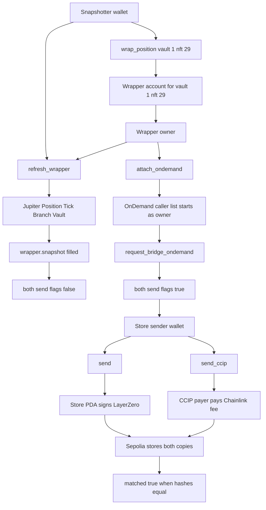

# LendMirror

Copy a Jupiter Lend borrow snapshot from Solana onto Ethereum. It does not move the loan. It does not move tokens.

- **Mainnet path:** Solana (eid `30168`) → Arbitrum (eid `30110`)
- **Testnet path:** Solana Devnet (eid `40168`) → Ethereum Sepolia (eid `40161`)

Example used in this file: Jupiter vault `1`, nft `29`, Devnet wallet `AF1uGS22J8KUQdM41x3x6FYg4uhgS8sdcHrNPVc3MDPo`.

## Goal

Publish one Jupiter Lend position to Ethereum so EVM apps can read:

- which position (vault + nft)
- collateral and debt (live, after any liquidation)
- the stored amounts the Jupiter Position account still has, so you can see the gap
- whether it was liquidated, and whether anything is left
- when the snapshot was taken
- related token mints and exchange prices

Ethereum cannot read Solana. LendMirror sends the same snapshot two ways on Devnet:

1. **LayerZero** — DVNs check that this exact send happened on Solana.
2. **Chainlink CCIP** — a second, separate delivery of the same bytes.

Sepolia stores both copies. `matched` is true only when both arrived and the bytes are equal.

Mainnet sends on LayerZero only. Chainlink is not wired there yet.

## What this is not

- Not a token bridge
- Not moving the Jupiter loan itself
- Not holding the Jupiter NFT
- Not letting Ethereum unlock money
- DVNs do not re-read Jupiter Lend. They check the LayerZero packet.
- There is no website yet

## How a send happens


```mermaid
flowchart TD
  snapList[Snapshotter wallet]
  wrapIx["wrap_position vault 1 nft 29"]
  wrapperPda["Wrapper account for vault 1 nft 29"]
  owner[Wrapper owner]
  attachIx[attach_ondemand]
  callers["OnDemand caller list starts as owner"]
  refreshIx[refresh_wrapper]
  jupiter[Jupiter Position Tick Branch Vault]
  snapshot["wrapper.snapshot filled"]
  flagsOff["both send flags false"]
  requestIx[request_bridge_ondemand]
  flagsOn["both send flags true"]
  sender[Store sender wallet]
  lzSend[send]
  ccipSend[send_ccip]
  storePda["Store PDA signs LayerZero"]
  payerPda["CCIP payer pays Chainlink fee"]
  sepolia[Sepolia stores both copies]
  matched["matched true when hashes equal"]

  snapList --> wrapIx --> wrapperPda
  wrapperPda --> owner --> attachIx --> callers
  snapList --> refreshIx
  owner --> refreshIx
  refreshIx --> jupiter --> snapshot --> flagsOff
  callers --> requestIx --> flagsOn
  flagsOn --> sender
  sender --> lzSend --> storePda --> sepolia
  sender --> ccipSend --> payerPda --> sepolia
  sepolia --> matched
```

Old path `get_jupiter_position` still writes `Store.last_position`. **Send does not use that field.** `send` and `send_ccip` read `wrapper.snapshot` and only run when the matching flag is true.

## Wrap and OnDemand, step by step

One Jupiter position is one pair: vault id + nft id. Vault `1` nft `29` is one position. Vault `1` nft `30` is a different position.

LendMirror keeps a small account for that pair. That account is the **wrapper**. It does not take the NFT. The NFT stays on Jupiter. The wrapper only stores: who owns this tracking record, the latest numbers, and whether a send is allowed.

A second account, **OnDemand**, is a list of wallets allowed to turn sending on for that wrapper.

### 1. Wrap

Who: a wallet on the Store **snapshotters** list. On Devnet that is `AF1uGS22…` (admin is put on that list at create; admin can change the list).

```bash
npx hardhat lz:oapp:solana:wrap-position --vault-id 1 --nft-id 29
```

What you get: one account whose address is fixed from `LendMirrorWrapper` + vault `1` + nft `29`.

After it lands:

- `owner` = the wallet that called wrap (`AF1uGS22…` if that wallet called it)
- `vault_id` = 1, `nft_id` = 29
- `snapshot` = empty
- `lz_send_allowed` = false
- `ccip_send_allowed` = false

There is only one wrapper for vault `1` nft `29`. The first snapshotter to wrap it becomes owner. A later wrap of the same pair fails because that account already exists. Vault `1` nft `30` is a new account and can still be wrapped.

A wallet that is not on snapshotters cannot wrap. Example: a random key calling wrap for vault `1` nft `29` is rejected.

### 2. Attach OnDemand

Who: the wrapper owner (`AF1uGS22…` in the example).

```bash
npx hardhat lz:oapp:solana:attach-ondemand --vault-id 1 --nft-id 29
```

What you get: a second account for that same wrapper. Address comes from `LendMirrorOnDemand` + the wrapper address. Its caller list starts as `[owner]`, so `AF1uGS22…` can request a send.

This account does not read Jupiter and does not send. It only stores who may turn the send flags on.

You do not have to change the list. Call the next command only when you want other wallets on it (max 8). Only the wrapper owner can do that.

```bash
npx hardhat lz:oapp:solana:set-ondemand-callers --vault-id 1 --nft-id 29 --callers AF1uGS22J8KUQdM41x3x6FYg4uhgS8sdcHrNPVc3MDPo,<otherPubkey>
```

### 3. Refresh

Who: the wrapper owner, **or** any Store snapshotter.

```bash
npx hardhat lz:oapp:solana:refresh-wrapper --vault-id 1 --nft-id 29
```

The program reads Jupiter for vault `1` nft `29`: Position, Tick, VaultState, VaultConfig. If that tick was liquidated, it also reads TickIdLiquidation and Branch accounts and recomputes what is left.

It writes those numbers into `wrapper.snapshot` and sets both send flags back to **false**. Nothing is sent.

### 4. Request a bridge

Who: a wallet on the OnDemand caller list. After step 2, that is the owner.

```bash
npx hardhat lz:oapp:solana:request-bridge --vault-id 1 --nft-id 29
```

Checks:

1. Signer is on the OnDemand list.
2. `wrapper.snapshot` is not empty (step 3 already ran).

Then it sets `lz_send_allowed = true` and `ccip_send_allowed = true`.

It does not call LayerZero or Chainlink. It only unlocks the next send. If you skip this step, send fails.

### 5. Send

Who: a wallet on the Store **senders** list. On Devnet that is also `AF1uGS22…`. That wallet pays the LayerZero fee. The recorded LayerZero sender stays the Store PDA `Bqsqzi…`, not the wallet.

```bash
npx hardhat lz:oapp:solana:send-jupiter --vault-id 1 --nft-id 29
```

Checks `lz_send_allowed` is true, encodes `wrapper.snapshot` (vault `1` nft `29`), sends it, then sets `lz_send_allowed` back to false.

Chainlink (Devnet only), same snapshot:

```bash
npx hardhat lz:oapp:solana:send-ccip --vault-id 1 --nft-id 29
```

Checks `ccip_send_allowed`, encodes the same snapshot, then clears only the CCIP flag. The empty payer `53Zqmx…` signs the Chainlink call and pays the SOL fee. The send task moves SOL onto that payer first.

One `request-bridge` unlocks both. Each send clears only its own flag. To send again you refresh (flags go false), then request-bridge again, then send.

### 6. Read Sepolia

Sepolia proxy `0xbE4c…` stores the LayerZero copy and the Chainlink copy for that position pubkey. `matched` is true when both arrived and the bodies are equal.

```bash
npx hardhat lz:oapp:evm:debug
npx hardhat lz:oapp:evm:match --position <POSITION>
```

`<POSITION>` is the Jupiter position pubkey printed by refresh or send.

## Who can do what

| Role | What it is | What it can do |
|------|------------|----------------|
| **Program id** | The deployed Solana program | Holds the code. Not a wallet. Not the LayerZero sender. |
| **Store** | PDA from `init_store` (seed `LendMirrorStoreV0`) | LayerZero **sender**. Ethereum `setPeer` must use this address, not the program id. |
| **CCIP payer** | Empty PDA (seed `LendMirrorCcipPayer`) | Signs `send_ccip` and pays the Chainlink SOL fee. Devnet: `53Zqmx…`. |
| **Admin** | Wallet named at `init_store` | Update peers. Replace snapshot and send lists (max 8 each). Cannot change admin on-chain. |
| **Snapshotter** | Wallet on the Store snapshot list | `wrap_position`, `get_jupiter_position`, and `refresh_wrapper` (refresh also allows the wrapper owner). |
| **Wrapper owner** | Snapshotter who wrapped that vault+nft | `attach_ondemand`, `set_ondemand_callers`, and `refresh_wrapper` for that wrapper. |
| **OnDemand caller** | Wallet on that wrapper’s OnDemand list (starts as the owner) | `request_bridge_ondemand` for that wrapper only. |
| **Sender** | Wallet on the Store send list | `send` and `send_ccip` when the matching flag is true. Cannot pick custom bytes. |
| **Upgrade authority** | Key that deployed the program | Only key that can call `init_store`. Can upgrade bytecode. |
| **Ethereum owner** | Wallet that initialized the proxy | Sets EVM peers and Chainlink receive allowlist. Upgrades the proxy. |

**Rules**

- Only the **upgrade authority** can call `init_store`. A random wallet cannot create the Store and become admin.
- Admin is put on both allowlists at create. Admin can replace those lists later.
- Wrapping vault `1` nft `29` does not wrap vault `1` nft `30`.
- `quote_send` asks LayerZero for a fee from `wrapper.snapshot`. It does not send. The wrapper must already have a snapshot.

```bash
npx hardhat lz:oapp:solana:set-snapshotters --keys <pubkey1>,<pubkey2>
npx hardhat lz:oapp:solana:set-senders --keys <pubkey1>,<pubkey2>
```

## What is built

| Piece | Status |
|-------|--------|
| `init_store` only by upgrade authority | Built |
| Live Jupiter read (ticks and liquidation branches) | Built |
| LayerZero send + Chainlink send, Sepolia stores both and checks they match | Built on Devnet. Mainnet is LayerZero only. |
| Wrapper + OnDemand (one strategy) | Built in this repo. Needs a Solana program upgrade before Devnet tasks use it. |
| Website | Not built |

Solana instructions: `init_store`, `set_peer_config`, `set_snapshotters`, `set_senders`, `get_jupiter_position`, `wrap_position`, `attach_ondemand`, `set_ondemand_callers`, `refresh_wrapper`, `request_bridge_ondemand`, `quote_send`, `send`, `set_ccip_route`, `send_ccip`.

Ethereum: UUPS proxy. `lzReceive` and `ccipReceive` write two copies. `matched(position)` compares them. Peer address is the **proxy**.

We do not build LayerZero, DVNs, Chainlink’s programs, or Jupiter Lend.

## One switch: `DEPLOYMENT_TYPE`

Set `DEPLOYMENT_TYPE=devnet` or `DEPLOYMENT_TYPE=mainnet` in `.env`.

| File | Path |
|------|------|
| [`config/devnet.ts`](config/devnet.ts) | Solana Devnet `40168` → Sepolia `40161` |
| [`config/mainnet.ts`](config/mainnet.ts) | Solana `30168` → Arbitrum `30110` |

Hardhat, `npx lm`, and `layerzero.config.ts` use that profile. If you pass `--eid` or `--network` and it disagrees, the command stops.

Use `npx lm` for Solana CLI, Forge, Cast, and Anchor build. Bare `solana` / `forge` / `cast` ignore the switch.

```bash
nvm use 18
set -a && source .env && set +a
```

| Variable | Used for |
|----------|----------|
| `DEPLOYMENT_TYPE` | `devnet` or `mainnet` |
| `SOLANA_KEYPAIR_PATH_DEVNET` / `_MAINNET` | Wallet for that path |
| `EVM_PRIVATE_KEY_DEVNET` / `_MAINNET` | EVM owner key |
| `RPC_URL_SOLANA_DEVNET` / `_MAINNET` | Solana RPC. Use a paid RPC on Devnet. |
| `RPC_URL_EVM_DEVNET` / `_MAINNET` | Sepolia or Arbitrum RPC |

`lendmirror-keypair.json` is the **program id**. `SOLANA_KEYPAIR_PATH_*` is the **wallet**.

`lz:oapp:wire` crashes. Do not use it. Set peers with `set-peer`.

## Addresses

### Devnet / Sepolia (`DEPLOYMENT_TYPE=devnet`)

| Item | Value |
|------|-------|
| Solana program id | `GQDxkWJhMGppaXExXBC8hGWmfaUv9igo4PKdaLyc53T1` |
| Solana Store (OApp) | `BqsqziQ9VsD3o81zPCQuMfZebdn4eQUAtMjJxZLYhXdM` |
| Solana CCIP payer | `53ZqmxXwJhXxgLBFXpM1mZUDZ4AZwXaVhpnktxusQn6m` |
| Solana admin | `AF1uGS22J8KUQdM41x3x6FYg4uhgS8sdcHrNPVc3MDPo` |
| Snapshotters / Senders | `AF1uGS22J8KUQdM41x3x6FYg4uhgS8sdcHrNPVc3MDPo` |
| Sepolia LendMirror (proxy) | `0xbE4c9C5DB8E2747C545B2591B3937764f1A2d514` |
| Sepolia implementation | `0xC722956634AC775A05F78B50BC840d27614916fd` |
| Sepolia owner | `0x9Dee2100Cb47734A7a629Db0a1B061Df865a9c87` |
| LayerZero pathway | Devnet `40168` → Sepolia `40161` |
| Chainlink | Wired (payer is the Sepolia `ccipSender`) |

Local files: `deployments/solana-testnet/OApp.json`, `deployments/sepolia/LendMirror.json`. Etherscan: https://sepolia.etherscan.io/address/0xbE4c9C5DB8E2747C545B2591B3937764f1A2d514

Wrapper and OnDemand accounts are created per position when you run the wrap steps. They are not a single global address.

### Mainnet (`DEPLOYMENT_TYPE=mainnet`)

| Item | Value |
|------|-------|
| Solana program id | `9oySM9Jo4ZEXFcWYFbuPK1FeqwrDr6wmnAmenAybzHqQ` |
| Solana Store (OApp) | `BLoEaf2L5rZvEwZuVfFjAabHW4woM9Mr1XknBQCZkyf4` |
| Solana admin | `B8HnbEgetyiAdvkbgZR7LsChh93KR3jWuSw6xSQxt1hL` |
| Snapshotters / Senders | `B8HnbEgetyiAdvkbgZR7LsChh93KR3jWuSw6xSQxt1hL` |
| Arbitrum LendMirror (proxy) | `0xb42E98c712B5CAf1e55dB8106262077515879EA2` |
| Arbitrum implementation | `0xdAAE65Df8B96e9eE45eb756441B7942e5E128924` |
| Arbitrum owner | `0x9Dee2100Cb47734A7a629Db0a1B061Df865a9c87` |
| LayerZero pathway | Solana `30168` → Arbitrum `30110` |
| Chainlink | Not wired |

Local files: `deployments/solana-mainnet/OApp.json`, `deployments/arbitrum/LendMirror.json`. The proxy is the LayerZero peer, not the implementation. Arbiscan: https://arbiscan.io/address/0xb42E98c712B5CAf1e55dB8106262077515879EA2

Mainnet has not been upgraded for wrappers. The addresses above are the existing LayerZero deploy.

## Send on Devnet (Store already exists)

Do not run `create` or `lz:deploy` again.

```bash
nvm use 18
set -a && source .env && set +a

# Upgrade Solana after a program change (see deployment-instructions.md if the upload stalls).
npx lm build -- --features no-log-ix-name
npx lm solana program deploy \
  --program-id target/deploy/lendmirror-keypair.json \
  target/deploy/lendmirror.so \
  --use-rpc \
  --max-sign-attempts 20 \
  --with-compute-unit-price 50000

# Once per position
npx hardhat lz:oapp:solana:wrap-position --vault-id 1 --nft-id 29
npx hardhat lz:oapp:solana:attach-ondemand --vault-id 1 --nft-id 29

# Every time you want a new copy on Ethereum
npx hardhat lz:oapp:solana:refresh-wrapper --vault-id 1 --nft-id 29
npx hardhat lz:oapp:solana:request-bridge --vault-id 1 --nft-id 29
npx hardhat lz:oapp:solana:send-jupiter --vault-id 1 --nft-id 29
npx hardhat lz:oapp:solana:send-ccip --vault-id 1 --nft-id 29

npx hardhat lz:oapp:evm:debug
npx hardhat lz:oapp:evm:match --position <POSITION>
```

Chainlink routes, if not already set:

```bash
npx hardhat lz:oapp:solana:set-ccip-route
npx hardhat lz:oapp:evm:set-ccip-route
```

Sepolia does not need a new contract for wrappers. It already stores both deliveries.

## First deploy (no Store yet)

```bash
nvm use 18
npx lm build -- --features no-log-ix-name
npx lm solana program deploy \
  --program-id target/deploy/lendmirror-keypair.json \
  target/deploy/lendmirror.so \
  --use-rpc \
  --max-sign-attempts 20 \
  --with-compute-unit-price 50000
npx hardhat lz:oapp:solana:create
npx hardhat lz:deploy --ci
npx hardhat lz:oapp:solana:init-config --oapp-config layerzero.config.ts
npx hardhat lz:oapp:solana:set-peer
npx hardhat lz:oapp:evm:set-peer
npx hardhat lz:oapp:solana:get-peer
```

Then the Devnet Chainlink route commands, then the wrap → attach → refresh → request-bridge → send steps.

`create` signer must be the upgrade authority. Do not run `create` twice on the same program id.

## Tools

Node **18** (`nvm use 18`). Also Rust, Solana CLI, Anchor **0.31.1**, `npm install`.

## Tests

```bash
cargo test -p lendmirror
npx lm build
LENDMIRROR_ID=GQDxkWJhMGppaXExXBC8hGWmfaUv9igo4PKdaLyc53T1 anchor test

cd crates/jup-tick-parity
cargo test

npm run test:jup-live
```

`jup-tick-parity` checks tick math against the Jupiter Rust SDK. `test:jup-live` compares a real NFT (default vault `1`, nft `1`) with this program’s liquidation math. Set `JUP_VAULT_ID` / `JUP_NFT_ID` to change it. Skips if `RPC_URL_SOLANA_MAINNET` is unset.

## Optional: IDL and verified build

Not required to send.

After `npx lm build`, fix `target/idl/lendmirror.json` `address` to the program id, then `anchor idl init` / `anchor idl upgrade` with the profile RPC and wallet.

Solana verified builds use `solana-verify` against the public git commit. A Mac `anchor build` hash will not match that Linux build. Mainnet program id for that check is `9oySM9Jo4ZEXFcWYFbuPK1FeqwrDr6wmnAmenAybzHqQ`. Devnet is `GQDxkWJhMGppaXExXBC8hGWmfaUv9igo4PKdaLyc53T1`.

On Etherscan or Arbiscan, read the contract **as proxy**.
